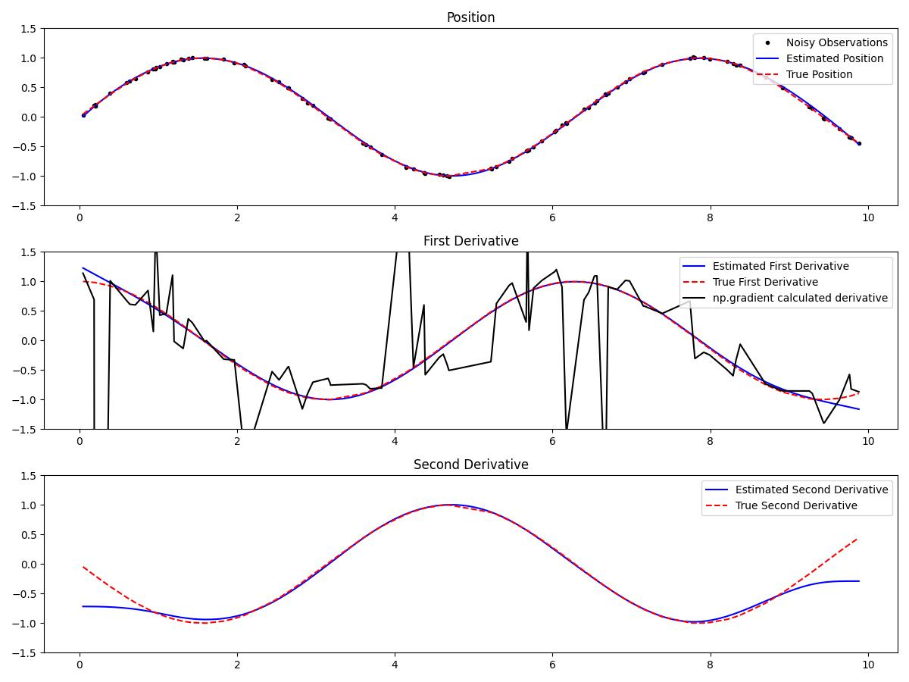

# Kalmangrad

`kalmangrad` is a python package that calculates automated smooth N'th order derivatives of non-uniformly sampled time series data. The approach leverages Bayesian filtering techniques to compute derivatives up to any specified order, offering a robust alternative to traditional numerical differentiation methods that are sensitive to noise. This package is built on top of the underlying [bayesfilter](https://github.com/hugohadfield/bayesfilter/) package.



## Table of Contents

- [Introduction](#introduction)
- [Features](#features)
- [Installation](#installation)
- [Usage](#usage)
- [Example](#example)
- [Functions Overview](#functions-overview)
- [Dependencies](#dependencies)
- [License](#license)

## Introduction

Estimating derivatives from noisy data is a common challenge in fields like signal processing, control systems, and data analysis. Traditional numerical differentiation amplifies noise, leading to inaccurate results. Anyone who has naiivly attempted to differentiate sensor data has run into this problem. This repository implements a bayesian filtering based method to estimate derivatives of any order, providing smoother and more accurate estimates even in the presence of noise and non-uniform sampling.


## Features

- **Higher-Order Derivative Estimation**: Compute derivatives up to any specified order.
- **Robust to Noise**: Uses Bayesian filtering to mitigate the effects of noise in the data.
- **Flexible Time Steps**: Handles non-uniformly sampled data with automatic time step adjustment.
- **Easy Integration**: Its simple API allows for easy integration into existing projects.
- **Few Dependencies**: Requires only NumPy and the BayesFilter package (which is turn just needs NumPy).

## Installation

1. **Install from PyPI**:

   ```bash
   pip install kalmangrad
   ```

2. **Install from Source**:

   - Clone the repository:

     ```bash
     git clone
      ```
    - Install the package:
    
     ```bash
     pip install .
     ```

## Usage

The main function provided is `grad`, which estimates the derivatives of the input data `y` sampled at times `t`.

```python
def grad(
    y: np.ndarray, 
    t: np.ndarray, 
    n: int = 1,
    delta_t = None,
    obs_noise_std = 1e-2
) -> Tuple[List[Gaussian], np.ndarray]:
    """
    Estimates the derivatives of the input data y up to order n.

    Parameters:
    - y (np.ndarray): Observed data array.
    - t (np.ndarray): Time points corresponding to y.
    - n (int): Maximum order of derivative to estimate (default is 1).
    - delta_t (float, optional): Time step for the Kalman filter. If None, it's automatically determined.
    - obs_noise_std (float): Standard deviation of the observation noise (default is 1e-2).

    Returns:
    - smoother_states (List[Gaussian]): List of Gaussian states containing mean and covariance estimates.
    - filter_times (np.ndarray): Time points corresponding to the estimates.
    """
```

## Example

Below is an example demonstrating how to estimate the first and second derivatives of noisy sinusoidal data.

```python
import numpy as np
import matplotlib.pyplot as plt

# Import the grad function
from kalmangrad import grad  # Replace with the actual module name

# Generate noisy sinusoidal data with random time points
np.random.seed(0)
t = sorted(np.random.uniform(0.0, 10.0, 100))
noise_std = 0.01
y = np.sin(t) + noise_std * np.random.randn(len(t))
true_first_derivative = np.cos(t)
true_second_derivative = -np.sin(t)

# Estimate derivatives using the Kalman filter
N = 2  # Order of the highest derivative to estimate
smoother_states, filter_times = grad(y, t, n=N)

# Extract estimated derivatives
estimated_position = [state.mean()[0] for state in smoother_states]
estimated_first_derivative = [state.mean()[1] for state in smoother_states]
estimated_second_derivative = [state.mean()[2] for state in smoother_states]

# Plot the results
plt.figure(figsize=(12, 9))

# Position
plt.subplot(3, 1, 1)
plt.plot(t, y, 'k.', label='Noisy Observations')
plt.plot(filter_times, estimated_position, 'b-', label='Estimated Position')
plt.plot(t, np.sin(t), 'r--', label='True Position')
plt.legend(loc='upper right')
plt.ylim(-1.5, 1.5)
plt.title('Position')

# First Derivative
plt.subplot(3, 1, 2)
plt.plot(filter_times, estimated_first_derivative, 'b-', label='Estimated First Derivative')
plt.plot(t, true_first_derivative, 'r--', label='True First Derivative')
plt.plot(
    t,
    np.gradient(y, t),
    'k-',
    label='np.gradient calculated derivative'
)
plt.legend(loc='upper right')
plt.ylim(-1.5, 1.5)
plt.title('First Derivative')

# Second Derivative
plt.subplot(3, 1, 3)
plt.plot(filter_times, estimated_second_derivative, 'b-', label='Estimated Second Derivative')
plt.plot(t, true_second_derivative, 'r--', label='True Second Derivative')
plt.legend(loc='upper right')
plt.ylim(-1.5, 1.5)
plt.title('Second Derivative')

plt.tight_layout()
plt.show()
```

**Explanation:**

- **Data Generation**: We generate noisy observations of a sine wave.
- **Derivative Estimation**: The `grad` function is called with `n=2` to estimate up to the second derivative.
- **Result Extraction**: The mean estimates for position and derivatives are extracted from the Gaussian states.
- **Visualization**: The true functions and the estimates are plotted for comparison.

## Functions Overview

### `transition_func(y, delta_t, n)`

Computes the new state vector at time `t + delta_t` given the current state vector `y` at time `t`, for a Kalman filter of order `n`.

- **Parameters**:
  - `y (np.ndarray)`: Current state vector `[y, y', y'', ..., y^(n)]^T`.
  - `delta_t (float)`: Time step.
  - `n (int)`: Order of the derivative.

- **Returns**:
  - `new_y (np.ndarray)`: Updated state vector at time `t + delta_t`.

### `transition_matrix(delta_t, n)`

Returns the state transition matrix `A` for a Kalman filter of order `n`.

- **Parameters**:
  - `delta_t (float)`: Time step.
  - `n (int)`: Order of the derivative.

- **Returns**:
  - `A (np.ndarray)`: Transition matrix of size `(n+1, n+1)`.

### `observation_func(state)`

Extracts the observation from the state vector. Currently, it observes only the first element (position).

- **Parameters**:
  - `state (np.ndarray)`: State vector.

- **Returns**:
  - `np.ndarray`: Observation vector.

### `jac_observation_func(state)`

Computes the Jacobian of the observation function with respect to the state vector.

- **Parameters**:
  - `state (np.ndarray)`: State vector.

- **Returns**:
  - `np.ndarray`: Jacobian matrix of size `(1, n+1)`.

### `grad(y, t, n=1, delta_t=None, obs_noise_std=1e-2)`

Main function to estimate the derivatives of the input data `y` up to order `n`.

- **Parameters**:
  - `y (np.ndarray)`: Observed data array.
  - `t (np.ndarray)`: Time points corresponding to `y`.
  - `n (int)`: Maximum order of derivative to estimate (default is `1`).
  - `delta_t (float, optional)`: Time step for the Kalman filter. If `None`, it is automatically determined.
  - `obs_noise_std (float)`: Standard deviation of the observation noise.

- **Returns**:
  - `smoother_states (List[Gaussian])`: List of Gaussian states containing mean and covariance estimates for each time step.
  - `filter_times (np.ndarray)`: Time points corresponding to the estimates.

## Dependencies

- **Python 3.x**
- **NumPy**: For numerical computations.
- **Matplotlib**: For plotting results.
- **BayesFilter**: For Bayesian filtering and smoothing.

   Install via:

   ```bash
   pip install numpy matplotlib bayesfilter
   ```

## License

This project is licensed under the MIT License - see the [LICENSE](license.txt) file for details.

---

**Disclaimer**: This code is provided as-is without any guarantees. Please test and validate the code in your specific context.
