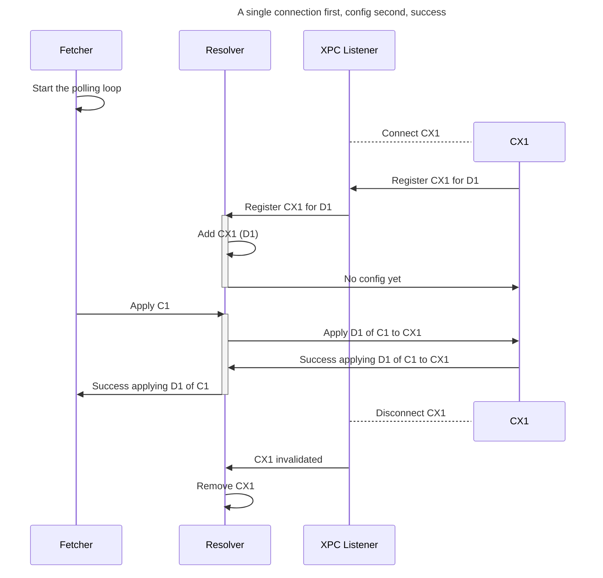
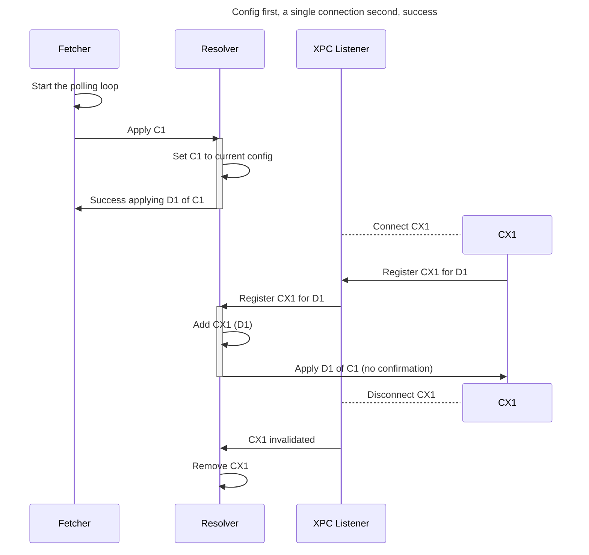
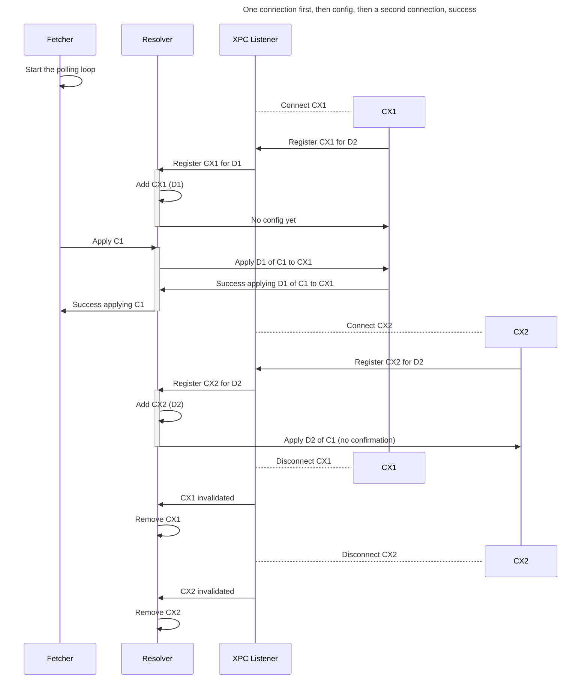
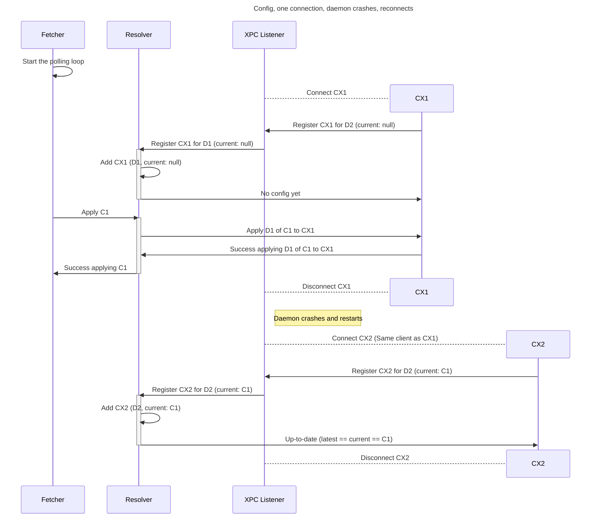

Copyright © 2024 Apple Inc. All Rights Reserved.

APPLE INC.
PRIVATE CLOUD COMPUTE SOURCE CODE INTERNAL USE LICENSE AGREEMENT
PLEASE READ THE FOLLOWING PRIVATE CLOUD COMPUTE SOURCE CODE INTERNAL USE LICENSE AGREEMENT (“AGREEMENT”) CAREFULLY BEFORE DOWNLOADING OR USING THE APPLE SOFTWARE ACCOMPANYING THIS AGREEMENT(AS DEFINED BELOW). BY DOWNLOADING OR USING THE APPLE SOFTWARE, YOU ARE AGREEING TO BE BOUND BY THE TERMS OF THIS AGREEMENT. IF YOU DO NOT AGREE TO THE TERMS OF THIS AGREEMENT, DO NOT DOWNLOAD OR USE THE APPLE SOFTWARE. THESE TERMS AND CONDITIONS CONSTITUTE A LEGAL AGREEMENT BETWEEN YOU AND APPLE.
IMPORTANT NOTE: BY DOWNLOADING OR USING THE APPLE SOFTWARE, YOU ARE AGREEING ON YOUR OWN BEHALF AND/OR ON BEHALF OF YOUR COMPANY OR ORGANIZATION TO THE TERMS OF THIS AGREEMENT.
1. As used in this Agreement, the term “Apple Software” collectively means and includes all of the Apple Private Cloud Compute materials provided by Apple here, including but not limited to the Apple Private Cloud Compute software, tools, data, files, frameworks, libraries, documentation, logs and other Apple-created materials. In consideration for your agreement to abide by the following terms, conditioned upon your compliance with these terms and subject to these terms, Apple grants you, for a period of ninety (90) days from the date you download the Apple Software, a limited, non-exclusive, non-sublicensable license under Apple’s copyrights in the Apple Software to download, install, compile and run the Apple Software internally within your organization only on a single Apple-branded computer you own or control, for the sole purpose of verifying the security and privacy characteristics of Apple Private Cloud Compute. This Agreement does not allow the Apple Software to exist on more than one Apple-branded computer at a time, and you may not distribute or make the Apple Software available over a network where it could be used by multiple devices at the same time. You may not, directly or indirectly, redistribute the Apple Software or any portions thereof. The Apple Software is only licensed and intended for use as expressly stated above and may not be used for other purposes or in other contexts without Apple's prior written permission. Except as expressly stated in this notice, no other rights or licenses, express or implied, are granted by Apple herein.
2. The Apple Software is provided by Apple on an "AS IS" basis. APPLE MAKES NO WARRANTIES, EXPRESS OR IMPLIED, INCLUDING WITHOUT LIMITATION THE IMPLIED WARRANTIES OF NON-INFRINGEMENT, MERCHANTABILITY AND FITNESS FOR A PARTICULAR PURPOSE, REGARDING THE APPLE SOFTWARE OR ITS USE AND OPERATION ALONE OR IN COMBINATION WITH YOUR PRODUCTS, SYSTEMS, OR SERVICES. APPLE DOES NOT WARRANT THAT THE APPLE SOFTWARE WILL MEET YOUR REQUIREMENTS, THAT THE OPERATION OF THE APPLE SOFTWARE WILL BE UNINTERRUPTED OR ERROR-FREE, THAT DEFECTS IN THE APPLE SOFTWARE WILL BE CORRECTED, OR THAT THE APPLE SOFTWARE WILL BE COMPATIBLE WITH FUTURE APPLE PRODUCTS, SOFTWARE OR SERVICES. NO ORAL OR WRITTEN INFORMATION OR ADVICE GIVEN BY APPLE OR AN APPLE AUTHORIZED REPRESENTATIVE WILL CREATE A WARRANTY.
3. IN NO EVENT SHALL APPLE BE LIABLE FOR ANY DIRECT, SPECIAL, INDIRECT, INCIDENTAL OR CONSEQUENTIAL DAMAGES (INCLUDING, BUT NOT LIMITED TO, PROCUREMENT OF SUBSTITUTE GOODS OR SERVICES; LOSS OF USE, DATA, OR PROFITS; OR BUSINESS INTERRUPTION) ARISING IN ANY WAY OUT OF THE USE, REPRODUCTION, COMPILATION OR OPERATION OF THE APPLE SOFTWARE, HOWEVER CAUSED AND WHETHER UNDER THEORY OF CONTRACT, TORT (INCLUDING NEGLIGENCE), STRICT LIABILITY OR OTHERWISE, EVEN IF APPLE HAS BEEN ADVISED OF THE POSSIBILITY OF SUCH DAMAGE.
4. This Agreement is effective until terminated. Your rights under this Agreement will terminate automatically without notice from Apple if you fail to comply with any term(s) of this Agreement. Upon termination, you agree to cease all use of the Apple Software and destroy all copies, full or partial, of the Apple Software. This Agreement constitutes the entire understanding of the parties with respect to the subject matter contained herein, and supersedes all prior negotiations, representations, or understandings, written or oral. This Agreement will be governed and construed in accordance with the laws of the State of California, without regard to its choice of law rules.
You may report security issues about Apple products to product-security@apple.com, as described here: https://www.apple.com/support/security/. Non-security bugs and enhancement requests can be made via https://bugreport.apple.com as described here: https://developer.apple.com/bug-reporting/
EA1937
10/02/2024

# Registry sequence diagrams

The component between the Fetcher and the XPC Listener.

---

---

---

---

