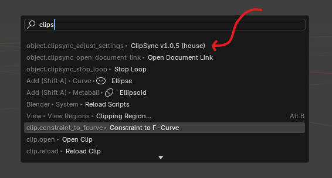
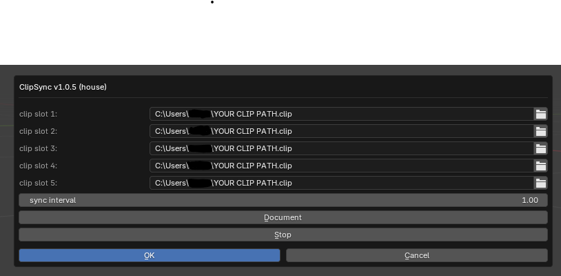

# ClipSync

English:
Synchronize canvas preview image from .clip file to .png file in blender

日本語:
.clipファイルからcanvasのプレビュー画像を.pngファイルに同期するアドオン

## Demo Link (x.com)

https://x.com/arthur484_/status/1846780897724715502

## Download

[Releases](https://github.com/arthur-vr/ClipSync/releases)

## How to invoke

English:
- Install the addon
- press F3 and type `clipsync`

日本語:
- アドオンをインストール
- f3を押してclipsyncと検索

## Panel Description

English:
- clip slot 1-5: set the path of the clip under Users/*, only the clip file that exists will be synchronized
- sync interval: set the interval of the sync(seconds)
- Document: open the document in the web browser
- Stop: stop the sync
- OK: save the settings and execute the sync, after that, the sync will be started automatically, .png file will be generated in the same directory as the .clip file, please set the png file as the texture

日本語:
- clip slot 1-5: Users/*以下のclipファイルのパスを設定。存在しているclipファイルのみが同期される
- sync interval: 同期間隔を設定(秒)
- Document: ドキュメントをウェブブラウザで開く
- Stop: 同期を停止
- OK: 同期が開始され、.clipファイルと同じディレクトリに.pngファイルが生成されるので、それをテクスチャとして設定してください

## Differences from AutoSync (frequently asked questions)

English:
- AutoSync can update supported image formats like PNG,PSD, but it doesn't support .clip files.
- AutoSync updates all images, which can be resource-intensive if you have many images. ClipSync only updates the specified image, making it lightweight.
- It intentionally uses only basic Python packages to ensure compatibility with a wide range of Blender versions.
- ClipSync is launched only by f3 search, and does not invade the UI.

日本語:
- AutoSyncはPNG,PSD等の対応画像を更新できるが、.clipファイルは更新できない
- AutoSyncはすべての画像を更新するため、画像が多いと重くなる可能性があるが、ClipSyncでは指定した一つの画像のみが更新されるので軽量である
- あえて、基本的なpythonパッケージのみを使用することで、幅広いバージョンのblenderでも動作するようにしている
- ClipSyncはf3検索からのみ起動され、UIを侵食しない
