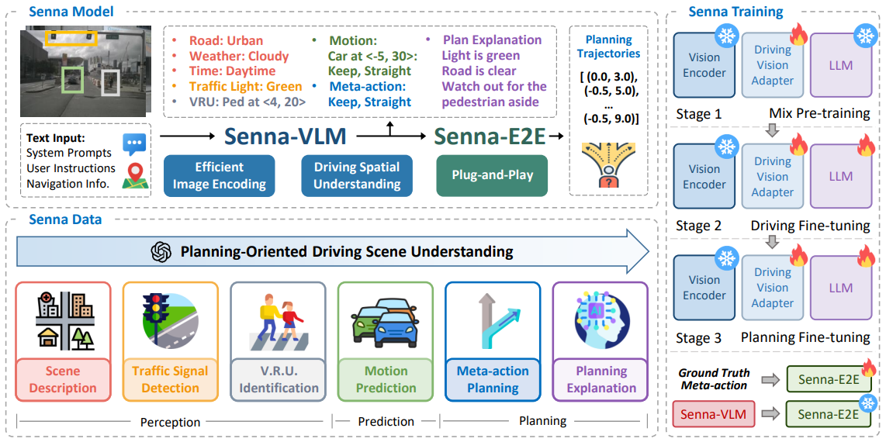
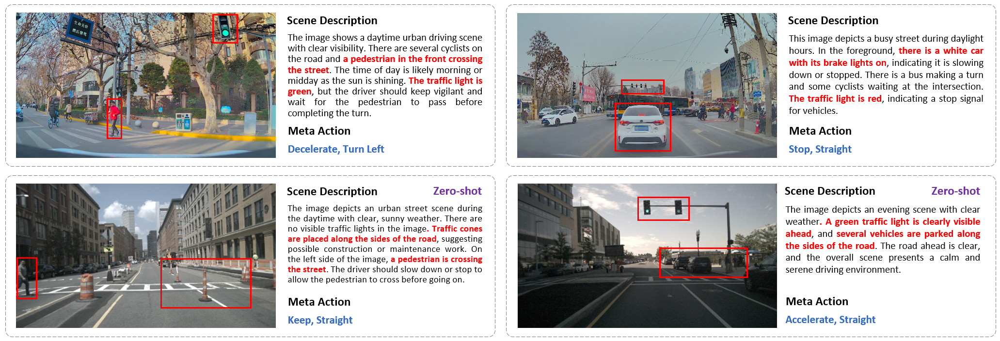

<div align ="center">


<h3> Senna: Bridging Large Vision-Language Models and End-to-End Autonomous Driving </h3>

[Bo Jiang](https://scholar.google.com/citations?user=UlDxGP0AAAAJ&hl=zh-CN)<sup>1</sup>, [Shaoyu Chen](https://scholar.google.com/citations?user=PIeNN2gAAAAJ&hl=en&oi=sra)<sup>1</sup>, [Bencheng Liao](https://scholar.google.com/citations?user=rUBdh_sAAAAJ&hl=zh-CN)<sup>1</sup>, Xingyu Zhang<sup>2</sup>, Wei Yin<sup>2</sup>, [Qian Zhang](https://scholar.google.com/citations?user=pCY-bikAAAAJ&hl=zh-CN)<sup>2</sup>, [Chang Huang](https://scholar.google.com/citations?user=IyyEKyIAAAAJ&hl=zh-CN)<sup>2</sup>, [Wenyu Liu](http://eic.hust.edu.cn/professor/liuwenyu/)<sup>1</sup>, [Xinggang Wang](https://xinggangw.info/)<sup>1,📧</sup>

<sup>1</sup> Huazhong University of Science and Technology,
<sup>2</sup> Horizon Robotics,
<sup>📧</sup> Corresponding Author


[](https://arxiv.org/abs/2410.22313)
</div>


<div align="center">

</div>


## News

`[2024-10-04]:` Senna [arXiv](https://arxiv.org/abs/2410.22313) paper released. Code/Models are coming soon. Please stay tuned! ☕️


## Highlights

* Senna is an autonomous driving system that integrates a Large Vision-Language Model with an end-to-end model to improve planning safety, robustness and generalization.

* Senna achieves SOTA planning performance and demonstrates strong cross-scenario generalization and transferability.


## Visualizations


<div align="center">

</div>


## Acknowledgments

[LLaVA](https://github.com/haotian-liu/LLaVA), the codebase we built upon, we sincerely thank the contributors for their great work!

## Citation
If you find Senna useful in your research or applications, please consider giving us a star &#127775; and citing it by the following BibTeX entry.


```bibtex
@article{jiang2024senna,
      title={Senna: Bridging Large Vision-Language Models and End-to-End Autonomous Driving}, 
      author={Bo Jiang and Shaoyu Chen and Bencheng Liao and Xingyu Zhang and Wei Yin and Qian Zhang and Chang Huang and Wenyu Liu and Xinggang Wang},
      year={2024},
      eprint={2410.22313},
      archivePrefix={arXiv},
      primaryClass={cs.CV},
      url={https://arxiv.org/abs/2410.22313}, 
}
```

## Related Projects
[VAD & VADv2](https://github.com/hustvl/VAD), [MapTR](https://github.com/hustvl/MapTR)
