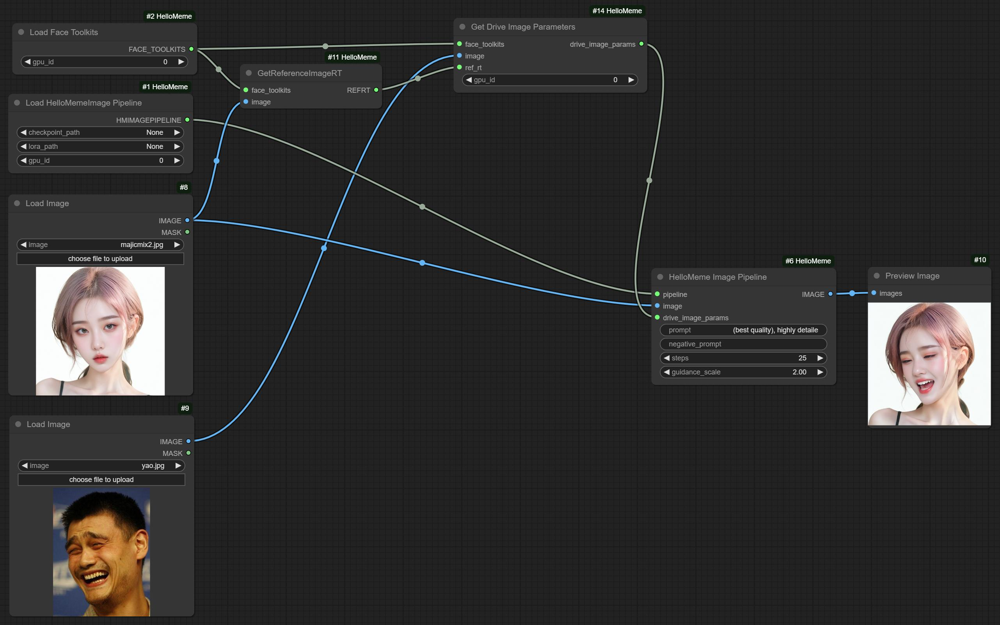
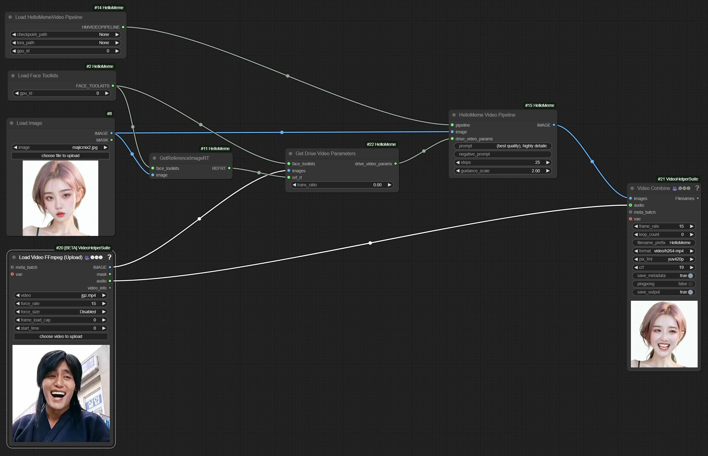

<h1 align='center'>HelloMeme: Integrating Spatial Knitting Attentions to Embed High-Level and Fidelity-Rich Conditions in Diffusion Models</h1>

    <a href='https://github.com/songkey' target='_blank'>Shengkai Zhang</a>, <a href='https://github.com/RhythmJnh' target='_blank'>Nianhong Jiao</a>, <a href='https://github.com/Shelton0215' target='_blank'>Tian Li</a>, <a href='https://github.com/chaojie12131243' target='_blank'>Chaojie Yang</a>, <a href='https://github.com/xchgit' target='_blank'>Chenhui Xue</a>*, <a href='https://github.com/boya34' target='_blank'>Boya Niu</a>*, <a href='https://github.com/HelloVision/HelloMeme' target='_blank'>Jun Gao</a> 

    HelloVision | HelloGroup Inc.

    <small>* Intern</small>

 

    
    
    
    

## 🔆 New Features/Updates

- ✅ `11/6/2024` The face proportion in the reference image significantly affects the generation quality. We have encapsulated the **recommended image cropping method** used during training into a `CropReferenceImage` Node. Refer to the workflows in the `ComfyUI_HelloMeme/workflows directory`: `hellomeme_video_cropref_workflow.json` and `hellomeme_image_cropref_workflow.json`.

## Introduction

This repository is the official implementation of the [`HelloMeme`](https://arxiv.org/pdf/2410.22901) ComfyUI interface, featuring both image and video generation functionalities. Example workflow files can be found in the `ComfyUI_HelloMeme/workflows` directory. Test images and videos are saved in the `ComfyUI_HelloMeme/examples` directory. Below are screenshots of the interfaces for image and video generation.

### Image Generation Interface

  

### Video Generation Interface

  

