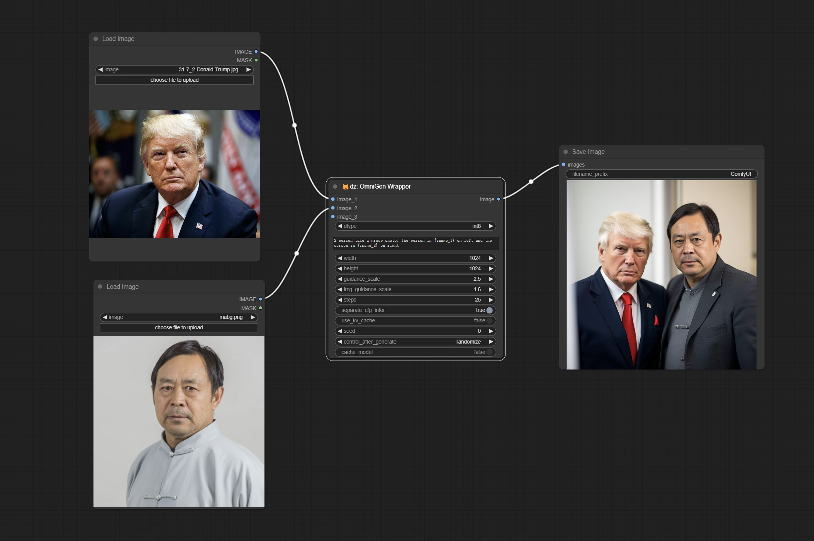
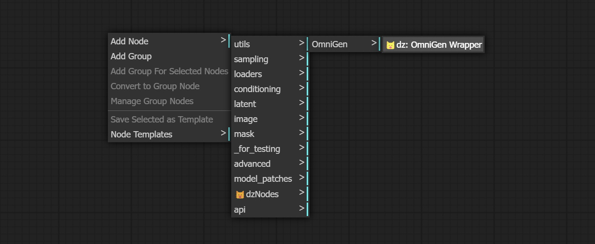
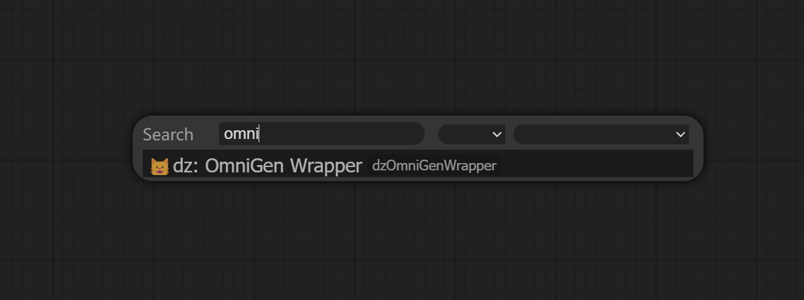
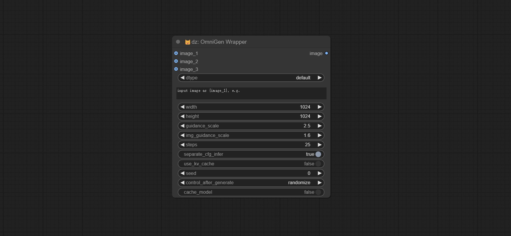

# ComfyUI_OmniGen_Wrapper

    

This node is an unofficial wrapper of the [OmniGen](https://github.com/VectorSpaceLab/OmniGen), running in ComfyUI.    
The quantization code is referenced from [Manni1000/OmniGen](https://github.com/Manni1000/OmniGen).

[中文说明点这里](./README_CN.md)


### Install
Open a terminal window in the ```ComfyUI/custom_nodes``` folder and enter the following command:
```
git clone https://github.com/chflame163/ComfyUI_OmniGen_Wrapper.git
```

### Install dependencies
Run the following command in the Python environment of ComfyUI:
```
python -s -m pip install -r ComfyUI/custom_nodes/ComfyUI_OmniGen_Wrapper/requirements.txt
```

### Download models
When running the plugin for the first time, the model will be automatically downloaded. If the automatic download fails, you can manually download it. Choose one of the following two download methods:   

From Huggingface:
* Download all files from [Shitao/OmniGen-v1](https://huggingface.co/Shitao/OmniGen-v1/tree/main) and copy to ```ComfyUI/models/OmniGen/Shitao/OmniGen-v1``` folder;    
* Download ```diffusion_pytorch_model.safetensors``` and ```config.json```  from [stabilityai/sdxl-vae](https://huggingface.co/stabilityai/sdxl-vae/tree/main), copy the two files to ```ComfyUI/models/OmniGen/Shitao/OmniGen-v1/vae``` folder.    

Or Download all files from BaiduNetdisk and copy to ```ComfyUI/models/OmniGen/Shitao/OmniGen-v1``` folder.
* [BaiduNetdisk](https://pan.baidu.com/s/1uivyo_voaZ668nT3aMLw8Q?pwd=ma06)


### How to use
Start ComfyUI, right click on screen to activate the menu, find ```Add Node``` - ```😺dzNodes``` - ```OmniGen Wrapper```, the node is here.    
   
Alternatively, enter OmniGen Wrapper in the node search bar to find the node.    


### Node Options


* image_1: Optional input image_1. If input, this image must be described in the prompt and referred to as ```{image_1}```.
* image_2: Optional input image_2. If input, this image must be described in the prompt and referred to as ```{image_2}```.
* image_3: Optional input image_3. If input, this image must be described in the prompt and referred to as ```{image_3}```.
* dtype: Model accuracy, default is the default model accuracy, optional int8. The default precision occupies approximately 12GB of video memory, while int8 occupies approximately 7GB of video memory.
* prompt: The prompt or prompts to guide the image generation. If have image input, use the placeholder ```{image_1}```, ```{image_2}```, ```{image_3}``` to refer to it.
* width: The height in pixels of the generated image. The number must be a multiple of 16.
* height: The width in pixels of the generated image. The number must be a multiple of 16.
* guidance_scale: A higher value will make the generated results of the model more biased towards the condition, but may sacrifice the diversity and degrees of freedom of the image.
* image_guidance_scale: The guidance scale of image.
* steps: The number of denoising steps. More denoising steps usually lead to a higher quality image at the expense of slower inference.
* separate_cfg_infer: Perform inference on images with different guidance separately; this can save memory when generating images of large size at the expense of slower inference.
* use_kv_cache: Enable kv cache to speed up the inference
* seed: A random seed for generating output.
* control_after_generate: Seed value change option every time it runs.
* cache_model: When set to True, the model is cached and does not need to be loaded again during the next run.

### Star

[](https://star-history.com/#chflame163/ComfyUI_OmniGen_Wrapper&Date)

###  statement

This project follows the MIT license, Some of its functional code comes from other open-source projects. Thanks to the original author. If used for commercial purposes, please refer to the original project license to authorization agreement.
