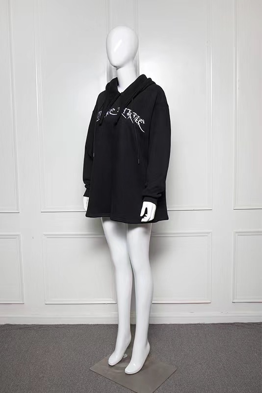

# ComfyUI API Integration Automated Suite

**其他语言版本: [English](README.md).**

## 概览

该项目为开发者提供了用于集成 ComfyUI API 并自动化图像生成工作流程。通过封装 API 输入和输出，开发者可以输入任意工作流 JSON 文件并直接获得处理后的输出图像，简化了与 ComfyUI 的集成过程。

## 起源

项目源于我开发了一个程序，希望便捷地使用 ComfyUI 的工作流程，为用户提供 AI 图像处理功能，如模特换装、模特生成、换脸和智能物体消除。当用户发送请求时，后端需要正确加载参数，将输入图像上传到 ComfyUI，触发工作流执行，并最终获取执行状态和输出图像结果。

## 功能

- **ComfyUI API 收集与测试**：完整的 ComfyUI API 集合，针对该精简工作流程所需的所有 API 进行了特定测试。
- **ComfyUI API 封装**：通过处理输入/输出格式来简化 API 使用，实现无缝集成。
- **自动化工作流程执行**：允许用户输入图像，并基于所选工作流程接收处理后的结果。

## ComfyUI API
[API详细说明文档](docs/comfyui-api-zh.md)

另外，由于应对服务器无法打开ws协议的情况，代码中未使用ws查询任务状态，若有需求可参考官方的示例代码

[官方API示例example](https://github.com/comfyanonymous/ComfyUI/blob/master/script_examples/websockets_api_example.py)

## Quick Start

1. **Installation**

```bash
# Clone the repository
git clone https://github.com/yourusername/comfyui-workflow-suite.git
cd comfyui-workflow-suite

# Install dependencies
pip install -r requirements.txt
```

1. **Usage**

```bash
python main.py --server-url 'your-server-address' --download-path 'path-to-save-image' --workflow-path 'workflow-json-path' --parameters 'workflow-json-parameters'

e.g. python main.py --server-url 'http://127.0.0.1:8188' --download-path '/Downloads' --workflow-path '/Documents/generate_image.json' --paramters '{"5": ["text", "masterpiece best quality man"], "10": ["image", "/Downloads/test.png"]}'
```

parameters的设置，示例：

```
prompt_text = """
{
    "3": {
        "class_type": "KSampler",
        "inputs": {
            "cfg": 8,
            "denoise": 1,
            "latent_image": [
                "5",
                0
            ],
            "model": [
                "4",
                0
            ],
            "negative": [
                "7",
                0
            ],
            "positive": [
                "6",
                0
            ],
            "sampler_name": "euler",
            "scheduler": "normal",
            "seed": 8566257,
            "steps": 20
        }
    },
    "4": {
        "class_type": "CheckpointLoaderSimple",
        "inputs": {
            "ckpt_name": "v1-5-pruned-emaonly.safetensors"
        }
    },
    "5": {
        "class_type": "EmptyLatentImage",
        "inputs": {
            "batch_size": 1,
            "height": 512,
            "width": 512
        }
    },
    "6": {
        "class_type": "CLIPTextEncode",
        "inputs": {
            "clip": [
                "4",
                1
            ],
            "text": "masterpiece best quality girl"
        }
    },
    "7": {
        "class_type": "CLIPTextEncode",
        "inputs": {
            "clip": [
                "4",
                1
            ],
            "text": "bad hands"
        }
    },
    "8": {
        "class_type": "VAEDecode",
        "inputs": {
            "samples": [
                "3",
                0
            ],
            "vae": [
                "4",
                2
            ]
        }
    },
    "9": {
        "class_type": "SaveImage",
        "inputs": {
            "filename_prefix": "ComfyUI",
            "images": [
                "8",
                0
            ]
        }
    }
}
"""

#set the text prompt for our positive CLIPTextEncode
prompt["6"]["inputs"]["text"] = "masterpiece best quality man"

#set the seed for our KSampler node
prompt["3"]["inputs"]["seed"] = 5
```

## Workflow Examples

### Example 1: Model Outfit Change


### Example 2: Model Face Change


