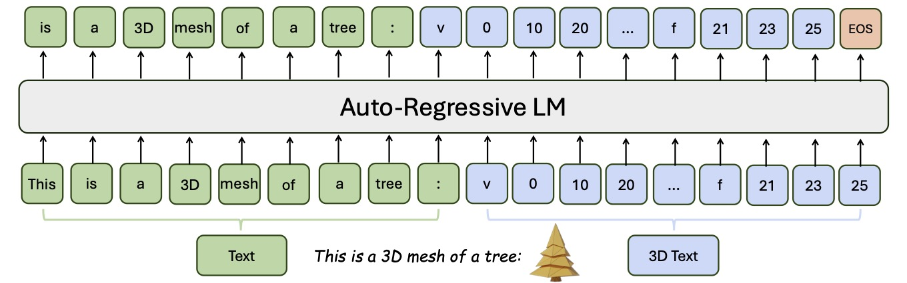

# LLaMA-Mesh: Unifying 3D Mesh Generation with Language Models

[**Paper**](https://arxiv.org/pdf/2411.09595) | [**Project Page**](https://research.nvidia.com/labs/toronto-ai/LLaMA-Mesh/)

Official implementation of ReconX: Reconstruct Any Scene from Sparse Views with Video Diffusion Model


[Zhengyi Wang](https://thuwzy.github.io/), [Jonathan Lorraine](https://www.jonlorraine.com/), [Yikai Wang](https://yikaiw.github.io/), [Hang Su](https://www.suhangss.me/), [Jun Zhu](https://ml.cs.tsinghua.edu.cn/~jun/index.shtml), [Sanja Fidler](https://www.cs.utoronto.ca/~fidler/), [Xiaohui Zeng](https://www.cs.utoronto.ca/~xiaohui/)

<p align="center"> All code and pre-trained weights will be released soon... 🏗️ 🚧 🔨</p>

Abstract: *This work explores expanding the capabilities of large language models (LLMs) pretrained on text to generate 3D meshes within a unified model. This offers key advantages of (1) leveraging spatial knowledge already embedded in LLMs, derived from textual sources like 3D tutorials, and (2) enabling conversational 3D generation and mesh understanding. A primary challenge is effectively tokenizing 3D mesh data into discrete tokens that LLMs can process seamlessly. To address this, we introduce LLaMA-Mesh, a novel approach that represents the vertex coordinates and face definitions of 3D meshes as plain text, allowing direct integration with LLMs without expanding the vocabulary. We construct a supervised fine-tuning (SFT) dataset enabling pretrained LLMs to (1) generate 3D meshes from text prompts, (2) produce interleaved text and 3D mesh outputs as required, and (3) understand and interpret 3D meshes. Our work is the first to demonstrate that LLMs can be fine-tuned to acquire complex spatial knowledge for 3D mesh generation in a text-based format, effectively unifying the 3D and text modalities. LLaMA-Mesh achieves mesh generation quality on par with models trained from scratch while maintaining strong text generation performance.*


https://github.com/user-attachments/assets/11291517-6309-453c-9e7d-087198a8bd87

## Method

Overview of our method. LLaMA-Mesh unifies text and 3D mesh in a uniform format by representing the numerical values of vertex coordinates and face definitions of a 3D mesh as plain text. Our model is trained using text and 3D interleaved data in an end-to-end manner. Therefore, our model can generate both text and 3D meshes in a unified model.
<p align="center">
    
</p>

## BibTeX

```bibtex
@misc{wang2024llamameshunifying3dmesh,
    title={LLaMA-Mesh: Unifying 3D Mesh Generation with Language Models}, 
    author={Zhengyi Wang and Jonathan Lorraine and Yikai Wang and Hang Su and Jun Zhu and Sanja Fidler and Xiaohui Zeng},
    year={2024},
    eprint={2411.09595},
    archivePrefix={arXiv},
    primaryClass={cs.LG},
    url={https://arxiv.org/abs/2411.09595}, 
} 
```
