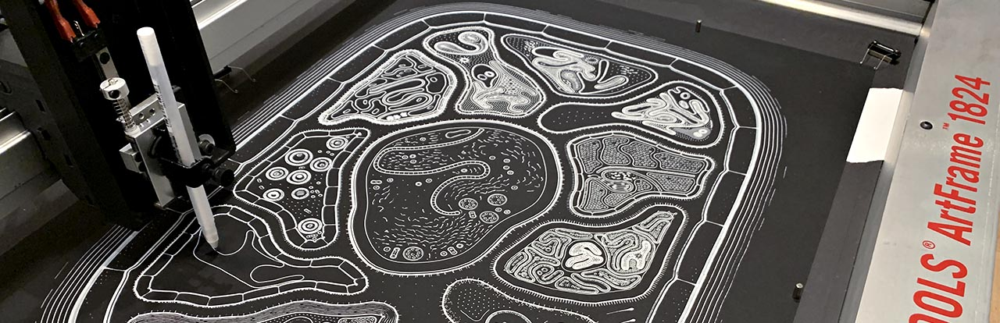

# p5.plotSvg

### A Plotter-Oriented SVG Exporter for p5.js



**p5.plotSvg** is a p5.js library for exporting SVG files tailored for pen plotting.<br /> 
Version 0.1.0, November 19, 2024<br />
By Golan Levin ([@golanlevin](https://github.com/golanlevin))<br />
[CMU School of Art](https://art.cmu.edu/)

### Key Links:

* [**Download p5.plotSvg.js**](lib/p5.plotSvg.js) from GitHub
* **npmjs.com**: [https://www.npmjs.com/package/p5.plotsvg](https://www.npmjs.com/package/p5.plotsvg)
* **unpkg.com**: [https://unpkg.com/p5.plotsvg@0.1.0/lib/p5.plotSvg.js](https://unpkg.com/p5.plotsvg@0.1.0/lib/p5.plotSvg.js)
* **cdn.jsdelivr.net**: [https://cdn.jsdelivr.net/npm/p5.plotsvg@latest/lib/p5.plotSvg.js](https://cdn.jsdelivr.net/npm/p5.plotsvg@latest/lib/p5.plotSvg.js)
* [**Documentation**](documentation.md)

### Contents:

* [About p5.plotSvg](#about-p5plotsvg)
* [Quickstart Installation](#quickstart-installation)
* [What the p5.plotSvg library *IS*](#what-the-p5plotsvg-library-is)
* [What the p5.plotSvg library *IS NOT*](#what-the-p5plotsvg-library-is-not)
* [Example Programs](#example-programs)
* [Usage Notes](#usage-notes)
* [Known Issues and Bugs](#known-issues-and-bugs)
* [Other Libraries and Related Work](#other-libraries-and-related-work)
* [Code of Conduct](#code-of-conduct)
* [License](#license)
* [Keywords](#keywords)
* [Todo](#todo)


---
## About p5.plotSvg

The p5.plotSvg library allows the [p5.js](https://p5js.org/) creative coding toolkit to generate SVG files specifically tailored for path-based vector output devices like the [AxiDraw pen-plotter](https://www.axidraw.com/). Note that p5.plotSvg is *not* a general-purpose library for importing, exporting, optimizing, or rendering SVG files in p5.js. The p5.plotSvg library is known to be compatible with [p5.js v.1.11.1](https://cdnjs.cloudflare.com/ajax/libs/p5.js/1.11.1/p5.js). 

p5.plotSvg was developed by [Golan Levin](https://art.cmu.edu/people/golan-levin/) in November 2024 as a resource for the CMU [Drawing with Machines](https://github.com/golanlevin/DrawingWithMachines) course. It was created with encouragement and generous support from [Bantam Tools](https://www.bantamtools.com/), makers of the world's finest pen-plotting instruments.


---
## Quickstart Installation

First, include `p5.plotSvg.js` in your project. You can do this by linking to an online copy of p5.plotSvg at [unpkg.com](https://unpkg.com/p5.plotsvg@0.1.0/lib/p5.plotSvg.js) or 
[cdn.jsdelivr.net](https://cdn.jsdelivr.net/npm/p5.plotsvg@latest/lib/p5.plotSvg.js) in your `index.html` file. Alternatively, you can include p5.plotSvg.js in your projects directly by downloading a local copy of it from [https://github.com/golanlevin/p5.plotSvg/blob/main/lib/p5.plotSvg.js](https://github.com/golanlevin/p5.plotSvg/blob/main/lib/p5.plotSvg.js).  Be sure to include a link to `p5.plotSvg.js` in your `index.html` file, like this: 

```
<!-- inside index.html -->
<script src="https://cdnjs.cloudflare.com/ajax/libs/p5.js/1.11.1/p5.js"></script>
<script src="https://unpkg.com/p5.plotsvg@0.1.0/lib/p5.plotSvg.js"></script>
<!-- Or https://cdn.jsdelivr.net/npm/p5.plotsvg@latest/lib/p5.plotSvg.js -->
```

Next, include the structure like the one below in your p5.js sketch. Press the 's' key to export an SVG file.

```
let bDoExportSvg = false; 
function keyPressed(){
  if (key == 's'){ 
    bDoExportSvg = true; 
  }
}

function draw(){
  background(255); 
  if (bDoExportSvg){
    beginRecordSVG(this, "myOutput.svg");
  }

  // Draw stuff here, such as:
  line(0,0, mouseX, mouseY); 

  if (bDoExportSvg){
    endRecordSVG();
    bDoExportSvg = false;
  }
}
```


---
## What the p5.plotSvg library *IS*: 

* The p5.plotSvg library allows you to export a p5.js drawing as an SVG file that consists exclusively of scalable vector paths, such as lines, arcs, shapes, polylines, and curves. I anticipate that you'll use the SVG files generated with this library to execute your drawings on a vector output device, such as a laser cutter or an AxiDraw/NextDraw pen-plotter.
* The p5.plotSvg library is intended for use with p5.js, and is modeled after the way in which [PDF exporting](https://processing.org/reference/libraries/pdf/index.html) and [SVG exporting](https://processing.org/reference/libraries/svg/index.html) are implemented in [Processing](https://processing.org/) (Java). To use p5.plotSvg, you are expected to manage the timing of a `beginRecordSVG()` and `endRecordSVG()` function.
* The p5.plotSvg library works by temporarily overriding the functionality of the p5.js drawing commands. At the precise moment when you export the SVG, p5 drawing commands like `line()` and `ellipse()` are redefined so that they not only draw onscreen, but *also* add their data to the SVG file. When the SVG is finished saving, the regular definitions of these functions are restored. 


---
## What the p5.plotSvg library *IS NOT*: 

* The p5.plotSvg library is not a general purpose p5-to-SVG exporter; it is intended for the *specific needs of plotter enthusiasts*. Large parts of both the p5 and SVG specifications have been purposefully omitted, even where they are common to both. To ensure plotter compatibility, SVG vector files exported with this library provide no support for graphics that include pixel-based images, transparency, filters, blend modes, gradients, clipping paths, animation, or (even) fills and stroke weights. You may be able to render such things onscreen with p5.js, but they will not appear in the SVG vector files made with this library.
* p5.plotSvg is not an SVG-based alternative renderer for the web browser. What you see onscreen is a regular p5 canvas. If you want an SVG runtime in the browser as a substitute for p5.js graphics, consider using Zenozeng's [p5.js-svg](https://github.com/zenozeng/p5.js-svg) library.
* This is not a library for loading, parsing, or displaying SVG files in p5.js. Zenozeng's [p5.js-svg](https://github.com/zenozeng/p5.js-svg) can do that as well.
* This is not a library for computational geometry in p5. For problems like computing offset curves or shape-shape intersections, consider using libraries like [Paper.js](http://paperjs.org/features/#svg-import-and-export) or [Shapely](https://shapely.readthedocs.io/en/stable/). 
* This is not a library for *optimizing* vector graphics for plotting or cutting. For example, no utilities are provided for *sorting* the order/direction of exported lines (using a TSP-like algorithm) to reduce your plotting time; for *merging* line segments with common endpoints; for *de-duplicating* multiple lines in the same location; or for *reordering* graphical elements from innermost to outermost for optimal laser-cutting. For such functionality, consider optimizing your SVGs with Antoine Beyeler's [vpype](https://vpype.readthedocs.io/en/latest/) for plotting, and/or [Deepnest](https://deepnest.io/) for laser cutting.
* This is not a library for *vectorizing* canvases rendered with p5.js. For example, no utilities are provided for hatching or dithering that would "convert" the pixels on the screen into vector strokes. The only marks that get exported to SVG are the ones you specify with p5.js drawing commands like `line()`, `ellipse()`, etc.


---
## Example Programs

These examples show how to generate plotter-friendly SVGs from p5.js using p5.plotSvg:

1. [**plotSvg_hello1**](examples/plotSvg_hello1/): Simplest possible demo; all art in `setup()` only. [@editor.p5js.org](https://editor.p5js.org/golan/sketches/AW8GI36fA) • [@openProcessing.org](https://openprocessing.org/sketch/2455362)
2. [**plotSvg_hello2**](examples/plotSvg_hello2/): Simple demo; uses `setup()` & `draw()` and a keypress. [@editor.p5js.org](https://editor.p5js.org/golan/sketches/JA-ty5j83) • [@openProcessing.org](https://openprocessing.org/sketch/2455390)
3. [**plotSvg_generative**](examples/plotSvg_generative/): Simple "generative artwork"; press button to export. [@editor.p5js.org](https://editor.p5js.org/golan/sketches/LRTXmDg2q) • [@openProcessing.org](https://openprocessing.org/sketch/2455399)
4. [**plotSvg_smorgasbord**](examples/plotSvg_smorgasbord/): Demonstration of all p5.js drawing primitives exporting to SVG. [@editor.p5js.org](https://editor.p5js.org/golan/sketches/QReF_9ss2) • [@openProcessing.org](https://openprocessing.org/sketch/2455426)


*Examples awaiting implementation (more soon!):*

* *plotSvg_animation_grab*: On a button press, one frame of animation is exported.
* *plotSvg_particle_paths*: Many frames are accreted into a single SVG image.
* *plotSvg_flipbook*: A number of frames are arranged onto a page.
* *plotSvg_hershey*: Displays [Hershey Font](https://en.wikipedia.org/wiki/Hershey_fonts) text using Lingdong Huang's [p5-hershey-js](https://github.com/LingDong-/p5-hershey-js)
* *plotSvg_simple_fill*: A trick for exporting hatched shapes is demonstrated. 

---
## Usage Notes

### Color

* SVGs produced with p5.plotSvg have a default stroke color, `black`. This can be altered with `setSvgDefaultStrokeColor()`, which takes valid CSS color strings (e.g., 'red', '#ff0000', 'rgb(255,0,0)').
* To create SVG paths with non-default colors, simply use the `stroke()` command as usual. Note, however, that any such strokes will have additional style information added to their SVG representation (e.g. `style="stroke:#ff0000;"`). This could lead to potentially large file sizes, depending on your design. To restore the default stroke color, you can use `stroke(getDefaultStrokeColor());`.
* If you use stroke colors, p5.plotSvg anticipates that you are using so to represent different *logical entities* — such as different color pens in a multi-pen plotter, different tools in a CNC machine, or different cutting settings in a laser cutter. For this reason, alpha (transparency) values are stripped out. I strongly recommend using just a small handful of colors, and selecting easy-to-remember [CSS color keyword names](https://www.w3.org/TR/SVG11/types.html#ColorKeywords) such as `'red'`, `'green'`, `'blue'`, etc. 
* This library only accepts p5 `stroke()` commands with the following types of arguments: CSS named colors [in the set of 147 official SVG colors](https://johndecember.com/html/spec/colorsvg.html), hex formatted color strings, or as RGB/gray colors whose values range from 0-255. The p5 `colorMode()` command is not supported by p5.plotSvg, and calls to `colorMode()` may produce unpredictable results in your SVG. 
* The p5.plotSvg library ignores p5.js `fill()` commands and does not export SVG shapes with filled colors.

### Graphics Transforms

The p5.plotSvg library offers two different ways of encoding graphics transformation operations (such as `rotate()`, `translate()`, `scale()`, `shearX()` and `shearY()`) into your SVG. These are selected with the following functions during `setup()`: 

* `setSvgFlattenTransforms (true)`: The current transformation matrix is encoded into each SVG element. This leads to potentially larger SVG files, but graphical elements will appear with *exactly* the same transformations as they do in the corresponding p5 sketch. 
* `setSvgFlattenTransforms (false)` (default): Graphics transforms are encoded into a hierarchy of SVG groups, each containing an atomic transform operation. This may produce smaller SVG files, depending on your design, but there is a possibility that different SVG rendering engines may accumulate the transforms with slightly different results.
* If no graphics transforms are used in a p5 sketch, none are encoded into the SVG file. 

### Numeric Precision

p5.plotSvg offers two convenience functions which control how many digits of decimal precision are exported to SVG files. These have a major impact on SVG file size: 

* `setSvgCoordinatePrecision()` - default is 4 digits of precision for path coordinates
* `setSvgTransformPrecision()` - default is 6 digits of precision for  matrix transform data. 


---
## Known Issues and Bugs: 

* As of p5.plotSvg v.0.1.0, non-default vertical `textAlign()` settings are not yet supported; only BASELINE currently works correctly.
* As of p5.plotSvg v.0.1.0, *multi-contour* shapes (made with `beginContour()` / [`endContour()`](https://p5js.org/reference/p5/endContour/) etc.) are not yet unsupported. For the time being, encode each contour in its own `beginShape()` / `endShape()` block instead. 
* As of p5.plotSvg v.0.1.0, there is a small discrepancy in the SVG output of polylines rendered with curveVertex(). Specifically, there is an error with the starting orientation of the first point of the polyline. 
* As of p5.plotSvg v.0.1.0, this library is not intended to be used in WEBGL mode. There is currently no support for converting 3D graphics to 2D, though this may be added later. 
* The [forthcoming p5.js vertex API](https://github.com/processing/p5.js/issues/6766), which is due to come out with p5.js v.2.0, will likely cause breaking changes to p5.plotSvg v.0.1.0.

---
## Other Libraries and Related Work

The following projects may be of interest to creative coders working with SVG files:

* [p5.js-svg](https://github.com/zenozeng/p5.js-svg) by Zenozeng allows for direct SVG rendering in p5.js sketches, offering an alternative SVG-based renderer for the web browser. It supports a wide range of SVG elements but also aims for full compatibility with p5.js drawing functions.
* [canvas2svg](https://github.com/gliffy/canvas2svg) by Gliffy provides a way to export HTML5 Canvas content to SVG using JavaScript. It works by implementing a virtual canvas that mimics the CanvasRenderingContext2D interface, capturing drawing commands as SVG elements.
* [p5-svg-test](https://github.com/runemadsen/p5-svg-test) by Rune Madsen is a simple test for SVG generation using p5.js. This repository provides a proof of concept for exporting p5.js graphics to SVG format but is not a fully-featured library.
* [Rune.js](https://runemadsen.github.io/rune.js/) by Rune Madsen is a JavaScript library for creative coding, similar to p5.js. While it is not strictly a p5.js SVG exporter, it includes capabilities for working with vector graphics, including SVG import/export.
* [vpype](https://vpype.readthedocs.io/en/latest/) by Antoine Beyeler is a command-line tool and Python library for preprocessing and optimizing vector graphics for plotting. It provides utilities for sorting paths, simplifying curves, and optimizing plotting jobs for pen plotters.
* [Paper.js](http://paperjs.org/features/#svg-import-and-export) by Jürg Lehni & Jonathan Puckey is a powerful open-source vector graphics scripting framework that runs on top of the HTML5 Canvas. It supports SVG import and export and offers a wide range of vector graphics manipulation features.
* [ln](https://github.com/fogleman/ln) by Michael Fogleman is a vector-based 3D renderer written in Go. It is used to produce 2D vector graphics depicting 3D scenes.
* [PEmbroider](https://github.com/CreativeInquiry/PEmbroider) by the Frank-Ratchye STUDIO for Creative Inquiry at Carnegie Mellon University is a library for computational embroidery using Processing (Java). It allows users to generate embroidery stitch paths from their Processing sketches, with support for various embroidery machine formats.
* [stitch.js](https://github.com/stitchables/stitch.js) by Stitchables is a JavaScript library for rendering SVG-based embroidery patterns. It allows users to convert drawings made with HTML5 Canvas or SVG paths into embroidery stitch paths.
* Bob Cook's [SVG Example](https://jsfiddle.net/bobcook/2p9tqzze/) provides an example demonstrating how to convert canvas-based drawings to SVG using a custom library in a jsFiddle example.

---
## Code of Conduct

The p5.plotSvg project adheres to a [Code of Conduct](CODE_OF_CONDUCT.md) adapted from the [Contributor Covenant](http://contributor-covenant.org), version 1.1.0. 

---
## License

p5.plotSvg is released under the [MIT License](LICENSE). 

--- 
## Keywords

Pen plotters, vector output, p5.js, SVG, #plotterTwitter, creative coding, generative art, drawing machines, JavaScript library, open-source software tools for the arts. 