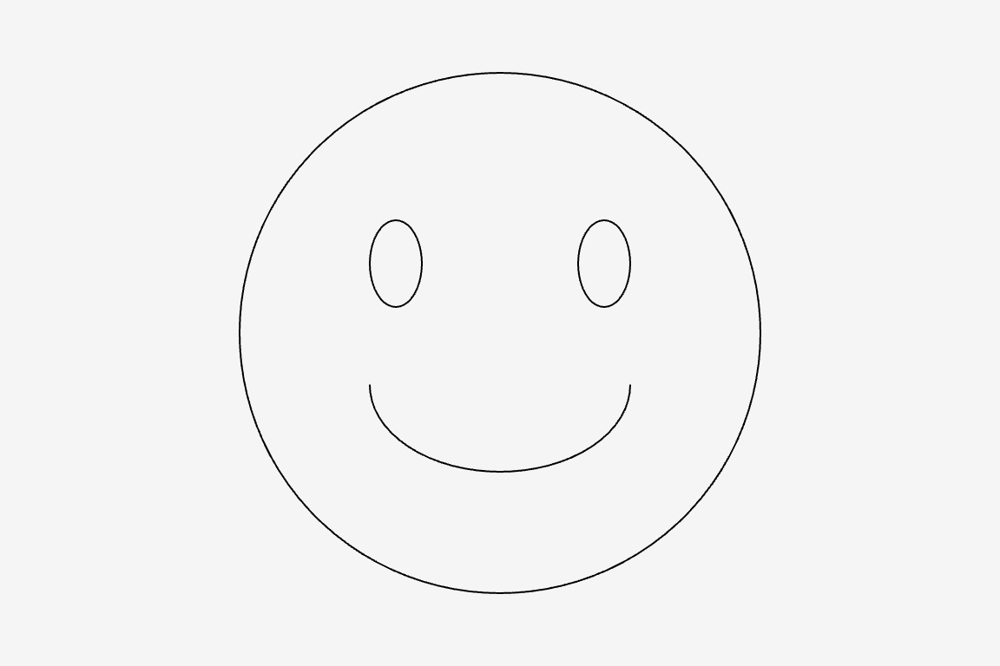

# plotSvg_hello1 Example

The `plotSvg_hello1` example shows the simplest possible use of the p5.plotSvg library. The SVG is exported at the conclusion of `setup()`; there is no interactivity or animation. 



Code: 

* At editor.p5js.org: [https://editor.p5js.org/golan/sketches/AW8GI36fA](https://editor.p5js.org/golan/sketches/AW8GI36fA)
* At openprocessing.org: [https://openprocessing.org/sketch/2455362](https://openprocessing.org/sketch/2455362)
* At GitHub: [sketch.js](https://raw.githubusercontent.com/golanlevin/p5.plotSvg/refs/heads/main/examples/plotSvg_hello1/sketch.js)

```
// https://github.com/golanlevin/p5.plotSvg (v.0.1.0)
// A Plotter-Oriented SVG Exporter for p5.js
// Golan Levin, November 2024
//
// Extremely simple demo of using p5.plotSvg to export SVG files.
// Requires https://unpkg.com/p5.plotsvg@0.1.0/lib/p5.plotSvg.js or
// https://cdn.jsdelivr.net/npm/p5.plotsvg@latest/lib/p5.plotSvg.js
// 
// Note 1: This sketch will save an SVG at the very moment when you run it. 
// Note 2: This sketch issues many warnings; this line quiets them:
p5.disableFriendlyErrors = true;

function setup() {
  createCanvas(576, 384); // 6"x4" at 96 dpi
  background(245); 
  noFill();

  beginRecordSVG(this, "plotSvg_hello1.svg");
  circle(width/2, height/2, 300); 
  ellipse(width/2-60, height/2-40, 30, 50);
  ellipse(width/2+60, height/2-40, 30, 50);
  arc(width/2, height/2+30, 150, 100, 0, PI);
  endRecordSVG();
}
```
