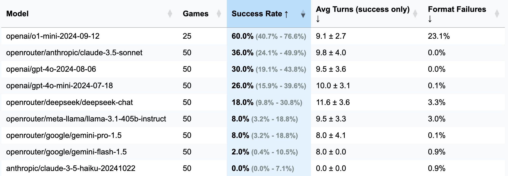

<h1 align="center">LLM Bulls and Cows Benchmark</h1>

A mini-framework for evaluating LLM performance on the [Bulls and Cows](https://en.wikipedia.org/wiki/Bulls_and_cows) number guessing game, supporting multiple providers through [LiteLLM](https://github.com/BerriAI/litellm).

> [!NOTE]
> TLDR: Bulls and Cows is a code-breaking game for two players. A player writes a 4-digit secret number. The digits must be all different (e.g., `1234`). Then another player (an LLM in this case) tries to guess the secret number (e.g., `1246`). For every guess the info of number of matches is returned. If the matching digits are in their right positions, they are "bulls" (two bulls in this example: `1` and `2`), if in different positions, they are "cows" (one cow, `4`). The correct solution requires Reasoning-to think of the next good guess-and In-Context memory-to learn from the past answers. It is proved that any 4-digit secret number can be solved within seven turns.

## Key Features

- ✅ **Multiple LLM Support**: Compatible with various providers through [LiteLLM](https://github.com/BerriAI/litellm); virtually, almost any endpoint could be used
- ✅ **Comprehensive Metrics**: Tracks success rates, format failures, and game efficiency (measured as a number of turns in games that ended successfully)
- ✅ **Interactive Visualization**: Generates [plots](./benchmark_results/4_digits/visualization.html) for performance analysis across runs, allowing comparisons between models and model providers
- ✅ **Configurable Parameters**: Customize game rules (3 or 4 repeatable/unique digits)
- ✅ **Rich Progress Bars**: Don't be bored while running the benchmark: all intermediate results for all concurrent games will be displayed, with live metric updates!


## Bulls and Cows Benchmark Results (4 digits w/o repetition)



<details>
<summary>... or as a Markdown table</summary>

| Model | Games | **Success Rate** | Avg Turns (success only) | Format Failures (Turns) |
|--------|-------|--------------|------------------------|----------------|
| openai/o1-mini-2024-09-12 | 25 | **60.0%** [40.7%; 76.6%] | 9.1±2.7 | 23.1% |
| openrouter/anthropic/claude-3.5-sonnet | 50 | **36.0%** [24.1%; 49.9%] | 9.8±4.0 | 0.0% |
| openai/gpt-4o-2024-08-06 | 50 | **30.0%** [19.1%; 43.8%] | 9.5±3.6 | 0.0% |
| openai/gpt-4o-mini-2024-07-18 | 50 | **26.0%** [15.9%; 39.6%] | 10.0±3.1 | 0.1% |
| openrouter/deepseek/deepseek-chat | 50 | **18.0%** [9.8%; 30.8%] | 11.6±3.6 | 3.3% |
| openrouter/meta-llama/llama-3.1-405b-instruct | 50 | **8.0%** [3.2%; 18.8%] | 9.5±3.3 | 3.0% |
| openrouter/google/gemini-pro-1.5 | 50 | **8.0%** [3.2%; 18.8%] | 8.0±4.1 | 0.1% |
| openrouter/google/gemini-flash-1.5 | 50 | **2.0%** [0.4%; 10.5%] | 8.0±0.0 | 0.9% |
| anthropic/claude-3-5-haiku-20241022 | 50 | **0.0%** [0.0%; 7.1%] | 0.0±0.0 | 0.9% |

</details>


> [!IMPORTANT]
> For most of the runs, 50 games were played (excl. o1-mini), thus, Confidence Intervals are wide. If you'd like to spend $100-200 in API credits on tests to achieve more accurate results and make CIs narrower, please feel free to reach me or open a PR with your results.

<details>
<summary><b>Some important details on testing</b></summary>

- All prompts and templates are conveniently collected in [one file](./src/prompts.py).
- The prompt specifies that the model can first reason and then provide a guess, which must be on a separate line and follow the format `GUESS: 1234` (defined in [prompts file](./src/prompts.py))
- Structured Outputs/JSON-mode are intentionally avoided for two reasons:
    1. Some studies (e.g., [Tam et al., 2024](https://arxiv.org/abs/2408.02442)) indicate a degradation in LLM quality in this mode.
    2. Not all APIs/frameworks support it equally well.
- Even small and cheap models handle response formatting well (e.g., Gemini Flash <1% Format Failures, although Google models tend to add a newline after a guess — `.strip()` was added to address this).
- Perhaps surprisingly, the best model, `o1-mini`, often forgets formatting rules and tries to add **bold emphasis** to the response. This behavior was deemed unacceptable and counted as an error and a wasted turn, as the instruction explicitly specifies the required formatting.
    - In most of the games, the model was able to reiterate on the formatting feedback and come up with an answer or a new guess.
- Prompts were not specifically optimized for any particular LLM, and I do not believe their creation process favors any specific model. For transparency, here is the prompt creation process:
    - Initially, Sonnet 3.5 (New) drafted them as part of developing the benchmark code.
    - The drafts were then revised by the same LLM based on my feedback.
    - I manually adjusted a small subset of prompts (including explicitly banning Markdown formatting in responses to counter `o1-mini`'s behaviour).
    - **No prompt optimization was performed to improve task-solving quality** (primarily due to the wide confidence intervals; hundreds of games are needed for reliable results).
- The benchmark's primary result considers the 4-digit version with numbers 0-9 without repetitions, as per the original [Bulls and Cows rules described on Wikipedia](https://en.wikipedia.org/wiki/Bulls_and_cows).
    - Due to budget constraints, a limit on the number of guesses was introduced:
        - 15 turns for the 4-digit version (more than double the optimal; it is proved that any secret number can be solved within seven turns).
        - 12 turns for the 3-digit version.
    - However, this can be changed in [the config file](./config/default_config.yaml).
- Some models tested via OpenRouter may have different quantization levels (fp8/bf16/fp16), so results of individual games may be slightly skewed. However, this is not expected to significantly impact overall quality and model rankings.
- For confidence interval estimation, the [Wilson score interval](https://en.wikipedia.org/wiki/Binomial_proportion_confidence_interval#Wilson_score_interval) is used. It is asymmetric relative to the obtained Success Rate; and:
    - It doesn't suffer from overshoot and zero-width interval issues that affect the normal interval.
    - It can be safely employed with small samples and skewed observations.


</details>

<hr/>

<details>
<summary>Approximate costs of running the benchmark with different LLMs</summary>

<hr/>

**3 Digits (Debug Version: fewer turns, shorter reasoning):**

`openai/gpt-4o-mini-2024-07-18`: 283k cached + 221k uncached + 68k output = $0.1 (**recommended for debug**)

`openai/gpt-4o-2024-08-06`: 174k cached + 241k uncached + 56k output = $1.38

`openai/gpt-4-turbo-2024-04-09`: UNKNOWN = $6.65

`openai/o1-mini-2024-09-12`: 0k cached + 335k uncached + **1345k output** = **$17.15**

`anthropic/claude-3-haiku-20240307`: 492k input + 46k output = $0.18

<hr/>

**4 Digits (Main Version):**

`openai/gpt-4o-mini-2024-07-18`: 451k cached + 429k uncached + 100k output = $0.15

`openai/gpt-4o-2024-08-06`: 553k cached + 287k uncached + 87k = $2.29

(25 games) `openai/o1-mini-2024-09-12`: 0k cached + 584k uncached + **1815k output** = **$23.54**

`anthropic/claude-3-5-haiku-20241022`: 969k input + 90k output = $1.42

`openrouter/anthropic/claude-3.5-sonnet` (new): UNKNOWN = $5.2

<hr/>

</details>

### Background:
This framework came into existence thanks to a curious comment from a subscriber of my [Telegram channel](t.me/seeallochnaya). They claimed to have tested various LLMs in a game of [Bulls and Cows](https://en.wikipedia.org/wiki/Bulls_and_cows), concluding that none could solve it and, therefore, LLMs can’t reason. Intrigued, I asked for examples of these so-called "failures," only to be told the chats were deleted. Convenient. Later, they mentioned trying o1-preview, which apparently did solve it—in about 20 moves, far from the 7 moves considered optimal.

Meanwhile, I had been looking for an excuse to experiment with [OpenHands](https://github.com/All-Hands-AI/OpenHands), and what better way than to challenge Copilot to spin up an LLM benchmark from scratch? After three evenings of half-hearted effort (I was playing [STALKER 2](https://store.steampowered.com/app/1643320/STALKER_2_Heart_of_Chornobyl/) simultaneously), this benchmark was born—a product of equal parts apathy and the desire to prove a point no one asked for. Enjoy!

## Quick Start

1. Install dependencies and set up pre-commit hooks:
```bash
pip install -r requirements.txt
pre-commit install
```
2. (Optional) To understand the logic, read all the prompts [here](./src/prompts.py).

3. Configure your LLM provider's API keys as environment variables (either direclty in your terminal or using [.env](./.env) file). I recommend using either OpenAI or Anthropic keys, and [OpenRouter](https://openrouter.ai/models) for anything else.

4. Adjust `config/default_config.yaml` with your desired model and game settings. Use `run_id` to store different runs in separate folders — otherwise result folders will be named with timestamps.
The main fields are: `model`, `target_length` (how many digits in the secret number), `num_concurrent_games` (to get around laughable TPS API limits. E.g., for Anthropic Tier 2 I do not recommend setting this value above `2`, while OpenAI easily could support `8`-`10` concurrent games).

5. Run the benchmark and visualize results of all runs:
```bash
python run_benchmark.py
python scripts/visualize_results.py
```

Results will be available in [HTML](./benchmark_results/4_digits/visualization.html) (with additional plots) and [Markdown](./benchmark_results/4_digits/results_table.md).


## Metrics & Analysis

The benchmark evaluates LLMs on three key aspects:
- **Success Rate**: Ability to find the correct number through several interactions with the game
- **Format Compliance**: How often a model fail to follow a simple instruction on Answer Formatting
- **Efficiency**: Average number of turns needed to win a game

Results are saved with full game histories (including conversation logs, e.g., [here](./benchmark_results/4_digits/benchmark_o1mini-4d/full_conversations.json)) and configurations for detailed analysis.

## Development

The project uses Black (line length: 100) and isort for code formatting. Pre-commit hooks ensure code quality by checking:
- Code formatting
- File integrity
- YAML validation

Run manual checks with:
```bash
pre-commit run --all-files
```

Run tests (yes, there are [tests](./tests/) on game logic, answer parsing & validation):
```bash
python -m pytest . -v
```
