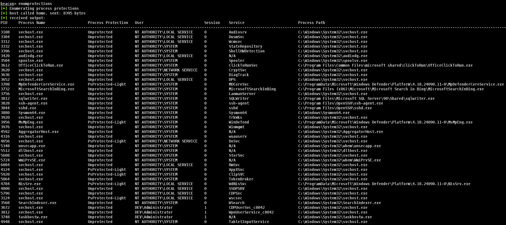
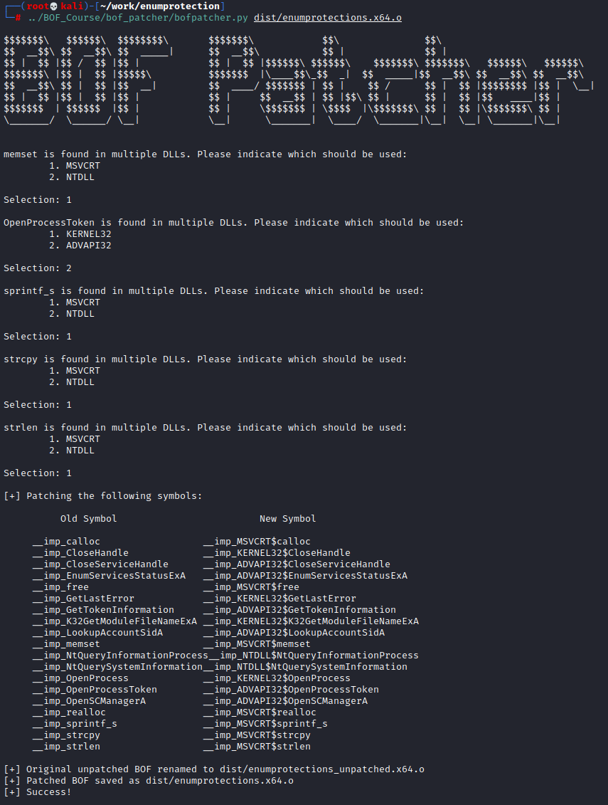

# Enumprotections BOF
This BOF can be used to enumerate system processes and identify the protection level of each one. Additional information, like service relation, user, session, and path, are also returned. This information in combination can be used to identify good candidates to explore for SYSTEM level DLL hijacks. Ideal processes will be:

1. Unprotected
2. Associated with a service, thus being start/stoppable
3. 3rd party software. Microsoft is good at ID'ing hijacks of Microsoft components. 

# Usage

# Compilation
This tool was written without the use of normal BOF API declarations (e.g. a bofdefs.h file). As outlined in this [blog post](https://blog.cybershenanigans.space/posts/writing-bofs-without-dfr/) by [Matt Ehrnschwender](https://x.com/M_alphaaa), it's possible to use objcopy to patch the proper symbols of format `DLL$API` into the BOF post-compilation. The Makefile for this tool calls objcopy, passing an imports_enumprotectionsXX.txt file containing the proper symbol replacements to the tool which then renders the BOF usable. 

I have written a tool called BOFPatcher that automates this process. This allows users to write BOFs as normal C without worrying about cumbersome API declarations:

This tool is available to those who purchase my [BOF Development and Tradecraft](https://training.zeropointsecurity.co.uk/courses/bof-dev-and-tradecraft) course. 

# Credits
Thanks to [hasherezade](https://x.com/hasherezade) for [this snippet](https://gist.github.com/hasherezade/c3f82fb3099fb5d1afd84c9e8831af1e) as well as [Gabriel Landau](https://x.com/GabrielLandau) for [NoFault](https://github.com/gabriellandau/PPLFault/blob/c835f98faf596ab9f2ceb362b30a79a1b4808888/NoFault/NoFault.cpp).

Also shoutout to the many talented individuals whose work was scraped by ChatGPT and used by me.