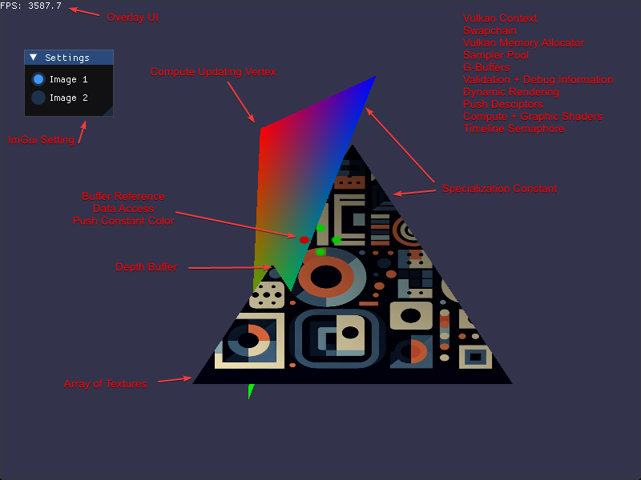

# Modern Vulkan Application Sample


This repository demonstrates contemporary Vulkan API usage patterns in a single, comprehensive file. The example showcases Vulkan 1.3 core functionality along with maintenance 6 features, implemented with current best practices.

> **Note**: This is not intended as a tutorial, but rather as a reference implementation demonstrating modern Vulkan development techniques.

## Features Demonstrated

This sample application implements numerous Vulkan concepts and patterns:

### Core Vulkan Setup
* Vulkan Instance creation and management
* Validation layers with configurable settings
* Debug callback implementation
* Physical device selection and logical device creation
* Queue management (graphics queue focus)
* Extension and feature handling with graceful fallbacks

### Modern Rendering Techniques
* Dynamic rendering
* Swapchain management
* Frame synchronization (timeline semaphore)
* Frame resource handling
* Color and depth buffer implementation
* Buffer references
* Specialized constants

### Memory and Resource Management
* Vulkan Memory Allocator (VMA) integration
* Descriptor management (Sets, Layouts, Pools)
* Push descriptors and constants
* SSBO (Shader Storage Buffer Objects) and UBO (Uniform Buffer Objects)
* Image and sampler handling
* Buffer and image barrier management

### Pipeline Implementation
* Graphics pipeline with vertex/fragment shaders
* Compute pipeline and shader integration
* Buffer updates (UBO)

### Third-Party Integration
* Volk for Vulkan function pointer loading
* Dear ImGui for user interface
* GLFW for window management and input handling
* GLM for mathematics operations

### Shader Compilation
* GLSL to SPIR-V compilation
* [Slang](https://github.com/shader-slang/slang) for shader compilation

## Application Overview

When running the application, you'll see:
* A rotating, colored triangle (vertices updated via compute shader)
* A textured triangle
* Screen positioned colored dots
* Triangle intersection demonstration
* Interactive UI elements

## Technical Implementation

### Initialization Flow
1. GLFW initialization provides the window and required Vulkan extensions
1. Vulkan context creation (Instance, Physical/Logical Devices, Queues)
1. Surface creation through GLFW
1. Swapchain initialization
1. VMA allocator setup
1. Resource creation:
   - Command buffers for setup operations
   - Descriptor layouts and sets
   - Pipeline configurations
   - Buffer allocation (SSBO for geometry, UBO for per-frame data)

### Frame Rendering Pipeline
1. Frame synchronization handling
1. Swapchain image acquisition
1. Command buffer recording initiation
1. Compute shader execution
1. Dynamic rendering pass
1. Triangle rendering with descriptor binding and data updates
1. UI rendering
1. Command submission with semaphore synchronization
1. Frame presentation
1. Frame resource cycling

## Prerequisites
- Understanding of C++ programming
- Basic familiarity with graphics programming concepts
- Basic knowledge of Vulkan fundamentals

## Building and Running

```
# Clone the repository
git clone https://github.com/nvpro-samples/vk_minimal_latest
cd vk_minimal_latest

# Configure and build
cmake -S . -B build
cmake --build build --config Release

# Running
build\Release\vk_minimal_latest.exe
```

## Dependencies

Besides [Vulkan SDK](https://vulkan.lunarg.com/sdk/home), all the following dependencies will be fetch when configuring CMake.

- GLFW
- GLM
- Dear ImGui
- Volk
- VMA (Vulkan Memory Allocator)

Note: 
 - The Vulkan SDK should be installed and the `VULKAN_SDK` environment variable set.
 - Using Vulkan SDK 1.3.296 and up, Slang will be the default shader language, but 
   you can change it to GLSL by setting the `USE_SLANG` CMake option to `OFF`.

## License
Apache-2.0

## Miscellanea

### Timeline Semaphore

With N frames in flight, you typically want to ensure that you're not overwriting resources that might still be in use by the GPU from N frames ago. 

Let's say we're rendering frames with 3 frames in flight:


```
Initial value: 2

Frame 0:
- wait(0)   // Passes because 2 > 0
- Submit work
- signal(3)  // Will happen when GPU completes

Frame 1:
- wait(1)   // Passes because 2 > 1
- Submit work
- signal(4)  

Frame 2:
- wait(2)   // Passes because 2 >= 2
- Submit work
- signal(5)

Frame 3:
- wait(3)   // NOW this blocks until Frame 0 completes and signals 3
- Submit work
- signal(6)
```

The pattern is:

1. For frame N:
   - wait(N)
   - Submit work
   - signal(N + numFramesInFlight)
