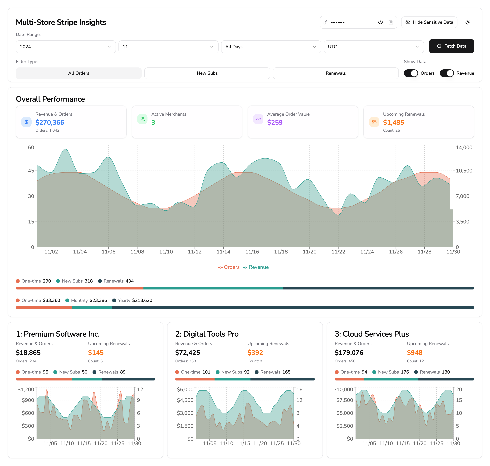

# Stripe Multi-Account Dashboard | Stripe 多商户看板

[English](#english) | [中文](#chinese)



## English

A comprehensive dashboard for managing and analyzing payment data across multiple Stripe accounts. This project provides intuitive data visualization interfaces to help businesses and developers monitor their payment operations and revenue trends across different Stripe accounts.

### Features

- Unified management and display of multiple Stripe account data
- Date-based transaction data filtering
- Key metrics display (order count, revenue, etc.)
- Distinction between one-time payments and subscriptions
- Light/Dark theme support
- Data visualization with charts
- Password protection for data access

### Tech Stack

- Next.js 14
- TypeScript
- Tailwind CSS
- Recharts
- Stripe API
- shadcn/ui

### Environment Setup

Create a `.env` file in the root directory with the following variables:

```bash
# Access password for data protection
STRIPE_VIEWER_PASSWORD=your_password_here

# Stripe API Keys (multiple merchants)
STRIPE_SECRET_KEY_1=sk_live_xxxxx
STRIPE_SECRET_KEY_2=sk_live_xxxxx
STRIPE_SECRET_KEY_3=sk_live_xxxxx
# ... add more Stripe Secret Keys as needed
```

### Deployment

The project supports multiple deployment methods:

> ⚠️ **Timezone Note**: Default timezone is set to Asia/Shanghai. If you need a different timezone, modify `TZ` in Dockerfile or docker-compose.yml. Currently there is a known timezone bug in production environment - manual timezone configuration is required.
> 
> 时区说明：默认时区设置为 Asia/Shanghai，如需修改请在 Dockerfile 或 docker-compose.yml 中设置 TZ 环境变量。目前生产环境中存在已知的时区 bug - 需要手动配置时区。

1. **Local Development:**

   ```bash
   npm install
   npm run dev
   ```

2. **Docker Deployment:**
   The project includes Dockerfile and docker-compose.yml, configured with Traefik reverse proxy and automatic HTTPS certification.

## Chinese

这是一个多商户 Stripe 支付数据分析看板项目，旨在帮助企业或开发者统一管理和分析多个 Stripe 账户的支付数据。项目提供直观的数据可视化界面，方便监控业务情况和收入趋势。

### 功能特性

- 多个 Stripe 账户数据的统一管理和展示
- 支持按日期查看交易数据
- 展示订单数量、收入等关键指标
- 区分一次性支付和订阅支付
- 支持明暗主题切换
- 数据可视化展示（图表等）
- 数据访问密码保护

### 技术栈

- Next.js 14
- TypeScript
- Tailwind CSS
- Recharts (图表库)
- Stripe API
- shadcn/ui (UI组件库)

### 环境变量配置

在项目根目录创建 `.env` 文件，配置以下环境变量：

```bash
# 访问密码，用于保护数据访问
STRIPE_VIEWER_PASSWORD=your_password_here

# Stripe API Keys (可配置多个商户)
STRIPE_SECRET_KEY_1=sk_live_xxxxx
STRIPE_SECRET_KEY_2=sk_live_xxxxx
STRIPE_SECRET_KEY_3=sk_live_xxxxx
# ... 可以继续添加更多商户的 Stripe Secret Key
```

### 部署方式

项目支持多种部署方式：

1. **本地开发：**

   ```bash
   npm install
   npm run dev
   ```

2. **Docker 部署：**
   项目包含了 Dockerfile 和 docker-compose.yml，可以直接使用 Docker 部署，已配置好 Traefik 反向代理和 HTTPS 证书自动申请。

## License

MIT License