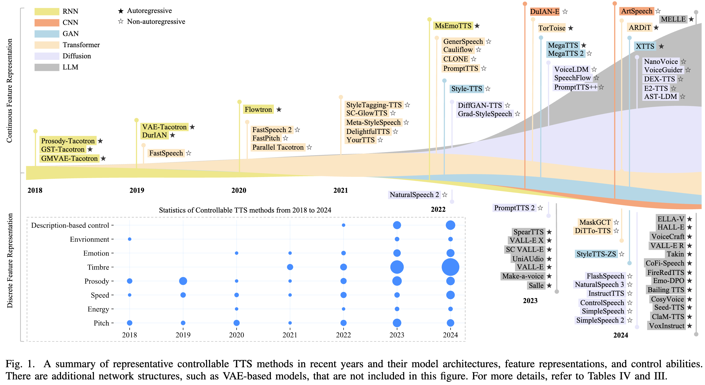
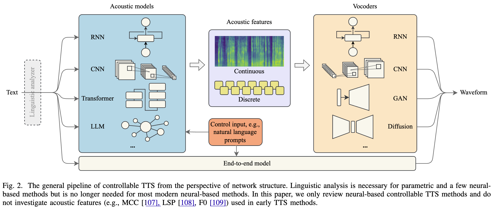
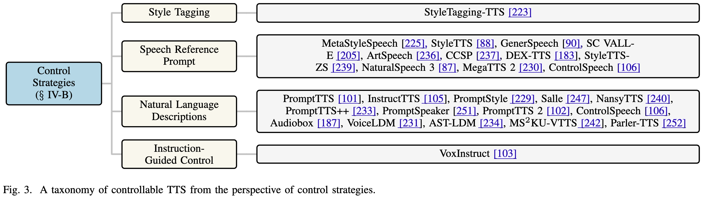

# Awesome Controllabe Speech Synthesis

This is an evolving repo for the paper [Towards Controllable Speech Synthesis in the Era of Large Language Models: A Survey](https://arxiv.org/abs/2412.06602).





## 🚀 Non-autoregressive Controllable TTS

|Method|ZS|Pit.|Ene.|Spe.|Pro.|Tim.|Emo.|Env.|Des.|Acoustic<br>Model|Vocoder|Acoustic<br>Feature|Release<br>Time|
|:---:|:---:|:---:|:---:|:---:|:---:|:---:|:---:|:---:|:---:|:---:|:---:|:---:|:---:|
|[FastSpeech](https://proceedings.neurips.cc/paper_files/paper/2019/hash/f63f65b503e22cb970527f23c9ad7db1-Abstract.html)||||✓|✓|||||Transformer|WaveGlow|MelS|2019.05|
|[DWAPI](https://ieeexplore.ieee.org/abstract/document/9072171)||✓|||✓||✓|||DNN|Straight|MelS + F0 + Intensity|2020.04|
|[FastSpeech 2](https://arxiv.org/abs/2006.04558)||✓|✓|✓|✓|||||Transformer|Parallel WaveGAN|MelS|2020.06|
|[FastPitch](https://ieeexplore.ieee.org/abstract/document/9413889)||✓|||✓|||||Transformer|WaveGlow|MelS|2020.06|
|[Parallel Tacotron](https://ieeexplore.ieee.org/abstract/document/9414718)|||||✓|||||Transformer + CNN|WaveRNN|MelS|2020.10|
|[StyleTagging-TTS](https://arxiv.org/abs/2104.00436)|✓|||||✓|✓|||Transformer + CNN|HiFi-GAN|MelS|2021.04|
|[SC-GlowTTS](https://arxiv.org/abs/2104.05557)|✓|||||✓||||Transformer + Conv|HiFi-GAN|MelS|2021.06|
|[Meta-StyleSpeech](https://proceedings.mlr.press/v139/min21b.html)|✓|||||✓||||Transformer|MelGAN|MelS|2021.06|
|[DelightfulTTS](https://arxiv.org/abs/2110.12612)||✓||✓|✓|||||Transformer + CNN|HiFiNet|MelS|2021.11|
|[YourTTS](https://proceedings.mlr.press/v162/casanova22a.html)|✓|||||✓||||Transformer|HiFi-GAN|LinS|2021.12|
|[DiffGAN-TTS](https://arxiv.org/abs/2201.11972)||✓||✓|✓|||||Diffusion + GAN|HiFi-GAN|MelS|2022.01|
|[StyleTTS](https://arxiv.org/abs/2205.15439)|✓|||||✓||||CNN + RNN + GAN|HiFi-GAN|MelS|2022.05|
|[GenerSpeech](https://proceedings.neurips.cc/paper_files/paper/2022/hash/4730d10b22261faa9a95ebf7497bc556-Abstract-Conference.html)|✓|||||✓||||Transformer + Flow-based|HiFi-GAN|MelS|2022.05|
|[NaturalSpeech 2](https://arxiv.org/abs/2304.09116)|✓|||||✓||||Diffusion|Codec Decoder|Token|2022.05|
|[Cauliflow](https://arxiv.org/abs/2206.14165)||||✓|✓|||||BERT + Flow|UP WaveNet|MelS|2022.06|
|[CLONE](https://arxiv.org/abs/2207.06088)||✓||✓|✓|||||Transformer + CNN|WaveNet|MelS + LinS|2022.07|
|[PromptTTS](https://ieeexplore.ieee.org/abstract/document/10096285)||✓|✓|✓||✓|✓||✓|Transformer|HiFi-GAN|MelS|2022.11|
|[Grad-StyleSpeech](https://ieeexplore.ieee.org/abstract/document/10095515)|✓|||||✓||||Score-based Diffusion|HiFi-GAN|MelS|2022.11|
|[PromptStyle](https://arxiv.org/abs/2305.19522)|✓|✓|||✓|✓|✓||✓|VITS|HiFi-GAN|MelS|2023.05|
|[StyleTTS 2](https://proceedings.neurips.cc/paper_files/paper/2023/hash/3eaad2a0b62b5ed7a2e66c2188bb1449-Abstract-Conference.html)|✓||||✓|✓|✓|||Diffusion + GAN|HifiGAN / iSTFTNet|MelS|2023.06|
|[VoiceBox](https://proceedings.neurips.cc/paper_files/paper/2023/hash/2d8911db9ecedf866015091b28946e15-Abstract-Conference.html)|✓|||||✓||||Flow Matching Diffusion|HiFi-GAN|MelS|2023.06|
|[MegaTTS 2](https://openreview.net/forum?id=mvMI3N4AvD)|✓||||✓|✓||||Diffusion + GAN|HiFi-GAN|MelS|2023.07|
|[PromptTTS 2](https://arxiv.org/abs/2309.02285)||✓|✓|✓||✓|||✓|Diffusion|Codec Decoder|Token|2023.09|
|[VoiceLDM](https://ieeexplore.ieee.org/abstract/document/10448268)||✓|||✓|✓|✓|✓|✓|Diffusion|HiFi-GAN|MelS|2023.09|
|[DuIAN-E](https://arxiv.org/abs/2309.12792)||✓||✓|✓|||||CNN + RNN|HiFi-GAN|MelS|2023.09|
|[PromptTTS++](https://ieeexplore.ieee.org/abstract/document/10448173)||✓||✓|✓|✓|✓||✓|Transformer + Diffusion|BigVGAN|MelS|2023.09|
|[SpeechFlow](https://arxiv.org/abs/2310.16338)|✓|||||✓||||Flow Matching Diffusion|HiFi-GAN|MelS|2023.10|
|[P-Flow](https://proceedings.neurips.cc/paper_files/paper/2023/hash/eb0965da1d2cb3fbbbb8dbbad5fa0bfc-Abstract-Conference.html)|✓|||||✓||||Flow Matching|HiFi-GAN|MelS|2023.10|
|[E3 TTS](https://ieeexplore.ieee.org/abstract/document/10389766)|✓|||||✓||||Diffusion|/|Waveform|2023.11|
|[HierSpeech++](https://arxiv.org/abs/2311.12454)|✓|||||✓||||Hierarchical Conditional VAE|BigVGAN|MelS|2023.11|
|[Audiobox](https://arxiv.org/abs/2312.15821)|✓|✓||✓|✓|✓||✓|✓|Flow Matching|EnCodec|MelS|2023.12|
|[FlashSpeech](https://dl.acm.org/doi/abs/10.1145/3664647.3681044)|✓|||||✓||||Latent Consistency Model|EnCodec|Token|2024.04|
|[NaturalSpeech 3](https://arxiv.org/abs/2403.03100)|✓|||✓|✓|✓||||Diffusion|EnCodec|Token|2024.04|
|[InstructTTS](https://ieeexplore.ieee.org/abstract/document/10534832)||✓||✓|✓|✓|✓||✓|Transformer + Diffusion|HiFi-GAN|Token|2024.05|
|[ControlSpeech](https://arxiv.org/abs/2406.01205)|✓|✓|✓|✓|✓|✓|✓||✓|Transformer + Diffusion|FACodec Decoder|Token|2024.06|
|[AST-LDM](https://arxiv.org/abs/2406.12688)||||||✓||✓|✓|Diffusion|HiFi-GAN|MelS|2024.06|
|[SimpleSpeech](https://arxiv.org/abs/2406.02328)|✓|||||✓||||Transformer Diffusion|SQ Decoder|Token|2024.06|
|[DiTTo-TTS](https://arxiv.org/abs/2406.11427)|✓|||✓||✓||||DiT|BigVGAN|Token|2024.06|
|[E2 TTS](https://arxiv.org/abs/2406.18009)|✓|||||✓||||Flow Matching Transformer|BigVGAN|MelS|2024.06|
|[MobileSpeech](https://arxiv.org/abs/2402.09378)|✓|||||✓||||ConFormer Decoder|Vocos|Token|2024.06|
|[DEX-TTS](https://arxiv.org/abs/2406.19135)|✓|||||✓||||Diffusion|HiFi-GAN|MelS|2024.06|
|[ArtSpeech](https://dl.acm.org/doi/abs/10.1145/3664647.3681097)|✓|||||✓||||RNN + CNN|HiFI-GAN|MelS|2024.07|
|[CCSP](https://dl.acm.org/doi/abs/10.1145/3664647.3681348)|✓|||||✓||||Diffusion|Codec Decoder|Token|2024.07|
|[SimpleSpeech 2](https://arxiv.org/abs/2408.13893)|✓|||✓||✓||||Flow-based Transformer Diffusion|SQ Decoder|Token|2024.08|
|[E1 TTS](https://arxiv.org/abs/2409.09351)|✓|||||✓||||DiT|BigVGAN|Token|2024.09|
|[VoiceGuider](https://arxiv.org/abs/2409.15759)|✓|||||✓||||Diffusion|BigVGAN|MelS|2024.09|
|[StyleTTS-ZS](https://arxiv.org/abs/2409.10058)|✓|||||✓||||Diffusion + GAN|HifiGAN / iSTFTNet|Token|2024.09|
|[NansyTTS](https://arxiv.org/abs/2409.17452)|✓|✓||✓|✓|✓|||✓|Transformer|NANSY++|MelS|2024.09|
|[NanoVoice](https://arxiv.org/abs/2409.15760)|✓|||||✓||||Diffusion|BigVGAN|MelS|2024.09|
|[MS$^{2}$KU-VTTS](https://arxiv.org/abs/2410.14101)||||||||✓|✓|Diffusion|BigvGAN|MelS|2024.10|
|[MaskGCT](https://arxiv.org/abs/2409.00750)|✓|||✓||✓||||Masked Generative Transformers|DAC + Vocos|Token|2024.10|

*Abbreviations*: Z(ero-)S(hot), Pit(ch), Ene(rgy)=Volume=Loudness, Spe(ed)=Duration, Pro(sody), Tim(bre), Emo(tion), Env(ironment), Des(cription). Timbre involves gender and age. MelS and LinS represent Mel Spectrogram and Linear Spectrogram respectively.

## 🎞️ Autoregressive Controllable TTS

|Method|ZS|Pit.|Ene.|Spe.|Pro.|Tim.|Emo.|Env.|Des.|Acoustic<br>Model|Vocoder|Acoustic<br>Feature|Release<br>Time|
|:---:|:---:|:---:|:---:|:---:|:---:|:---:|:---:|:---:|:---:|:---:|:---:|:---:|:---:|
|[Prosody-Tacotron](https://proceedings.mlr.press/v80/skerry-ryan18a.html)||✓|||✓|||||RNN|WaveNet|MelS|2018.03|
|[GST-Tacotron](https://ieeexplore.ieee.org/abstract/document/8639682)||✓|||✓|||||CNN + RNN|Griffin-Lim|LinS|2018.03|
|[GMVAE-Tacotron](https://arxiv.org/abs/1810.07217)||✓||✓|✓|||✓||CNN + RNN|WaveRNN|MelS|2018.12|
|[VAE-Tacotron](https://ieeexplore.ieee.org/abstract/document/8683623)||✓||✓|✓|||||CNN + RNN|WaveNet|MelS|2019.02|
|[DurIAN](https://arxiv.org/abs/1909.01700)||✓||✓|✓|||||CNN + RNN|MB-WaveRNN|MelS|2019.09|
|[Flowtron](https://arxiv.org/abs/2005.05957)||✓||✓|✓|||||CNN + RNN|WaveGlow|MelS|2020.07|
|[MsEmoTTS](https://ieeexplore.ieee.org/abstract/document/9693186)||✓|||✓||✓|||CNN + RNN|WaveRNN|MelS|2022.01|
|[VALL-E](https://arxiv.org/abs/2301.02111)|✓|||||✓||||LLM|EnCodec|Token|2023.01|
|[SpearTTS](https://direct.mit.edu/tacl/article/doi/10.1162/tacl_a_00618/118854)|✓|||||✓||||LLM|SoundStream|Token|2023.02|
|[VALL-E X](https://arxiv.org/abs/2303.03926)|✓|||||✓||||LLM|EnCodec|Token|2023.03|
|[Make-a-voice](https://arxiv.org/abs/2305.19269)|✓|||||✓||||LLM|BigVGAN|Token|2023.05|
|[TorToise](https://arxiv.org/abs/2305.07243)||||||✓||||Transformer + DDPM|Univnet|MelS|2023.05|
|[MegaTTS](https://arxiv.org/abs/2306.03509)|✓|||||✓||||LLM + GAN|HiFi-GAN|MelS|2023.06|
|[SC VALL-E](https://arxiv.org/abs/2307.10550)|✓|✓||✓|✓|✓|✓|||LLM|EnCodec|Token|2023.07|
|[Salle](https://ieeexplore.ieee.org/abstract/document/10445879)||✓|✓|✓|✓|✓|✓||✓|LLM|Codec Decoder|Token|2023.08|
|[UniAudio](https://arxiv.org/abs/2310.00704)|✓|✓||✓|✓|✓|||✓|LLM|EnCodec|Token|2023.10|
|[ELLA-V](https://arxiv.org/abs/2401.07333)|✓|||||✓||||LLM|EnCodec|Token|2024.01|
|[BaseTTS](https://arxiv.org/abs/2402.08093)|✓|||||✓||||LLM|UnivNet|Token|2024.02|
|[ClaM-TTS](https://arxiv.org/abs/2404.02781)|✓|||||✓||||LLM|BigVGAN|MelS+Token|2024.04|
|[RALL-E](https://arxiv.org/abs/2404.03204)|✓|||||✓||||LLM|SoundStream|Token|2024.05|
|[ARDiT](https://arxiv.org/abs/2406.05551)|✓|||✓||✓||||Decoder-only Diffusion Transformer|BigVGAN|MelS|2024.06|
|[VALL-E R](https://arxiv.org/abs/2406.07855)|✓|||||✓||||LLM|Vocos|Token|2024.06|
|[VALL-E 2](https://arxiv.org/abs/2406.05370)|✓|||||✓||||LLM|Vocos|Token|2024.06|
|[Seed-TTS](https://arxiv.org/abs/2406.02430)|✓|||||✓|✓|||LLM + Diffusion Transformer|/|Token|2024.06|
|[VoiceCraft](https://arxiv.org/abs/2403.16973)|✓|||||✓||||LLM|HiFi-GAN|Token|2024.06|
|[XTTS](https://arxiv.org/abs/2406.04904)|✓|||||✓||||LLM + GAN|HiFi-GAN|MelS+Token|2024.06|
|[CosyVoice](https://arxiv.org/abs/2407.05407)|✓|✓||✓|✓|✓|✓||✓|LLM + Conditional Flow Matching|HiFi-GAN|Token|2024.07|
|[MELLE](https://arxiv.org/abs/2407.08551)|✓|||||✓||||LLM|HiFi-GAN|MelS|2024.07|
|[Bailing TTS](https://arxiv.org/abs/2408.00284)|✓|||||✓||||LLM + Diffusion Transformer|/|Token|2024.08|
|[VoxInstruct](https://dl.acm.org/doi/abs/10.1145/3664647.3681680)|✓|✓|✓|✓|✓|✓|✓||✓|LLM|Vocos|Token|2024.08|
|[Emo-DPO](https://arxiv.org/abs/2409.10157)|||||||✓||✓|LLM|HiFi-GAN|Token|2024.09|
|[FireRedTTS](https://arxiv.org/abs/2409.03283)|✓||||✓|✓||||LLM + Conditional Flow Matching|BigVGAN-v2|Token|2024.09|
|[CoFi-Speech](https://arxiv.org/abs/2409.11630)|✓|||||✓||||LLM|BigVGAN|Token|2024.09|
|[Takin](https://arxiv.org/abs/2409.12139)|✓|✓||✓|✓|✓|✓||✓|LLM|HiFi-Codec|Token|2024.09|
|[HALL-E](https://arxiv.org/abs/2410.04380)|✓|||||✓||||LLM|EnCodec|Token|2024.10|

*Abbreviations*: Z(ero-)S(hot), Pit(ch), Ene(rgy)=Volume=Loudness, Spe(ed)=Duration, Pro(sody), Tim(bre), Emo(tion), Env(ironment), Des(cription). Timbre involves gender and age. MelS and LinS represent Mel Spectrogram and Linear Spectrogram respectively.

## 💾 Datsets

A summary of open-source datasets for controllable TTS:

|Dataset|Hours|#Speakers|Labels||||||||||||Lang|Release<br>Time|
|:---:|:---:|:---:|:---:|:---:|:---:|:---:|:---:|:---:|:---:|:---:|:---:|:---:|:---:|:---:|:---:|:---:|
||||Pit.|Ene.|Spe.|Age|Gen.|Emo.|Emp.|Acc.|Top.|Des.|Env.|Dia.|||
|[Taskmaster-1](https://arxiv.org/abs/1909.05358)|/|/||||||||||||✓|en|2019.09|
|[Libri-light](https://ieeexplore.ieee.org/abstract/document/9052942)|60,000|9,722|||||||||✓||||en|2019.12|
|[AISHELL-3](https://arxiv.org/abs/2010.11567)|85|218||||✓|✓|||✓|||||zh|2020.10|
|[ESD](https://www.sciencedirect.com/science/article/pii/S0167639321001308)|29|10||||||✓|||||||en,zh|2021.05|
|[GigaSpeech](https://arxiv.org/abs/2106.06909)|10,000|/|||||||||✓||||en|2021.06|
|[WenetSpeech](https://ieeexplore.ieee.org/abstract/document/9746682)|10,000|/|||||||||✓||||zh|2021.07|
|[PromptSpeech](https://ieeexplore.ieee.org/abstract/document/10096285)|/|/|✓|✓|✓|||✓||||✓|||en|2022.11|
|[DailyTalk](https://ieeexplore.ieee.org/abstract/document/10095751)|20|2||||||✓|||✓|||✓|en|2023.05|
|[TextrolSpeech](https://ieeexplore.ieee.org/abstract/document/10445879)|330|1,324|✓|✓|✓||✓|✓||||✓|||en|2023.08|
|[VoiceLDM](https://ieeexplore.ieee.org/abstract/document/10448268)|/|/|✓||||✓|✓||||✓|✓||en|2023.09|
|[VccmDataset](https://arxiv.org/abs/2406.01205)|330|1,324|✓|✓|✓||✓|✓||||✓|||en|2024.06|
|[MSceneSpeech](https://arxiv.org/abs/2407.14006)|13|13|||||||||✓||||zh|2024.07|
|[SpeechCraft](https://dl.acm.org/doi/abs/10.1145/3664647.3681674)|2,391|3,200|✓|✓|✓|✓|✓|✓|✓||✓|✓|||en,zh|2024.08|

*Abbreviations*: Pit(ch), Ene(rgy)=volume=loudness, Spe(ed)=duration, Gen(der), Emo(tion), Emp(hasis), Acc(ent), Dia(logue), Env(ironment), Des(cription).

## 📏 Evaluation Metrics

Common objective and subjective evaluation metrics:

|Metric|Type|Eval Target|GT Required|
|:---:|:---:|:---:|:---:|
|[MCD](https://www.cs.cmu.edu/~./awb/papers/sltu2008/kominek_black.sltu_2008.pdf)|Objective|Acoustic similarity|✓|
|[PESQ](https://ieeexplore.ieee.org/abstract/document/941023)|Objective|Perceptual quality|✓|
|[WER](https://en.wikipedia.org/wiki/Word_error_rate)|Objective|Intelligibility|✓|
|[MOS](https://en.wikipedia.org/wiki/Mean_opinion_score)|Subjective|Preference||
|[CMOS](https://link.springer.com/chapter/10.1007/978-3-642-19551-8_23)|Subjective|Preference||

## 📚 Citations

```latex
@article{xie2024controllablespeechsynthesisera,
    title={Towards Controllable Speech Synthesis in the Era of Large Language Models: A Survey}, 
    author={Tianxin Xie and Yan Rong and Pengfei Zhang and Li Liu},
    journal={arXiv preprint arXiv:2412.06602}
    year={2024},
}
```
