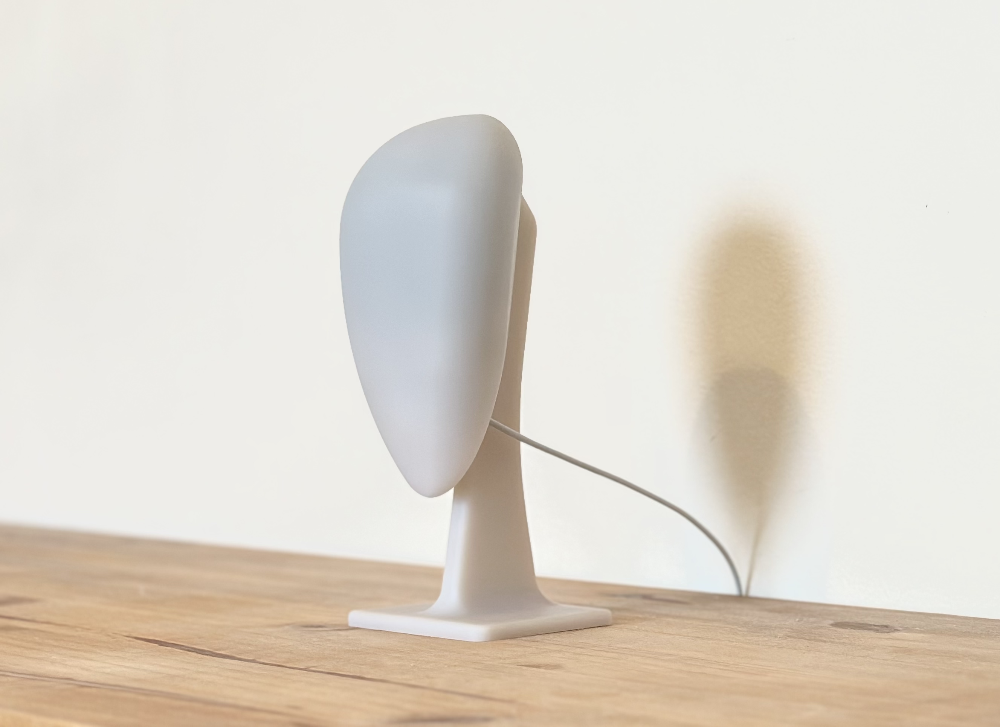

# PERSYS

Welcome! Persys (Personal System) is a device designed to be a second brain, running locally.

This entire Github org is a work in progress and I will continue to make updates (aiming for daily updates).

If you'd like to support this project, please consider ordering one at [https://persys.ai](https://persys.ai).
Orders are shipped on a rolling basis.

## Code
### [persys-server](https://github.com/persys-ai/persys-server)
You'll find the backend server here. Currently Linux only.

### [persys-desktop](https://github.com/persys-ai/persys-desktop)
You'll find the Electron based application to access your persys-server.
If you ordered the device, you'll get a link to the signed executable.

## Contact
Feel free to shoot me a DM on Twitter/X at [@aman_tsegai](https://x.com/amantsegai)

You can also find me on LinkedIn [here](https://linkedin.com/in/amants)

I publish updates on YouTube [here](https://www.youtube.com/@aman-labs)

## Contributions
I will add a seperate Contributions doc.
In the meantime, feel free to open a pull request on either repos.
Only accepting bug fixes due to my bandwidth and feature requests from orders are being prioritized.
