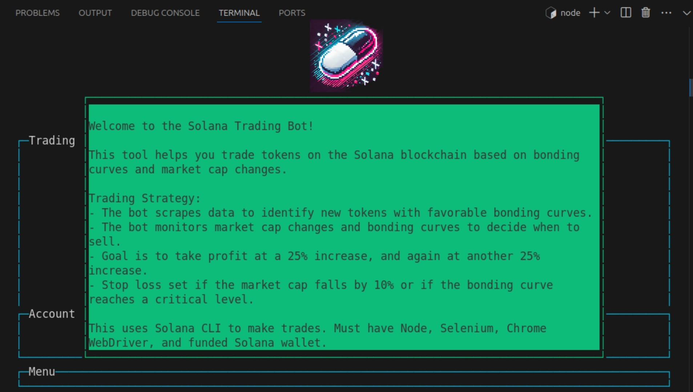
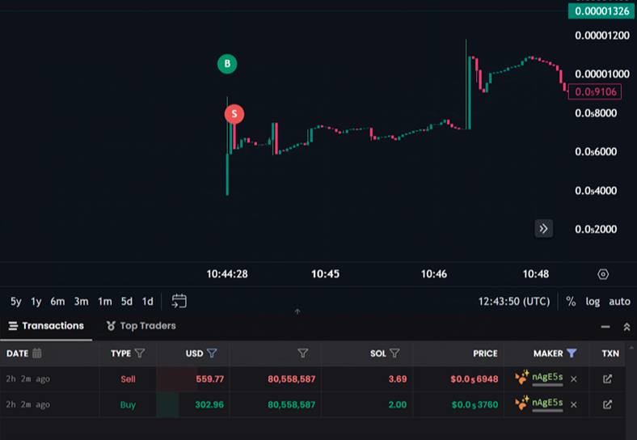

## Sfupu: Solana Pump Fun Sniper Bot – Fast, Free & Open Source Automated Trading Bot

Sfupu is the ultimate Pump Fun Sniper Bot for automated trading on Pump.fun tokens. Designed to excel on the Solana blockchain, Sfupu detects new liquidity pools, executes trades with precision, and optimizes profits using customizable strategies.


**Initial Buy:** The bot scrapes pump.fun to identify new token pairs with favorable bonding curves.

**Monitoring:** Once a token is bought, the bot monitors the market cap and bonding curve progress.


---


## Why Choose Sfupu Pump Fun Sniper Bot?

**The Original Pump Fun Sniper:** Sfupu is the ONLY Orginal Bot with low quality Imitators. Sfupu is the Original bot for Pump.fun tokens, designed for unmatched speed, reliability, and profitability. Beware of imitators offering unverified tools with slower performance.

**Lightning-Fast Execution**: Outperform competitors with advanced liquidity pool detection and trade execution.

**Customizable Strategies**: Tailor profit-taking and stop-loss thresholds to align with your trading goals.

**Beginner-Friendly Setup**: Quick and simple installation for users new to automated trading.

**Advanced Analytics**: Bonding curve monitoring and market cap analysis for expert-level insights.

**Completely Free**: No hidden fees or charges—profits are 100% yours.

**Community-Driven Development**: An open-source model ensures transparency, regular updates, and ongoing improvements from the community.


Sfupu is optimized to reduce risks while helping traders capitalize on Pump.fun token opportunities.





---


# Key Features:

**Profit Targets:** The bot aims to take profit at a 25% increase and then again at another 25% increase.
It sells 50% of the tokens at the first 25% increase and 75% of the remaining tokens at the next 25% increase.

**Stop Loss:** The bot will sell all tokens if the market cap falls by 10%.

**Bonding Curve:** The bot will sell 75% of the tokens if the bonding curve reaches a critical level and keep 25% as a moon bag.

**Timing:** The bot resets the timer if the price goes up and monitors the trade for a set period, adjusting its actions based on market conditions.

**Example Snipe**


Unlike other bots, Sfupu is continuously updated for speed, reliability, and profitability. As a 100% free and open-source bot, it encourages collaboration to shape the future of Solana token trading.


---


## Why Sfupu is Free & Open Source

Sfupu is open-source because we believe in building tools for the community, by the community. Here’s why:

1. Encouraging Collaboration: Traders and developers can contribute to refine and expand Sfupu’s functionality.


2. Fostering Innovation: A community-driven approach ensures Sfupu evolves to meet the latest trends and challenges in token trading.


3. Laying the Foundation for the Future: Open-source beginnings pave the way for potential premium tools or official applications tailored for professional users.


Your feedback, contributions, and testing are invaluable to improving Solana trading automation.


---

# Installation
*(You can always put this Readme File into ChatGPT & ask for a Detailed Step-by-Step Installation Tutorial From Scratch if you're new to installing bots.)*

## 1. Prerequisites

1. Wallet: A Solana-compatible wallet (e.g., Phantom, Solflare) with SOL, USDC, or WSOL.


2. Node.js: JavaScript runtime built on Chrome's V8 JavaScript engine.

   
3. Solana CLI: Command-line interface for interacting with the Solana blockchain.


4. Selenium WebDriver (Chrome): Automated web browser.


5. SOL Balance: The ratio I suggest is 1:10, that is, for every 1 SOL you'll use per trade, have 10 SOL in the wallet (so if you're using 0.1 SOL per trade, have 1 SOL in wallet. Just make sure you have more SOL for Faster Snipes)


---


## 2. Steps to Install

1. Clone the repository:
```git clone https://github.com/Sfupu/Solana-Pump-Fun-Sniper-Bot.git```


2. Navigate to the bot directory:
```cd Solana-Pump-Fun-Sniper-Bot```


3. Install dependencies:
```sh npm install dotenv axios @solana/web3.js @solana/spl-token selenium-webdriver nodemailer fs bs58 blessed blessed-contrib```


4. Set up environment variables:
Rename .env.example to .env and configure:
```SOLANA_WALLET_PATH=/path/to/your/solana/wallet.json MINIMUM_BUY_AMOUNT=0.015 MAX_BONDING_CURVE_PROGRESS=10 SELL_BONDING_CURVE_PROGRESS=15```


5. Configure Solana CLI:
```sh solana config set --url https://api.mainnet-beta.solana.com solana config set --keypair /path/to/your/solana/wallet.json```


6. Start the bot:
```node main.mjs```


7. Enjoy Profits


---


## Main Commands

**Start Trading:**
node main.mjs

**Sell All Tokens:**
node sell.js


---


## How to Contribute

Sfupu thrives on community collaboration. Here’s how you can help:

Report Issues: Found a bug or have suggestions? Share them in the issues tab.

Submit Code: Developers can fork the repository and enhance Sfupu through pull requests.

Spread the Word: Share Sfupu with fellow traders and developers to grow the community.


Every contribution helps improve Solana automated trading tools.


---

Keywords

Solana Pump Fun Sniper | Pump Fun Trading Bot | Automated Token Sniper | Solana Liquidity Sniper | Free Solana Trading Bot | Pump.fun Sniper Bot | Solana Blockchain Trading Tool | Token Sniping Bot | Profit Automation Solana | Pump Fun Sniping Bot


---

Disclaimer

Cryptocurrency trading involves significant risk. Use Sfupu responsibly and only trade what you can afford to lose. This bot is provided as-is, with no guarantees of profitability. Always conduct your own research before trading.
