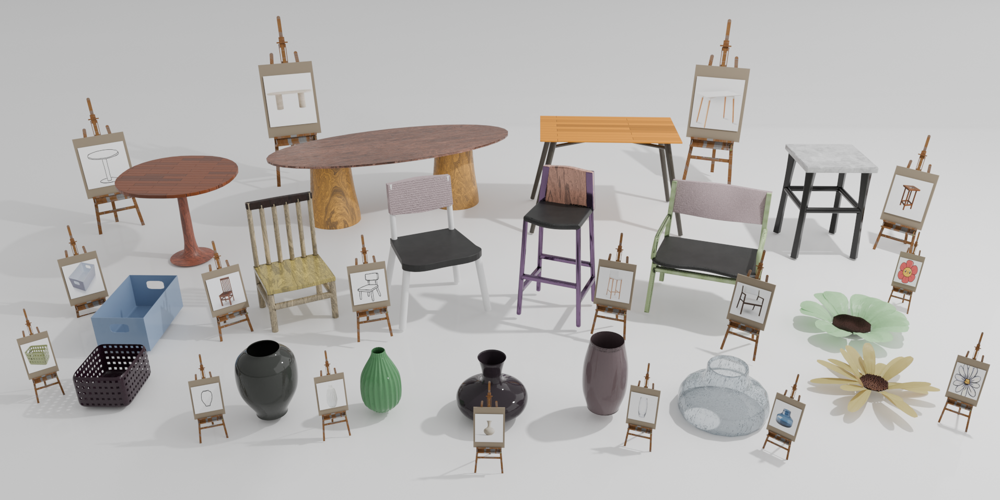

<div align="center">
  
# DI-PCG: Diffusion-based Efficient Inverse Procedural Content Generation for High-quality 3D Asset Creation

<a href="https://thuzhaowang.github.io/projects/DI-PCG"></a>&ensp;<a href="http://arxiv.org/abs/2412.15200"></a>&ensp;<a href="https://huggingface.co/TencentARC/DI-PCG"></a>&ensp;<a href="https://huggingface.co/spaces/TencentARC/DI-PCG"></a><br>

**[Wang Zhao<sup>1</sup>](https://thuzhaowang.github.io), [Yan-Pei Cao<sup>2</sup>](https://yanpei.me/), [Jiale Xu<sup>1</sup>](https://bluestyle97.github.io/),  [Yuejiang Dong<sup>1,3</sup>](https://scholar.google.com.hk/citations?user=0i7bPj8AAAAJ&hl=zh-CN), [Ying Shan<sup>1</sup>](https://scholar.google.com/citations?user=4oXBp9UAAAAJ&hl=en)**

<sup>1</sup>ARC Lab, Tencent PCG &ensp;&ensp;<sup>2</sup>VAST &ensp;&ensp;<sup>3</sup>Tsinghua University


</div>

---

## 🚩 Overview
This repository contains code release for our technical report "DI-PCG: Diffusion-based Efficient Inverse Procedural Content Generation for High-quality 3D Asset Creation".

<p align="center">
  
</p>


## ⚙️ Installation
First clone this repository:
```
git clone https://github.com/TencentARC/DI-PCG.git
cd DI-PCG
```
We recommend using anaconda to install the dependencies:
```
conda create -n di-pcg python=3.10.14
conda activate di-pcg
conda install pytorch==2.4.0 torchvision==0.19.0 torchaudio==2.4.0  pytorch-cuda=11.8 -c pytorch -c nvidia
pip install -r requirements.txt
```

## 🚀 Usage
For a quick start, try the huggingface gradio demo [here](https://huggingface.co/spaces/TencentARC/DI-PCG).

### Download models
We provide the pretrained diffusion models for chair, vase, table, basket, flower and dandelion. You can download them from [model card](https://huggingface.co/TencentARC/DI-PCG) and put them in `./pretrained_models/`. 

Alternatively, the inference script will automatically download the pretrained models for you.

### Local gradio demo
To run the gradio demo locally, run:
```
python app.py
```

### Inference
To run the inference demo, simply use:
```
python ./scripts/sample_diffusion.py --config ./configs/demo/chair_demo.yaml
```
This script processes all the chair images in the `./examples/chair` folder and saves the generated 3D models and their rendered images in `./logs`. 

To generate other categories, use the corresponding YAML config file such as `vase_demo.yaml`. Currently we supprt `chair`, `table`, `vase`, `basket`, `flower` and `dandelion` generators developped by [Infinigen](https://github.com/princeton-vl/infinigen).
```
python ./scripts/sample_diffusion.py --config ./configs/demo/vase_demo.yaml
```

### Training
We train a diffusion model for each procedural generator. The training data is generated by randomly sampling the PCG and render multi-view images. To prepare the training data, run:
```
python ./scripts/prepare_data.py --generator ChairFactory --save_root /path/to/save/training/data
```
Replace `ChairFactory` with other category options as detailed in the `./scripts/prepare_data.py` file. This script also conducts offline augmentation and saves the extracted DINOv2 features for each image, which may consume a lot of disk storage. You can adjust the number of the generated data and the render configurations accordingly.

After generating the training data, start the training by:
```
python ./scripts/train_diffusion.py --config ./configs/train/chair_train.yaml
```

### Use your own PCG
DI-PCG is general for any procedural generator. To train a diffusion model for your PCG, you need to implement the `get_params_dict`, `update_params`, `spawn_assets`, `finalize_assets` functions and place your PCG in `./core/assets/`. Also change the `num_params` in your training YAML config file.

If you have any question, feel free to open an issue or contact us.

## :books: Citation

If you find our work useful for your research or applications, please cite using this BibTeX:

```BibTeX
@article{zhao2024dipcg,
  title={DI-PCG: Diffusion-based Efficient Inverse Procedural Content Generation for High-quality 3D Asset Creation},
  author={Zhao, Wang and Cao, Yanpei and Xu, Jiale and Dong, Yuejiang and Shan, Ying},
  journal={arXiv preprint arXiv:2412.15200},
  year={2024}
}
```

## 🤗 Acknowledgements

DI-PCG is built on top of some awesome open-source projects: [Infinigen](https://github.com/princeton-vl/infinigen), [Fast-DiT](https://github.com/chuanyangjin/fast-DiT). We sincerely thank them all.
