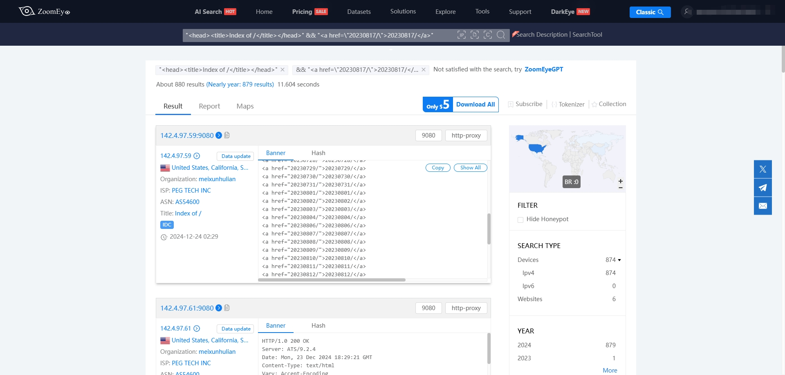

# Random Web Player
配合接口实现类似抖音效果的随机在线播放器，内置接口提供了 20W+ 随机地址播放

Demo 地址: http://43.154.146.172/

Cloudflare Pages: https://fuli.wwlww.org/

[](https://github.com/levywang/random_web_player "Click to view the repo on Github")
[](https://github.com/levywang/random_web_player/releases/latest "Click to view the repo on Github")
[](https://github.com/levywang/random_web_player "Click to view the repo on Github")
[](https://github.com/levywang/random_web_player "Click to view the repo on Github")
[](https://github.com/levywang/random_web_player "Click to view the repo on Github")
[](https://github.com/levywang/random_web_player/issue "Click to view the repo on Github")


## Stargazers over time

[](https://starchart.cc/levywang/random_web_player)


## 使用方法
直接下载 `index.html` 文件，复制到网站根目录，配置好域名即可访问

你也可以设置自己的接口地址，默认接口地址为：`https://api.imwlw.com/v1/get_video`
直接查找 `index.html` 文件替换默认接口关键字替换即可

支持以下两种返回格式：

1. Json 格式
```json
{
  "url": "http://137.175.55.201:8081/20240824/Pg0d0DkEWVkg1/index.m3u8"
}
```

2. 纯文本格式  
同时也支持直接返回纯文本地址的 `GET` 请求，例如
`https://mm.diskgirl.com/get/get1.php`，返回格式：
```
https://txmov2.a.yximgs.com/upic/2021/07/06/11/BMjAyMTA3MDYxMTIxNDZfMjM2MzkyOTY3Nl81MjcwMDc1MjQ0M18yXzM=_b_Bbbb2fa053f02e7f32cef6efe3577eb6d.mp4
```

**PS：请确保请求地址支持跨域，否则无法正常播放**


## 爬虫说明
该爬虫支持爬取开启了 nginx autoindex 网站，运行前请确认变量 `base_url` 是否可以访问，默认会爬取所有 `m3u8` 地址，存储到 `m3u8_links.txt` 文件中

使用前，确保你已经安装了所需的 Python 库：
```bash
pip install requests beautifulsoup4
```


## 关于爬虫源地址的说明
使用 `https://www.zoomeye.ai/` (挂代理)，搜索规则如下：
```
"<head><title>Index of /</title></head>" && "<a href=\"20230817/\">20230817/</a>"

```

**日期并无特殊含义，仅作为示例过滤，您也可以使用正则表达式实现**

可以获取到很多类似的地址，见下图：



## License
This project is provided under a GNU Affero General Public License v3.0 license that can be found in the [LICENSE](LICENSE) file. By using, distributing, or contributing to this project, you agree to the terms and conditions of this license.