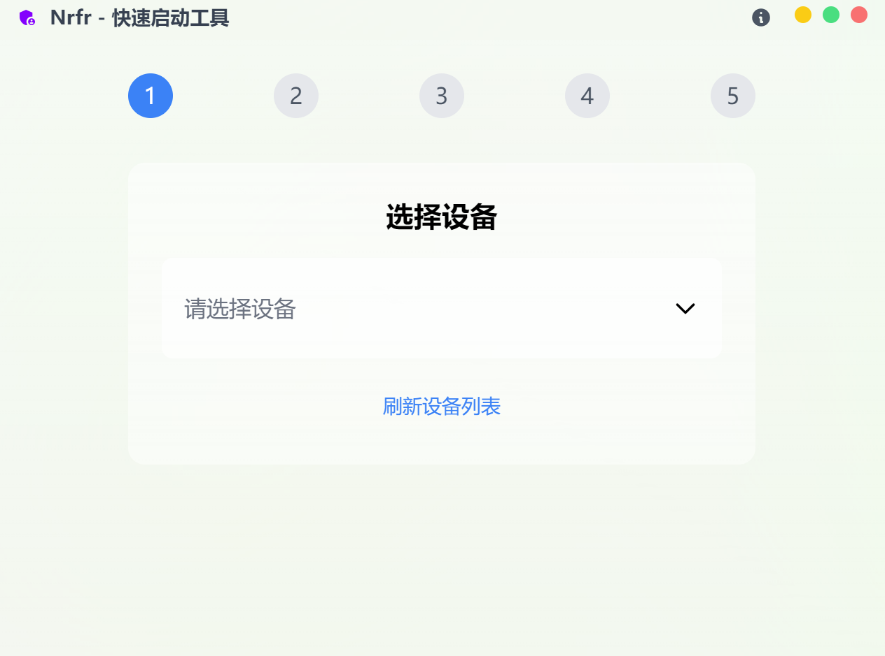
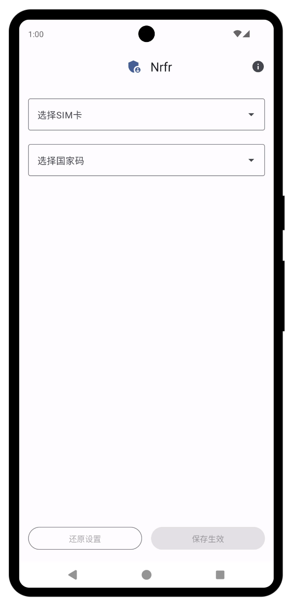

<div align="center">
  <h1>Nrfr</h1>
  <p>🌍 免 Root 的 SIM 卡国家码修改工具，让你的网络更自由</p>

  <p>
    
    
    
    
    
    
    
  </p>

  <p>
      
      
      
      
      
      
      
      
  </p>

  <div style="display: flex; justify-content: center; align-items: center; gap: 20px; margin: 20px 0;">
    
    
  </div>
   <br>
</div>

Nrfr 是一款强大的 SIM 卡国家码修改工具，无需 Root 权限即可修改 SIM 卡国家码。本项目完全基于 Android 系统原生 API 实现，不依赖
Xposed、Magisk 等任何第三方框架，仅通过调用系统级接口实现功能。通过修改国家码，你可以：

- 🌏 解锁运营商限制，使用更多本地功能
- 📱 优化信号显示和网络选择
- 🔓 突破某些区域限制的应用和服务
- 🛠️ 解决国际漫游时的兼容性问题
- 🌐 帮助使用海外 SIM 卡获得更好的本地化体验
- ⚙️ 解决部分应用识别 SIM 卡地区错误的问题

## 📱 使用案例

### TikTok 区域限制解除

如果你遇到以下情况：

- TikTok 网络错误
- 无法正常使用 TikTok 的完整功能

你可以：

1. 使用 Nrfr 修改 SIM 卡国家码为支持的地区（如 JP、US 等）
2. 重新打开 TikTok，就可以正常使用了

## 💡 实现原理

Nrfr 通过调用 Android 系统级 API（CarrierConfigLoader）修改系统内的运营商配置参数，而不是直接修改 SIM 卡。这种实现方式：

- 完全在系统层面工作，不会对 SIM 卡本身进行任何修改或造成损坏
- 仅改变系统对 SIM 卡信息的读取方式
- 基于 Android 原生 API 实现，不依赖任何第三方框架（如 Xposed、Magisk 等）
- 通过 Shizuku 仅提供必要的权限支持
- 所有修改都是可逆的，随时可以还原

## ✨ 特性

- 🔒 安全可靠
   - 无需 Root 权限
   - 不修改系统文件
   - 不影响系统稳定性
   - 不会对 SIM 卡造成任何影响
- 🔄 功能完善
   - 支持随时还原修改
   - 支持双卡设备，可分别配置
   - 一次修改永久生效，重启后保持
- 🚀 简单易用
   - 一键启动工具
   - 智能检测设备和 SIM 卡状态
   - 自动安装所需应用
   - 简洁优雅的用户界面
   - 轻量且高效，安装包体积小

## ⚠️ 注意事项

- 需要安装并启用 Shizuku
- 修改国家码可能会影响运营商服务，请谨慎操作
- 部分设备可能不支持修改国家码
- 如需还原设置，请使用应用内的还原功能

## 🚀 快速开始

1. 准备手机
    - 启用开发者选项（具体的自己查一下）
    - 进入开发者选项，开启 USB 调试
    - 开启 USB 调试（安全设置），如果有就开启
    - 开启 USB 安装（允许通过 USB 安装应用）
    - 如果提示未知来源应用安装，请允许从此来源安装

2. 连接手机到电脑
    - 使用数据线将手机连接到电脑
    - 在手机上允许 USB 调试授权

3. 下载并启动 Nrfr 快速启动工具
    - 从 Release 页面下载最新版本的快速启动工具
    - 解压并运行 Nrfr 快速启动工具
    - 工具会自动检测已连接的设备

4. 安装必要组件
    - 工具会自动安装 Shizuku 到手机
    - 按照提示启用 Shizuku
    - 等待工具自动安装 Nrfr 应用

5. 修改国家码
    - 在手机上打开 Nrfr 应用
    - 选择需要修改的 SIM 卡
    - 设置目标国家码
    - 应用修改

修改完成后无需重启设备，设置会立即生效并永久保持。如需还原，请使用应用内的还原功能。

## 📦 构建

项目包含两个部分：快速启动工具（桌面端）和手机应用（Android）。

### 快速启动工具 (nrfr-client)

```bash
# 进入客户端目录
cd nrfr-client

# 安装依赖
npm install

# 开发模式
wails dev

# 构建发布版本
wails build
```

### Android 应用 (app)

```bash
# 进入 Android 应用目录
cd app

# 使用 Gradle 构建 Debug 版本
./gradlew assembleDebug
```

构建完成后，可以在以下位置找到生成的文件：

- 快速启动工具: `nrfr-client/build/bin/`
- Android 应用: `app/build/outputs/apk/`

## 📝 依赖项

- [Shizuku](https://shizuku.rikka.app/) - 用于提供特权服务
- [ADB](https://developer.android.com/tools/adb) - Android 调试桥接

## 🤝 贡献

欢迎提交 Pull Request 和 Issue！在提交之前，请确保：

- 代码经过测试
- 遵循现有的代码风格
- 更新相关文档
- 描述清楚改动的目的和影响

## 📄 许可证

本项目采用 [Apache-2.0](LICENSE) 许可证。

## ⚠️ 免责声明

本工具仅供学习和研究使用。使用本工具修改系统设置可能会影响设备的正常使用，请自行承担风险。作者不对任何可能的损失负责。

## 💖 支持

如果你觉得这个项目有帮助：

- 在 X 上关注 [@actkites](https://x.com/intent/follow?screen_name=actkites)
- 给项目点个 Star ⭐
- 分享给更多的人

## ⭐ Star History

[](https://star-history.com/#Ackites/Nrfr&Date)

## 🙏 鸣谢

- [Shizuku](https://shizuku.rikka.app/) - 感谢 Shizuku 提供的特权服务支持
