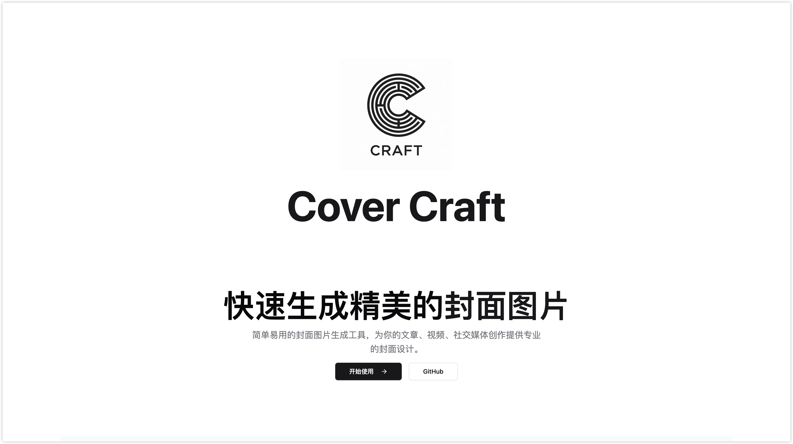
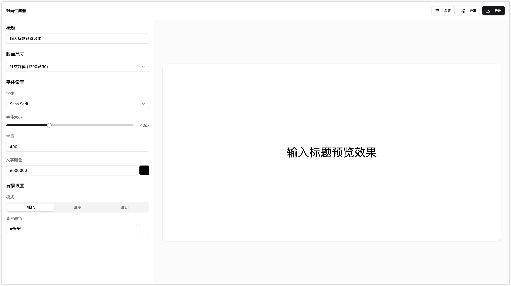

<div align="center">
  
  
  <h1>🎨 Cover Craft</h1>
  <p><em>一个现代化的封面设计工具，让创作更简单</em></p>

  <p align="center">
    
    
    
    
  </p>

  <p>
    <a href="#预览">预览</a> •
    <a href="#特性介绍">特性介绍</a> •
    <a href="#技术栈">技术栈</a> •
    <a href="#快速开始">快速开始</a> •
    <a href="#开发指南">开发指南</a>
  </p>
</div>

---

## 📸 预览

<div align="center">
  
  <p><em>极简主义</em></p>
</div>

<div align="center">
  
  <p><em>强大的编辑器界面</em></p>
</div>

## ✨ 技术栈

- 
- 
- 
- 

### UI 组件
- Radix UI - 无障碍的 React UI 原语
- Lucide React - 美观的图标库
- React Resizable Panels - 可调整大小的面板组件

## 🚀 快速开始

确保你的开发环境中已安装 [Node.js](https://nodejs.org/) (推荐 v18+) 和 [pnpm](https://pnpm.io/)。

```bash
# 克隆项目
git clone https://github.com/guizimo/cover-craft.git

# 进入项目目录
cd cover-craft

# 安装依赖
pnpm install

# 启动开发服务器
pnpm dev
```

## 📁 项目结构
```
cover-craft/
├── src/
│ ├── components/ # React 组件
│ ├── pages/ # 页面组件
│ ├── styles/ # 样式文件
│ └── main.tsx # 入口文件
├── public/ # 静态资源
└── package.json # 项目配置
```
## 🎯 功能特性

- 现代化的用户界面
- 响应式设计
- 可调整布局
- 图片导出功能
- 实时预览

## 💻 开发指南

### 可用的脚本命令
```bash
pnpm dev # 启动开发服务器
pnpm build # 构建生产版本
pnpm preview # 预览生产构建
pnpm lint # 运行 ESLint 检查
```

### 开发环境要求

- Node.js >= 18.x
- pnpm >= 9.15.0

## 📦 依赖说明

### 核心依赖
- `react` & `react-dom`: React 核心库
- `vite`: 现代前端构建工具
- `typescript`: JavaScript 的超集，提供类型支持

### UI 组件
- `@radix-ui/*`: 无障碍的 React UI 组件
- `lucide-react`: 图标库
- `react-resizable-panels`: 可调整大小的面板

### 工具库
- `file-saver`: 文件保存功能
- `html2canvas`: HTML 转换为 canvas
- `clsx` & `tailwind-merge`: 样式工具

## 📄 许可证

[GPL-3.0 License](LICENSE)

---

<div align="center">
  <sub>Built with ❤️ by Guizimo</sub>
</div>
