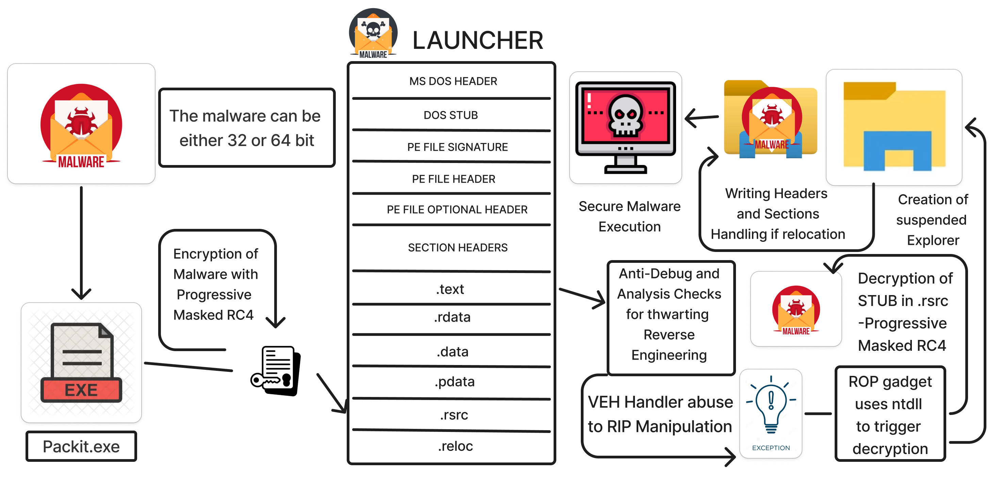
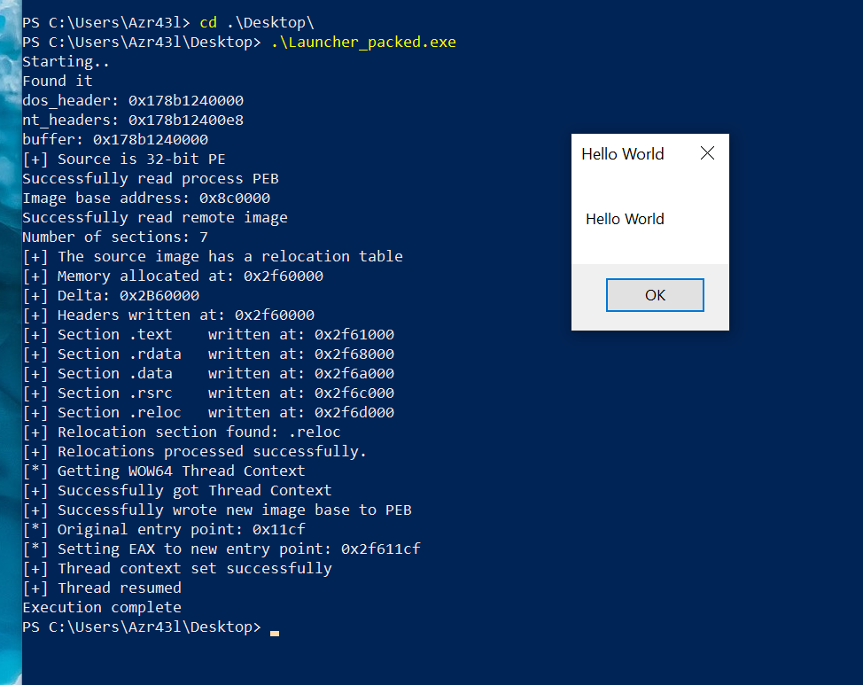

```

██████╗ ██╗   ██╗███████╗████████╗██╗   ██╗     ██████╗ ███████╗    ██████╗  █████╗  ██████╗██╗  ██╗███████╗██████╗ 
██╔══██╗██║   ██║██╔════╝╚══██╔══╝╚██╗ ██╔╝     ██╔══██╗██╔════╝    ██╔══██╗██╔══██╗██╔════╝██║ ██╔╝██╔════╝██╔══██╗
██████╔╝██║   ██║███████╗   ██║    ╚████╔╝█████╗██████╔╝█████╗█████╗██████╔╝███████║██║     █████╔╝ █████╗  ██████╔╝
██╔══██╗██║   ██║╚════██║   ██║     ╚██╔╝ ╚════╝██╔═══╝ ██╔══╝╚════╝██╔═══╝ ██╔══██║██║     ██╔═██╗ ██╔══╝  ██╔══██╗
██║  ██║╚██████╔╝███████║   ██║      ██║        ██║     ███████╗    ██║     ██║  ██║╚██████╗██║  ██╗███████╗██║  ██║
╚═╝  ╚═╝ ╚═════╝ ╚══════╝   ╚═╝      ╚═╝        ╚═╝     ╚══════╝    ╚═╝     ╚═╝  ╚═╝ ╚═════╝╚═╝  ╚═╝╚══════╝╚═╝  ╚═╝
                                                                                                                    
                                Windows Executable Packer in Rust (x86 / x64)         
                        Anti-Debug and Anti-Analysis to VEH abuse with ROP gadget
```
<p align="center">
    
    
    
</p>

## :open_book: Project Overview :

A robust Windows Process Executable Packer and Launcher implementation written in Rust for Windows x64 systems. The packer packs the EXE with Progressive Masked RC4 or AIP-XOR-RC4 with customizable 30-byte key. The PE packed into the launcher utilizes VEH to abuse pagegaurd access exception in sleep function, confuses execution flow and thwarts analysis with RIP manipulation with ROP gadget in ntdll, the launcher then decrypts the packed stub and creates a suspended explorer process(can be customized), unmaps the process memory and writes the headers and sections, handles reloaction if necessary and executes the new entrypoint. This packer and launcher works on x86 and x64 system processes, defaulting to Explorer as the target process for the launcher.

### :sparkles: Features :

- x64 executable supporting both x86 and x64 target processes for launching and packing
- Anti-Debug and Anti-Analysis techniques to thwart analysis and debugging
- VEH abuse using PageGaurd access exception in sleep function to confuse execution flow
- ROP gadget in ntdll to manipulate RIP for exectiuon of stub decryption
- Progressive Masked RC4 or AIP-XOR-RC4 encryption with customizable 30-byte key for packing
- Packed PE image execution in a legitamate process (Explorer by default)
- PE image Executaion with and without relocation tables
- Automatic preferred base address allocation attempt for images without relocation
- Compatible with Windows system processes
- Robust error handling and logging



## :rocket: Getting Started :

> **Warning** <br>
> This is a **x64 executable**, you can't compile this project in x86, this loader is made to inject into x86 and x64 processes.
> You can easily make a x86 process hollowing program based on this repository.

### :gear: Build :

To build the project, you need to have Rust installed on your system. You can install Rust from [here](https://www.rust-lang.org/tools/install). Once you have Rust installed, you can build the project using the following command :

```shell
cd Launcher
cargo build --release
cd Packit
cargo build --release
```

This will create a `Launcher.exe and Packit.exe` executables in the respective `target/release` directory.


## 🧪 Usage :

### How to use the program :

Use it in the command line :

```shell
Packit.exe <EXE_to_Pack> <Launcher.exe>
Launcher_packed.exe will be the packed executable
```
This can be integrated with reading the file directly in the code.

### Example :

The Launcher is packed with a simple 32bit HelloWorld MessageBox program.



## References :

https://github.com/Azr43lKn1ght/Rust-ProcHollow

https://github.com/WKL-Sec/LayeredSyscall

https://github.com/BlackSnufkin/Rusty-Playground/tree/main/VEH-ProxyDll

https://chuongdong.com/malware%20development/2020/08/24/Packer/

## :page_facing_up: License :

This project is licensed under the MIT License - see the [LICENSE](LICENSE) file for details.