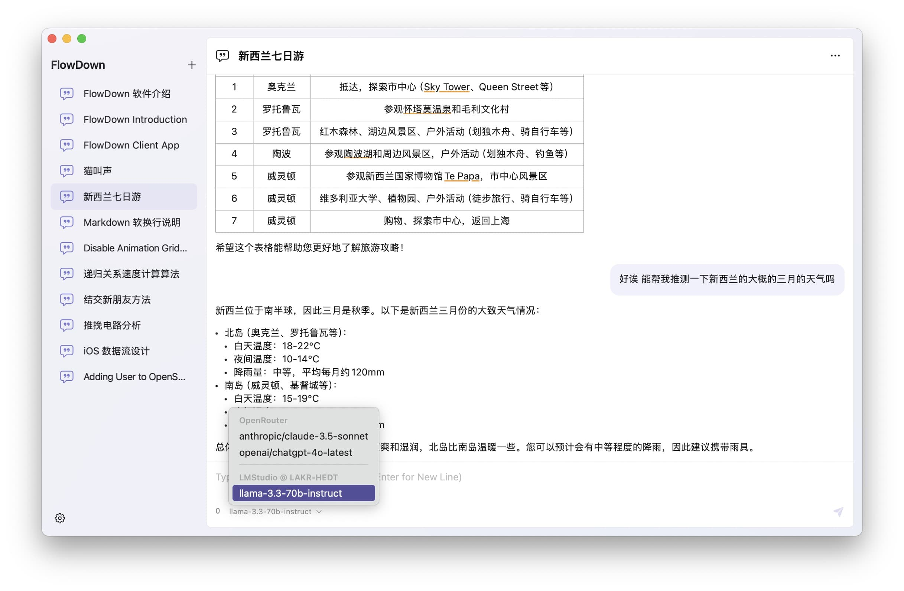

# FlowDown (Pre-Beta Test)

FlowDown is a blazing fast and smooth client app for using AI/LLM.

  <a href="README.md">English</a> |
  <a href="/Resources/i18n/zh-Hans/README.md">简体中文</a>

**We're currently testing the Mac version of FlowDown Community.**

## Keep in touch

Please consider join our discussion on [Discord](https://discord.gg/Y2YEzNEH). We are working hard to get features done and might not be able to response to you quickly.

## Preview

## Features

- [x] **Lightweight and Efficient** Compact design for seamless performance
- [x] **Markdown Support** Rich formatted text in responses
- [x] **Universal Compatibility** Works with all OpenAI compatible service providers
- [x] **Blazing Fast Text Rendering** Delivers a seamless user experience
- [x] **Automated Chat Titles** Streamlines conversations and boosts productivity
- [x] **Privacy by Design** We don't collect your data

## Editions

We offer two editions of FlowDown: **FlowDown Pro** and **FlowDown Community**.

| **Feature**           | **FlowDown Pro** | **FlowDown Community** |
| --------------------- | ---------------- | ---------------------- |
| Chat with AI          | ✅               | ✅                     |
| Fast Markdown         | ✅               | ✅                     |
| Privacy by Design     | ✅               | ✅                     |
| Bring Your Own LLM    | ✅               | ✅                     |
| Open-Source           | ❌               | ✅                     |
| Web Search            | ✅               | ❌                     |
| Documents Analysis    | ✅               | ❌                     |
| Language Localization | ✅               | ❌                     |

**Open Source Notice**

**FlowDown Community** will be open-sourced soon, with its source code released shortly after the official version in this repository. By sharing our code, we aim to empower developers to build more interactive and responsive AI client apps.

## Get Started

### System Requirements

- iOS 15.0 or later
- macOS 12.0 or later

**Important Note**

**FlowDown Community** requires an OpenAI compatible service provider. You'll need to bring your own Large Language Model (LLM) service provider and set it up with the app.

Have a look in setting pages for more information.

### Installation

See [Releases](https://github.com/Lakr233/FlowDown-Beta/releases) for details.

## License

- **FlowDown Pro** is proprietary software. All rights reserved.
- **FlowDown Community** is licensed under [MIT](./LICENSE).

---

© 2025 FlowDown Team (@Lakr233, @ktiays, @unixzii) All Rights Reserved.
