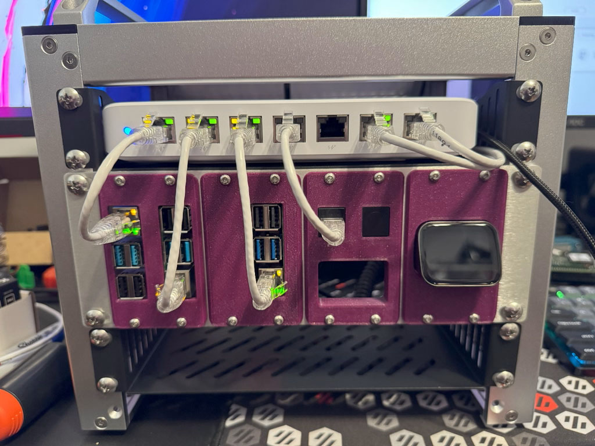
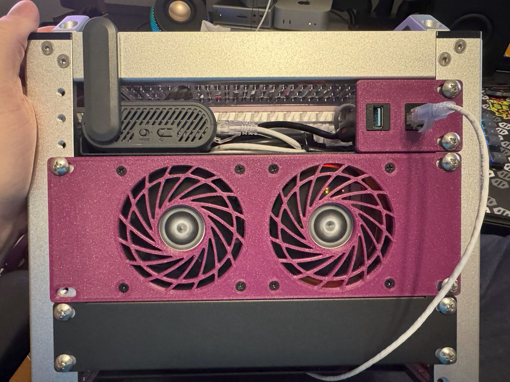
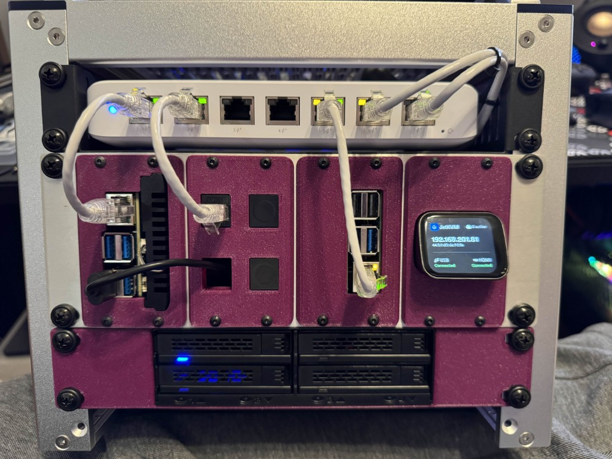

# LabStack
Modular rackmount solutions for Raspberry Pi's and other SBC's and accessories.

#### Hey Everyone!
Just to keep everyone in the loop, I will continue to work on uploading instructions and images as I have time.  In the meantime, all of the current STLs are available!

**NOTE: Additional hardware IS required for most models.**

Here's a short list of hardware off the top of my head:
* 2U Printed Bracket - Requires 16x M3x4x5mm Brass Heatset Inserts, 4x M3x6mm (or other M3x6mm thru M3x20mm) screws per module (BHCS or SHCS, no FHCS).
* 1U 5.25" Drive Bay Mount (designed specifically for the Icy Dock ExpressCage MB324SP-B) - Requires 8x M3x6mm screws (BHCS or SHCS, no FHCS).
* General Pi Mounts (2x Pi, 1x Pi, etc.) - Requires 4x M2.5x5 SHCS screws.  If using a HAT (PoE or otherwise), standoffs and/or other length M2.5 screws may be required.
* JetKVM Modules - Requires 2x M2x12 SHCS screws per JetKVM unit.
* 80mm Fan Panel - Requires the coarse-thread screws that the fans come with.

**I am open to helping create mounts for specific models within reason, but will be releasing CAD for users to create their own mounts!  The possibilities are endless!**

