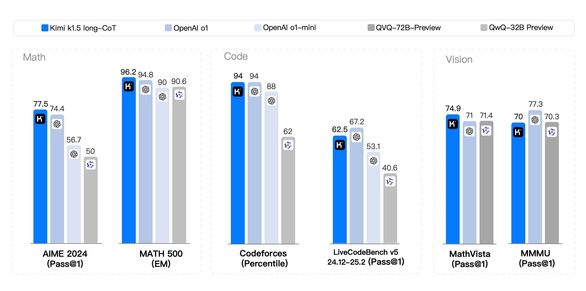
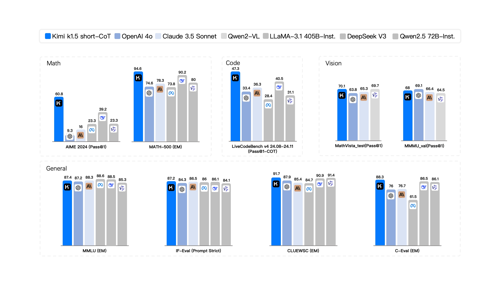
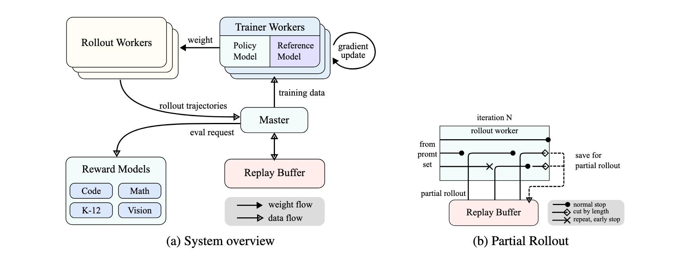

<p align="center">
  <a href="Kimi_k1.5.pdf"></a>
</p>

# Kimi k1.5: Scaling Reinforcement Learning with LLMs

<p align="center">
  <b>Kimi Team</b></a>
</p>


<p align="center">
  <a href="Kimi_k1.5.pdf"><b> Full Report</b></a>
</p>

🚀 Introducing Kimi k1.5 --- an o1-level multi-modal model

- Sota short-CoT performance, outperforming GPT-4o and Claude Sonnet 3.5 on 📐AIME, 📐MATH-500, 💻 LiveCodeBench by a large margin (up to +550%)
- Long-CoT performance matches o1 across multiple modalities (👀MathVista, 📐AIME, 💻Codeforces, etc)

## Abstract

Language model pretraining with next token prediction has proved effective for scaling compute but is limited to the amount of available training data. Scaling reinforcement learning (RL) unlocks a new axis for the continued improvement of artificial intelligence, with the promise that large language models (LLMs) can scale their training data by learning to explore with rewards. However, prior published work has not produced competitive results. In light of this, we report on the training practice of Kimi k1.5, our latest multi-modal LLM trained with RL, including its RL training techniques, multi-modal data recipes, and infrastructure optimization. Long context scaling and improved policy optimization methods are key ingredients of our approach, which establishes a simplistic, effective RL framework without relying on more complex techniques such as Monte Carlo tree search, value functions, and process reward models. Notably, our system achieves state-of-the-art reasoning performance across multiple benchmarks and modalities---e.g., 77.5 on AIME, 96.2 on MATH 500, 94-th percentile on Codeforces, 74.9 on MathVista---matching OpenAI's o1. Moreover, we present effective long2short methods that use long-CoT techniques to improve short-CoT models, yielding state-of-the-art short-CoT reasoning results---e.g., 60.8 on AIME, 94.6 on MATH500, 47.3 on LiveCodeBench---outperforming existing short-CoT models such as GPT-4o and Claude Sonnet 3.5 by a large margin (up to +550\%). The service of Kimi k1.5 on https://kimi.ai will be available soon.

<p align="center">
  
</p>

<p align="center">
  
</p>


## Key Ingredients of Kimi k1.5

<div style="display: flex; justify-content: space-between;">
  
</div>

There are a few key ingredients about the design and training of k1.5.


- **Long context scaling**. We scale the context window of RL to 128k and observe continued improvement of performance with an increased context length. A key idea behind our approach is to use partial rollouts to improve training efficiency---i.e., sampling new trajectories by reusing a large chunk of previous trajectories, avoiding the cost to re-generate the new trajectories from scratch. Our observation identifies the context length as a key dimension of the continued scaling of RL with LLMs.
- **Improved policy optimization**. We derive a formulation of RL with long-CoT and employ a variant of online mirror descent for robust policy optimization. This algorithm is further improved by our effective sampling strategy, length penalty, and optimization of the data recipe.
- **Simplistic Framework**. Long context scaling, combined with the improved policy optimization methods, establishes a simplistic RL framework for learning with LLMs. Since we are able to scale the context length, the learned CoTs exhibit the properties of planning, reflection, and correction. An increased context length has an effect of increasing the number of search steps. As a result, we show that strong performance can be achieved without relying on more complex techniques such as Monte Carlo tree search, value functions, and process reward models.
- **Mutimodalities**. Our model is jointly trained on text and vision data, which has the capabilities of jointly reasoning over the two modalities.


## Test Model by API
You can test Kimi k1.5 through the Kimi OpenPlatform. Fill out the test application form in [this link](https://forms.gle/TqZ9XQnPiJPddzhV8). We will contact you via email to provide a test account later.

Here's an example of calling Kimi k1.5
```python
from openai import Client

client = Client(
    api_key="YOUR_KIMI_KEY",
    base_url="https://api.moonshot.ai/v1",
)

messages = [
    {
        "role": "user",
        "content": "The lengths of the two legs of a right triangle are 3 cm and 4 cm respectively. Find the length of the hypotenuse of this right triangle.",
    },
]

stream = client.chat.completions.create(
    model="kimi-k1.5-preview",
    messages=messages,
    temperature=0.3,
    stream=True,
    max_tokens=8192,
)

for chunk in stream:
    if chunk.choices[0].delta:
        if chunk.choices[0].delta.content:
            print(chunk.choices[0].delta.content, end="")

```


## Citation

```
@article{MoonshotAI,
  author = {Kimi Team},
  title = {Kimi k1.5: Scaling Reinforcement Learning with LLMs},
  year = {2025},
}
```
