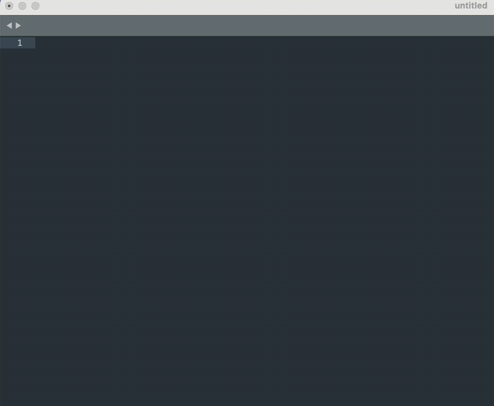
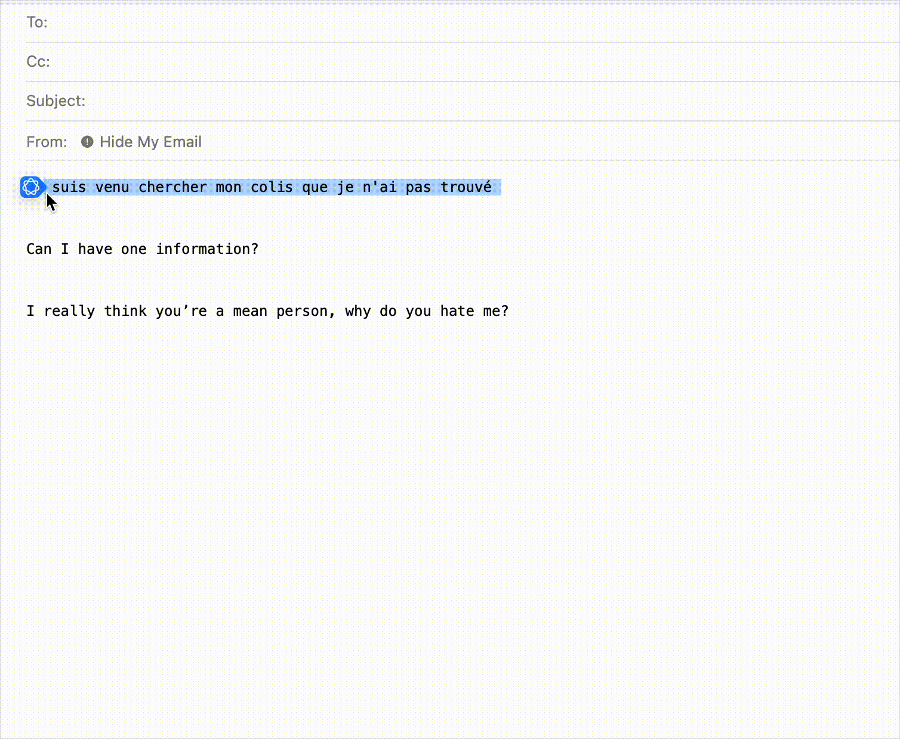

# 🍊 Orange Intelligence  

**A Better Open Source Version of Apple Intelligence for macOS**  

Orange Intelligence is a powerful, fully customizable productivity tool for macOS. With its elegant floating window interface, you can capture, process, and replace text seamlessly across any application. Whether you're running basic text processing, leveraging the power of large language models (LLMs) like OpenAI or local LLaMA, or creating complex agent systems, Orange Intelligence empowers you to work smarter, faster, and better.  

---

## 🌟 Why Orange Intelligence?  

Apple Intelligence is closed, limited, and inflexible. Orange Intelligence brings the power of customization and open source innovation to macOS, making it the perfect productivity tool for developers, researchers, and AI enthusiasts.  

---
## Demo

| Feature                          | Demo GIF                      |
|----------------------------------|-------------------------------|
| **Variables and text processing examples** |  |
| **LLMs with local Ollama**       |      |


## ✨ Features  

- **Floating Text Processor**: Double-tap the `Option` key to open a sleek floating window.  
- **Run Any Python Function**: Execute any Python code, from simple string manipulations to advanced AI/LLM integrations (OpenAI, local LLaMA, or your own agents).  
- **Fully Customizable**: Add your own Python logic to extend its functionality and tailor the app to your specific workflows.  
- **Global variable replacement**: Global variable replacement (You no longer need to open your notes app to do a simple copy and paste!)
---

## 🛠️ How It Works  

Orange Intelligence simplifies text processing with a three-step pipeline:  

1. **Capture Text from Any Application**  
   - Using a clever Applescript trick, the app simulates a global `Cmd+C` to grab the content of the clipboard from the active application.  

2. **Process the Text**  
   - The floating window opens in focus, allowing the user to select which Python function to run. The selected function processes the clipboard text (e.g., formatting, AI generation, etc.).  

3. **Replace the Text**  
   - Once processed, the floating window closes, the focus returns to the previous app, and a global `Cmd+V` pastes the updated content back into the app.  

---

## 🚀 Getting Started  

### Prerequisites  

1. **Install Python 3.9+**  
2. **Install Poetry** for dependency management:  
   ```bash
   pip install poetry
   ```  
3. **Grant Permissions**: Ensure your Python interpreter has the following rights:  
   - **Accessibility**: To allow replacing text via `Cmd+V`.  
   - **Input Monitoring**: To listen for global key shortcuts like the `Option` key.  

4. **Optional Dependencies**:  
   - **Ollama**: If you want to run local LLaMA models, ensure [Ollama](https://ollama.ai/) is installed and running.  
   - If you have a custom setup, you might need to adapt the Python code for your environment.  

5. **Optional Configuration**:  
   - Adjust the log level in `config.py` if needed.  

### Installation  

1. Clone this repository:  
   ```bash
   git clone [https://github.com/sharingan-no-kakashi/orange-intelligence.git]
   cd orange-intelligence
   ```  
2. Install dependencies using Poetry:  
   ```bash
   poetry install
   ```  
3. Start the app using Make:  
   ```bash
   make run
   ```  
   (Use `make help` to see other available commands.)  

4. When the **orange icon** appears in the system tray, the app is ready to use.  

### Usage  

1. Highlight any text in a macOS application.  
2. Double-tap the `Option` key to bring up the floating window.  
3. Select a function to apply to the highlighted text.  

---

## 🧩 Customization  

- Add custom logic by defining callable Python objects in the `extensions` package.  
- **Every function (or callable object)** defined in the `__init__.py` file of the `extensions` package will automatically appear as an option in the floating window.  

Example:  
```python
# extensions/__init__.py
def reverse_text(input_text):
    return input_text[::-1]
```  

---

## 📝 To-Do and Future Improvements  

These are the features currently in progress:  

- **Custom Prompts**: Add the ability to pass custom prompts (hint: that's why you see `**kwargs` in the code).  
- **Text Playground**: Open a new custom window for text processing, allowing users to combine LLM/Python/text utilities in a single workspace.  
- **Clipboard Restoration**: Automatically restore the content of the clipboard after processing operations.  
- **UI/UX Enhancements**: Improve the design and user experience for better usability.  

- **Code improvements**: The codebase feels a bit hacky at the moment, there are lots debatable decisions (subprocessing/time.sleep(), controller feels a bit overwhelmed of logic) etc
- **Other platforms support** There is probably no reason why this cannot be extended to other platforms linux/window.  
- **CI/CD** Setup a nice ci pipeline to run the lint/banding/mypy and handling versions/releases
---

## 🏗️ Tech Stack  

- **Python**: The core logic of the app is written in Python for flexibility and extensibility.  
- **PyQt6**: Provides a polished and responsive UI for the floating window, built with a clean MVC architecture.  
- **Applescript**: Facilitates system-level clipboard interactions and application switching.  

---


## 📝 License  

This project is licensed under the [MIT License](LICENSE).  

---

## 🤝 Contributing  

We welcome contributions! Check out the [CONTRIBUTING.md](Contributing.md) for guidelines on how to get involved.  

---

## 📧 Contact  

Questions, feedback, or ideas? Reach out via Github issues.

---

**Empower your workflow with 🍊 Orange Intelligence — because better is open source.**  
