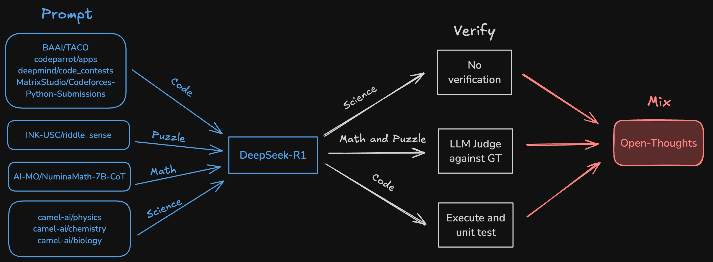

<!-- markdownlint-disable first-line-h1 -->
<!-- markdownlint-disable html -->
<!-- markdownlint-disable no-duplicate-header -->

<div align="center">
  
</div>
<p align="center">
  <a href="https://open-thoughts.ai">
    
  </a>
  <a href="https://huggingface.co/open-thoughts">
    
  </a>
  <br>
  <i>Curating the best open reasoning datasets</i><br> 
  A collaboration led by <a href="https://bespokelabs.ai/">Bespoke Labs</a> and the <a href="https://www.datacomp.ai/">DataComp</a> community

</p>
<hr>

Our first goal is to curate a reasoning dataset to train state-of-the-art small reasoning models that surpass [DeepSeek-R1-Distill-Qwen-32B](https://huggingface.co/deepseek-ai/DeepSeek-R1-Distill-Qwen-32B) and [DeepSeek-R1-Distill-Qwen-7B](https://huggingface.co/deepseek-ai/DeepSeek-R1-Distill-Qwen-7B) on math and code reasoning benchmarks.


# News
- **[2025/01/28]** 🎉 [Open Thoughts](https://www.open-thoughts.ai/) launches with [OpenThoughts-114k dataset](https://huggingface.co/datasets/open-thoughts/OpenThoughts-114k) and [OpenThinker-7B model](https://huggingface.co/open-thoughts/OpenThinker-7B).
- **[2025/01/27]** 🎉 [Bespoke-Stratos-17k dataset](https://huggingface.co/datasets/bespokelabs/Bespoke-Stratos-17k) is a top trending dataset on Hugging Face.
- **[2025/01/22]** 🎉 We [release](https://www.bespokelabs.ai/blog/bespoke-stratos-the-unreasonable-effectiveness-of-reasoning-distillation) our [Bespoke-Stratos-17k dataset](https://huggingface.co/datasets/bespokelabs/Bespoke-Stratos-17k) and [Bespoke-Stratos-32B model](https://huggingface.co/bespokelabs/Bespoke-Stratos-32B)

# Results
The numbers reported in the table below are evaluated with our open-source tool [Evalchemy](https://github.com/mlfoundations/Evalchemy).

|                             | AIME24   | MATH500 | GPQA-Diamond | LCBv2 Easy  | LCBv2 Medium  | LCBv2 Hard  | LCBv2 All  |
| --------------------------- | -------- | ------- | ------------ | ----------- | ------------- | ----------- | ---------- |
| OpenThinker-7B              | 43.3     | 83.0    | 42.4         | 75.3        | 28.6          | 6.5         | 39.9       |
| Bespoke-Stratos-7B          | 16.6     | 79.6    | 38.9         | 71.4        | 25.2          | 0.8         | 35.8       |
| DeepSeek-R1-Distill-Qwen-7B | 60       | 88.2    | 46.9         | 79.7        | 45.1          | 14.6        | 50.1       |
| gpt-4o-0513                 | 10       | 75.8    | 46.5         | 87.4        | 42.7          | 8.9         | 50.5       |
| o1-mini                     | 63       | 85.6    | 60           | 92.8        | 74.7          | 39.8        | 72.8       |

We are fully open-source. Our [model weights](https://huggingface.co/open-thoughts), [datasets](https://huggingface.co/open-thoughts), [data generation code](https://github.com/open-thoughts/open-thoughts), [evaluation code](https://github.com/mlfoundations/Evalchemy), and [training code](https://github.com/hiyouga/LLaMA-Factory) are all publicly available. 

|  | Open Weights | Open Data | Open Code | 
|--|--------------|-----------| --------- |
|OpenThinker-7B|✅|[✅](https://huggingface.co/datasets/open-thoughts/OpenThoughts-114k)|[✅](https://github.com/open-thoughts/open-thoughts) |
|Bespoke-Stratos-7B|✅|[✅](https://huggingface.co/datasets/bespokelabs/Bespoke-Stratos-17k)|[✅](https://github.com/bespokelabsai/curator/tree/main/examples/bespoke-stratos-data-generation)|
|DeepSeek-R1-Distill-Qwen-7B|✅|❌|❌|
|gpt-4o-0513|❌|❌|❌|❌|
|o1-mini|❌|❌|❌|❌|

# Installation
```
make install
poetry shell
```
Set the DeepSeek API key:
```
export DEEPSEEK_API_KEY=your_api_key
```

Set HF_ORG to your organization id. Set HF_PRIVATE=true if you want to push to a private repo.
```
export HF_ORG=your_org_id
export HF_PRIVATE=false
```

# Data Generation

Currently, we are generating data for the following domains:
1. Code
2. Math
3. Science
4. Puzzle

The recipe is outlined below:
<picture>
    <source media="(prefers-color-scheme: light)" width="100%" srcset="diagram.png">
    
</picture>

More instructions are in [open_thoughts/README.md](open_thoughts/README.md).


# Training and Evaluation
Training and evaluation code coming soon.

# Links
- 📊 [Open Thoughts Launch Blog Post](https://www.open-thoughts.ai/blog/launch)
- 🧠 [OpenThoughts-114k dataset](https://huggingface.co/datasets/open-thoughts/OpenThoughts-114k)
- 🤖 [OpenThinker-7B model](https://huggingface.co/open-thoughts/OpenThinker-7B)
- 📊 [Bespoke-Stratos Blog Post](https://www.bespokelabs.ai/blog/bespoke-stratos-the-unreasonable-effectiveness-of-reasoning-distillation)
- 🧠 [Bespoke-Stratos-17k dataset](https://huggingface.co/datasets/bespokelabs/Bespoke-Stratos-17k)
- 🤖 [Bespoke-Stratos-32B model](https://huggingface.co/bespokelabs/Bespoke-Stratos-32B)
- 🤖 [Bespoke-Stratos-7B model](https://huggingface.co/bespokelabs/Bespoke-Stratos-7B)

# About Us

We are a team of researchers and engineers from [Bespoke Labs](https://www.bespokelabs.ai/), Stanford, University of California Berkeley, University of Washington, Juelich Supercomputing Center (JSC), LAION, UCLA, UNC Chapel Hill, UT Austin, and Toyota Research Institute united around building the best datasets (and thus the best models). See our previous works at [datacomp.ai](https://www.datacomp.ai/) and [mlfoundations](https://github.com/mlfoundations).

# Sponsors
Open Thoughts is supported by 
- [Bespoke Labs](https://www.bespokelabs.ai/)
- [Lambda Labs](https://lambdalabs.com/)
- [NSF IFML](https://www.ifml.institute/)
- [UT Austin Machine Learning Lab](https://ml.utexas.edu/)
- [Juelich Supercomputing Center](https://www.fz-juelich.de/en/ias/jsc)
- Toyota Research Institute
