# FBI Watchdog

:shield: FBI Watchdog is a cyber threat intelligence OSINT tool that monitors domain DNS changes in real-time, specifically detecting law enforcement seizures (`ns1.fbi.seized.gov` and `ns2.fbi.seized.gov`). It alerts users via Telegram and Discord and captures screenshots of seized domains.

<p align="center">
  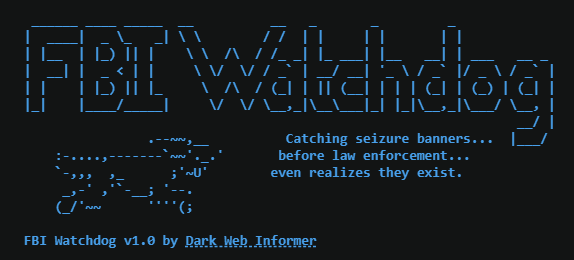
</p>

✅ FBI Watchdog is clean! No detections on VirusTotal. Check the latest scan report here: [VirusTotal Report](https://www.virustotal.com/gui/file/87466e912dcf3b3439c02bf6208703def32e864cd2bcecd47763277193f2241f)

🚨 **Live in Action**: FBI Watchdog is actively monitoring domains on **my Telegram channel**: [TheDarkWebInformer](https://t.me/TheDarkWebInformer).  

🔍 **Want Cyber Threat Intelligence updates?** Visit **[DarkWebInformer.com](https://darkwebinformer.com)** for real-time insights on data breaches, data leaks, ransomware and more dark web threats.

---

## 📸 FBI Watchdog in Action

### 🔍 Checking DNS
| **DNS Checking** | **More DNS Checking** | **DNS Checking Finished** |
|:---------------:|:-------------------:|:-----------------:|
|  | 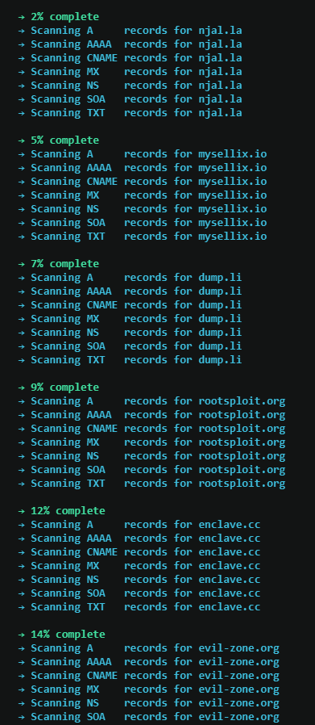 | 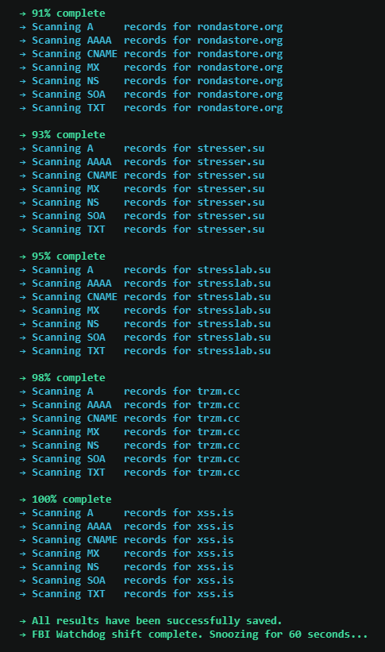 |
| *Checking for DNS Record Changes* | *Checking for More DNS Changes* | *DNS Checking Completed* |

### ⚠️ Detecting DNS Changes & Seizure Capture
| **DNS Changes Alerted** | **Seizure Page Captured** |
|:----------------------:|:----------------------:|
| 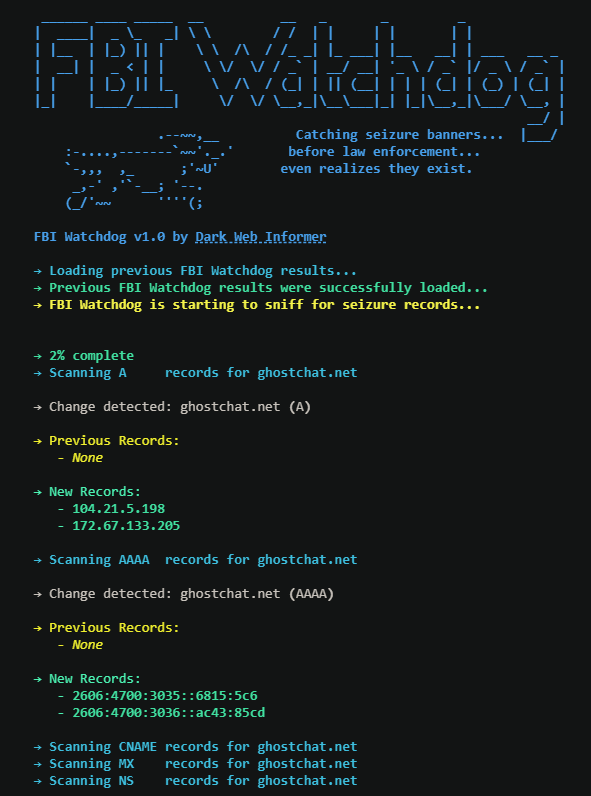 | 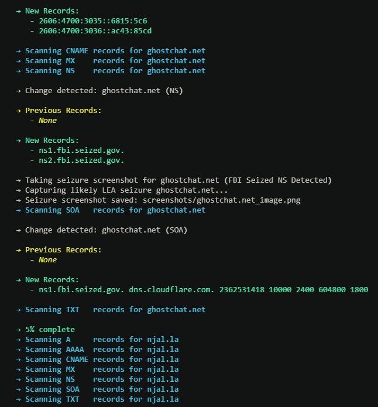 |
| *Detected DNS Record Change* | *Captured LEA Seizure Page* |

### 📲 Telegram Notifications
| **DNS Change Alert** | **Seizure Alert** | **Seizure Screenshot** |
|:--------------------:|:----------------:|:-----------------:|
| 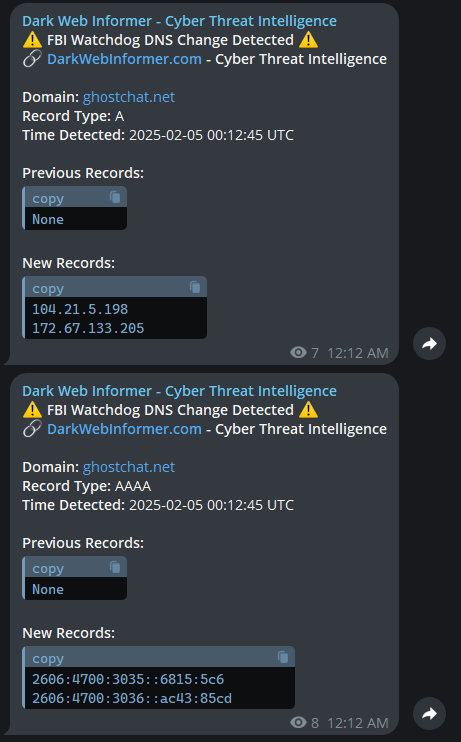 | 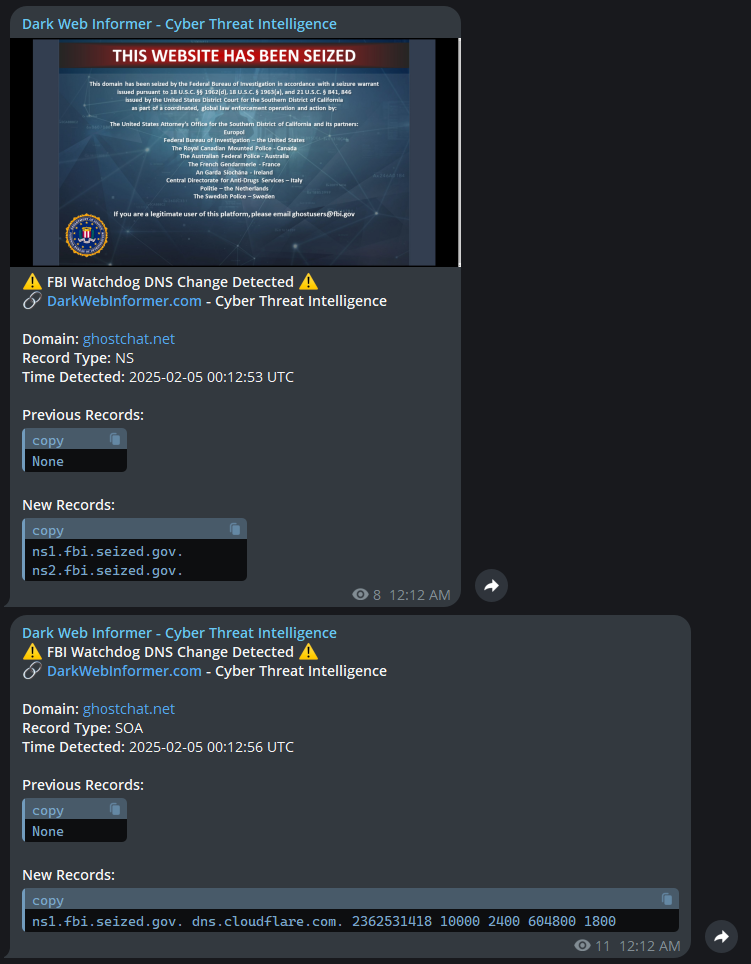 | 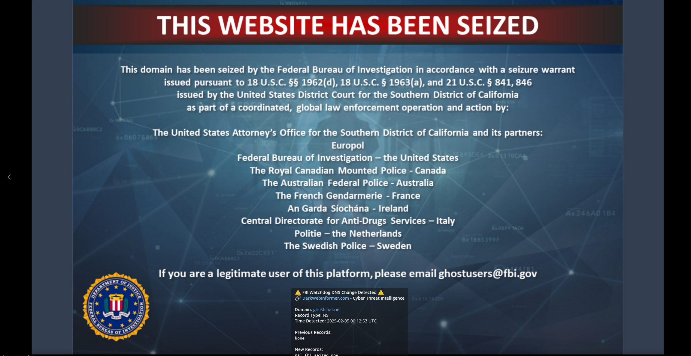 |
| *DNS Changes Sent to Telegram* | *Discord LEA Seizure Notification* | *Telegram Seizure Screenshot* |

### 🔔 Discord Notifications
| **DNS Change Alert** | **Seizure Alert** | **Seizure Screenshot** |
|:--------------------:|:----------------:|:------------------:|
| 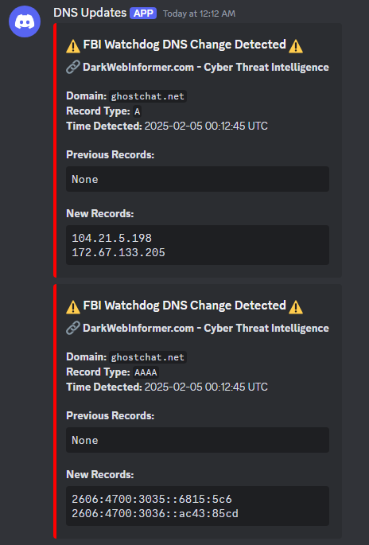 | 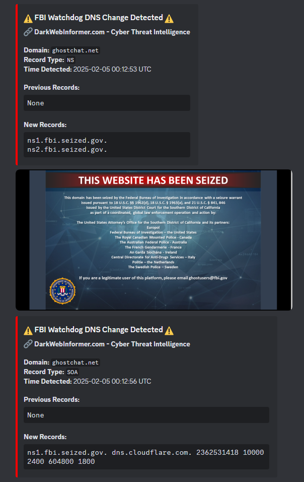 | 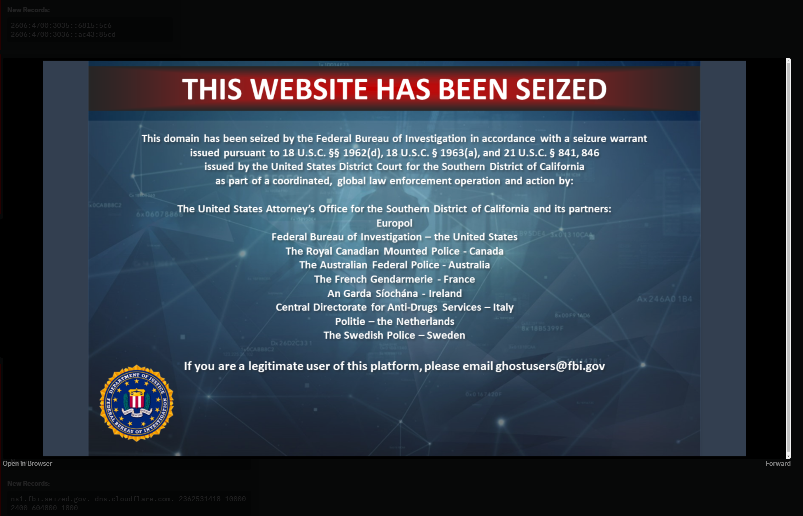 |
| *DNS Changes Sent to Discord* | *Telegram LEA Seizure Notification* | *Discord Seizure Screenshot* |

---

## :pushpin: Features
- :white_check_mark: **Real-time DNS Monitoring** – Detects changes in `A`, `AAAA`, `CNAME`, `MX`, `NS`, `SOA`, and `TXT` records.
- :white_check_mark: **Seizure Detection** – Identifies law enforcement takeovers (`ns1.fbi.seized.gov, ns2.fbi.seized.gov, jocelyn.ns.cloudflare.com, and plato.ns.cloudflare.com`).
- :white_check_mark: **Telegram & Discord Alerts** – Sends detailed notifications when a DNS change occurs or a domain is seized.
- :white_check_mark: **Screenshot Capture** – Uses **Selenium** to take snapshots of affected sites.
- :white_check_mark: **Rich CLI Output** – Uses **`rich`** for colored logs and better visibility.
- :white_check_mark: **Auto-Saves DNS History** – Stores previous DNS states in `fbi_watchdog_results.json`.
- :white_check_mark: **Cross-Platform** – Works on **Windows, Linux, and macOS**.

---

## :exclamation: Known Issues / Bugs
- :exclamation: **SSL Errors in Screenshots** – Some sites may not load in Selenium due to `ERR_SSL_VERSION_OR_CIPHER_MISMATCH`.
- :exclamation: **DNS Query Failures** – Some domains may not return results due to **NXDOMAIN** errors.
- :exclamation: **Telegram Message Duplication** – On rare occasions, Telegram alerts may be sent twice.

---

## :rocket: Future Features
- :rocket: **Multi-Platform Notifications** – Add support for **Slack & Email alerts**.
- :rocket: **Database Support** – Store DNS history in **SQLite or PostgreSQL** instead of JSON.
- :rocket: **Check For Updates** – Script will check for new updates on startup.
- :rocket: **Seizure Detection Without NS Changes** – Detect LEA seizures using HTTP status codes, WHOIS changes, and/or SSL certificate logs.
- :rocket: **Custom Domain List and DNS Records File (`config.json`)** – Allow users to define monitored domains, and records into a config file instead of hardcoding.
- :rocket: **Randomized User-Agent for Selenium** – Implement a rotating User-Agent to bypass bot detection and avoid fingerprinting.
- :rocket: **Onion Site Monitoring** – Add `.onion` support for hidden services.
- :rocket: **Faster Checks with AsyncIO or Threading** – Improve DNS monitoring speed by using asyncio (aiodns) or threading for parallel lookups, reducing scan times and improving efficiency.

---

### 💻 System Requirements:
- 🐍 **Python 3.x** (Latest version preferred, minimum recommended: Python 3.8)
- 🖥️ **Google Chrome installed** (For Selenium screenshots)

### 📜 Required Python Packages:
The script requires the following dependencies:

```sh
dnspython requests python-dotenv selenium webdriver-manager rich
```

---

## 🖥️ Installation Guide

Follow these steps to install and set up **FBI Watchdog** on your system.

---

### **1️⃣ Clone the Repository**
```sh
git clone https://github.com/DarkWebInformer/FBI_Watchdog.git
cd FBI_Watchdog
```

---

### **2️⃣ Install Dependencies**
Ensure you have Python **3.x** installed. Then, install the required dependencies:

```sh
pip install -r requirements.txt
```

---

### **3️⃣ Setup Environment Variables**
Create a `.env` file in your **root directory** and add your Discord Webhook, Telegram API key, and Telegram Channel ID:

```ini
WEBHOOK=<your_discord_webhook>
TELEGRAM_BOT_TOKEN=<your_telegram_bot_token>
TELEGRAM_CHAT_ID=<your_telegram_chat_id>
```

🔹 Replace `<your_discord_webhook>`, `<your_telegram_bot_token>`, and `<your_telegram_chat_id>` with your actual credentials.

---

### **4️⃣ Add Domains to Monitor**
Add domains you want to monitor for DNS and seizure changes.

```sh
domains = ["example.com", "example1.com", "example2.com"]
```

---

### **4️⃣ Run the Script**
Start FBI Watchdog with:

```sh
python fbi_watchdog.py
```

🔍 **FBI Watchdog** will now begin monitoring for seizure banners and tracking domain changes.

---

## 💰 Support FBI Watchdog & Dark Web Informer

FBI Watchdog is an open-source project dedicated to cyber threat intelligence, monitoring seizure banners, and providing real-time insights. Your support helps keep this project running!

You can also get access to premium cyber threat intelligence on **[Dark Web Informer](https://darkwebinformer.com)**.

### 📢 Subscription Options:  
- 💳 **Standard Subscription:** [Sign up here](https://darkwebinformer.com/#/portal/signup)  
- 🏴‍☠️ **Crypto Subscription:** [Pay with cryptocurrency](https://darkwebinformer.com/crypto-payments/)  

🔍 Stay ahead of the latest cyber threats with real-time intelligence. 🚀  

### ❤️ Donate to Support Dark Web Informer's Work
If you find Dark Web Informer and/or FBI Watchdog valuable, consider making a **donation** to help future development, research, and cyber threat intelligence.
👉 [Donate here](https://darkwebinformer.com/donations)

### 📢 Advertise With Dark Web Informer
Looking to **promote your cybersecurity services** or **reach the right audience**?
Check out the **advertising options** here: [Advertising Rates](https://darkwebinformer.com/advertising-rates)

Your support helps keep **FBI Watchdog** and **Dark Web Informer** independent and continuously improving. Thank you!

---

## Star History

<a href="https://star-history.com/#DarkWebInformer/FBI_Watchdog&Date">
 <picture>
   <source media="(prefers-color-scheme: dark)" srcset="https://api.star-history.com/svg?repos=DarkWebInformer/FBI_Watchdog&type=Date&theme=dark" />
   <source media="(prefers-color-scheme: light)" srcset="https://api.star-history.com/svg?repos=DarkWebInformer/FBI_Watchdog&type=Date" />
   
 </picture>
</a>

## 📝 License

This project is licensed under the **MIT License** – see the [LICENSE](https://github.com/DarkWebInformer/FBI_Watchdog/blob/main/LICENSE) file for details.
