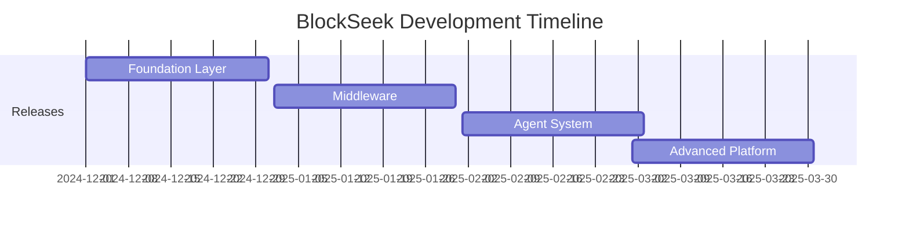

# 🚀 BlockSeek Documentation

### AI-Powered Blockchain Intelligence Platform

---

Welcome to BlockSeek's official documentation. BlockSeek combines state-of-the-art AI with blockchain technology to revolutionize cryptocurrency trading and analysis.

**Some Features:**

- 🔗 Born for **On-Chain Trading**
  - Deeply trained on on-chain data to significantly enhance every user's trading efficiency
  - Real-time market insights and trading signals
- 🔒 **Decentralized** Data Storage
  - Store data on the blockchain to ensure data integrity and security
  - Immutable and transparent data management
- 🤖 Freely Build Your **Own Agent**
  - **No-code Agent** Creation Platform for custom trading strategies
  - Enterprise-grade LLM & Agent APIs with extensive documentation
  - Seamless integration capabilities

## 🎮 Try Our Demo!

Experience BlockSeek's capabilities firsthand:

- 🤖 Test our **AI Trading Assistant** in action
- 📊 Explore real-time market data
- 🛠️ Experiment with sample trading strategies
- 📈 View live blockchain data analysis

👉 **[Launch Interactive Demo](https://demo.blockseek.ai)**

## 📚 Documentation

[Getting Started](./getting-started.md)

[Architecture](./architecture/overview.md)

[Technical Docs](./technical/index.md)

[API Reference](./api-reference/index.md)

## 🌟 Core Features

<b>Foundation Layer</b>

- 🤖 State-of-the-art Large Language Model with domain-specific fine-tuning
- 🔍 Comprehensive distributed blockchain indexing infrastructure
- 📚 Proprietary Web3-specialized knowledge embeddings (RAG)

<b>Middleware Layer</b>

- 📊 Real-time blockchain transaction monitoring
- 💹 High-frequency trading execution engine
- 📈 Advanced quantitative modeling
- 🎯 NLP-based sentiment analysis
- 🧪 Multi-strategy backtesting environment

<b>Application Layer</b>

- 🤝 Autonomous AI Trading Assistant
- 🛠️ No-code Agent Creation Platform
- 🔌 Enterprise-grade LLM & Agent APIs

## 📚 Dataset & Training

BlockSeek's LLM is fine-tuned on comprehensive data from 15+ authoritative sources in the Solana ecosystem:

| Category | Sources |
|----------|---------|
| Official Docs | Solana Documentation |
| Projects | Jito, Raydium, Jupiter |
| Infrastructure | Helius, QuickNode, ChainStack |
| DeFi & NFTs | Leading protocols and marketplaces |

## 🗓️ Release Schedule

## 🤝 Contributing

We welcome contributions! See our [Contributing Guidelines](./contributing.md) for:
- Code standards
- Development setup
- Pull request process
- Community guidelines

## 📝 License

This project is licensed under the MIT License - see the [LICENSE](../LICENSE) file for details.

## 🌐 Community

---

### Stay Updated! ⭐

Star our repository for notifications about releases, features, and updates.

[Report Bug](https://github.com/blockseek/issues) · [Request Feature](https://github.com/blockseek/issues) · [Documentation](https://docs.blockseek.ai)

 