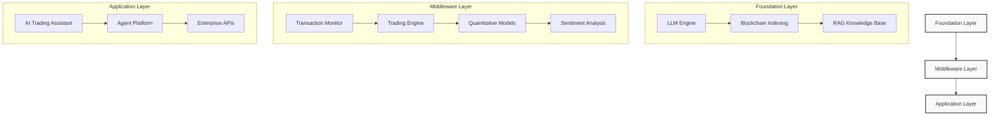

# BlockSeek Architecture Overview

> **Quick Links**
> - [Getting Started Guide](../getting-started.md)
> - [Project Roadmap](../roadmap.md)
> - [How to Contribute](../contributing.md)

BlockSeek is built on a three-layer architecture that combines advanced AI capabilities with blockchain technology to provide a comprehensive trading and analysis platform.

## Table of Contents
- [System Architecture](#system-architecture)
- [Foundation Layer](#foundation-layer)
- [Middleware Layer](#middleware-layer)
- [Application Layer](#application-layer)
- [Technical Details](#technical-details)

## System Architecture

> 💡 **Note**: The diagram above shows the high-level system architecture. Each component is detailed in the sections below.

## Foundation Layer

The foundation layer serves as the backbone of BlockSeek, providing core infrastructure and AI capabilities:

### Large Language Model (LLM) 🤖
- Custom-trained on 15+ authoritative Solana ecosystem sources
- Built on DeepSeek's open-source architecture
- Domain-specific fine-tuning for cryptocurrency markets
- Specialized Web3 knowledge integration

### Blockchain Indexing 🔍
- Distributed infrastructure for real-time data processing
- Comprehensive historical data archival
- High-performance query capabilities
- Multi-chain support with Solana focus

### RAG Knowledge Base 📚
- Proprietary Web3-specialized embeddings
- Real-time knowledge updates
- Context-aware information retrieval
- Automated knowledge graph maintenance

## Middleware Layer

The middleware layer handles data processing, analysis, and execution:

### Transaction Monitoring 📊
- Real-time mempool analysis
- Pattern recognition
- Anomaly detection
- Market impact assessment

### Trading Engine 💹
- High-frequency execution capabilities
- Smart order routing
- Risk management systems
- Multi-venue integration

### Quantitative Modeling 📈
- Deep learning models
- Statistical arbitrage
- Market prediction
- Risk assessment

### Sentiment Analysis 🎯
- Social media monitoring
- News analysis
- Market sentiment indicators
- Trend detection

## Application Layer

The application layer provides user-facing features and integration capabilities:

### AI Trading Assistant 🤝
- Natural language interface
- Contextual awareness
- Autonomous decision-making
- Strategy optimization

### Agent Creation Platform 🛠️
- Visual workflow builder
- No-code agent development
- Strategy backtesting
- Performance analytics

### Enterprise APIs 🔌
- Comprehensive SDKs
- Real-time data streams
- Secure authentication
- Rate limiting and quotas

## Technical Details

### Data Flow
1. The Foundation Layer continuously processes and indexes blockchain data
2. The Middleware Layer analyzes this data in real-time
3. The Application Layer presents insights and enables action through various interfaces

### Security Considerations 🔒
- End-to-end encryption
- Multi-factor authentication
- Rate limiting
- Regular security audits
- Secure key management

### Performance Optimization ⚡
- Distributed processing
- Caching layers
- Load balancing
- Geographic distribution
- Optimized query patterns

### Future Scalability 🚀
The architecture is designed to scale horizontally across all layers:
- Foundation Layer: Additional model deployment and data nodes
- Middleware Layer: Increased processing capacity
- Application Layer: Enhanced feature set and user capacity

---

> **Need Help?**
> - For implementation details, check our [Getting Started Guide](../getting-started.md)
> - To contribute, see our [Contributing Guidelines](../contributing.md)
> - For future plans, view our [Roadmap](../roadmap.md) 