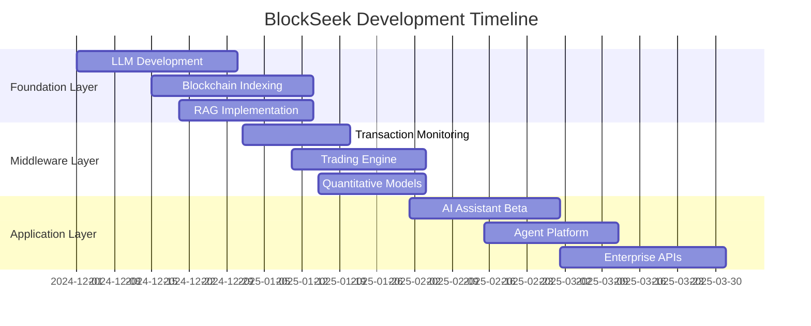

# BlockSeek Development Roadmap

## Overview

BlockSeek's development roadmap outlines our strategic vision for building a comprehensive AI-powered trading and analysis platform. This document details our planned features, milestones, and release schedule.

## Timeline

## Phase 1: Foundation Layer (December 2024)

### Week 1-2
- Initialize DeepSeek-based LLM architecture
- Begin domain-specific training data preparation
- Set up basic blockchain indexing infrastructure

### Week 3-4
- Complete LLM fine-tuning
- Implement comprehensive blockchain data indexing
- Develop initial RAG knowledge base
- Begin integration testing

**Key Deliverables:**
- ✅ Production-ready LLM
- ✅ Functional blockchain indexing system
- ✅ Basic RAG implementation
- ✅ Initial API endpoints

## Phase 2: Middleware Integration (January 2025)

### Week 1-2
- Deploy transaction monitoring system
- Implement basic trading execution engine
- Begin quantitative modeling framework development

### Week 3-4
- Complete high-frequency trading engine
- Integrate advanced analytics
- Deploy initial developer APIs
- Begin beta testing

**Key Deliverables:**
- ✅ Real-time transaction monitoring
- ✅ Functional trading engine
- ✅ Basic quantitative models
- ✅ Developer SDK v1.0

## Phase 3: Autonomous Agent Release (February 2025)

### Week 1-2
- Launch AI Trading Assistant beta
- Implement basic agent architecture
- Begin integration with analytics

### Week 3-4
- Complete core agent functionality
- Deploy beta version of agent platform
- Begin user testing

**Key Deliverables:**
- ✅ AI Trading Assistant beta
- ✅ Basic agent creation tools
- ✅ Integration with analytics
- ✅ Initial user documentation

## Phase 4: Advanced Agent Platform (March 2025)

### Week 1-2
- Deploy advanced ML models
- Implement statistical arbitrage
- Enhance NLP capabilities
- Launch multi-agent orchestration

### Week 3-4
- Complete visual workflow builder
- Deploy automated backtesting
- Launch risk management system
- Release enterprise features

**Key Deliverables:**
- ✅ Complete agent platform
- ✅ Advanced trading features
- ✅ Enterprise integration
- ✅ Comprehensive documentation

## Future Development

### Q2 2025
- Advanced market prediction models
- Enhanced automation capabilities
- Additional chain integrations
- Expanded enterprise features

### Q3 2025
- Community-driven agent marketplace
- Advanced risk management tools
- Cross-chain optimization
- Enhanced security features

### Q4 2025
- AI-driven portfolio management
- Advanced backtesting capabilities
- Institutional-grade features
- Global market expansion

## Success Metrics

### Technical Metrics
- System uptime: 99.99%
- Transaction processing speed
- Model accuracy rates
- API response times

### Business Metrics
- User adoption rate
- Trading volume
- Revenue growth
- Market share

## Risk Management

### Technical Risks
- Model performance
- System scalability
- Security vulnerabilities
- Integration challenges

### Mitigation Strategies
- Comprehensive testing
- Regular security audits
- Scalable architecture
- Redundant systems

## Community Engagement

### Developer Program
- SDK documentation
- Technical workshops
- Developer support
- Community contributions

### User Community
- Feature requests
- Bug reporting
- User feedback
- Community events

## Conclusion

This roadmap represents our commitment to building a comprehensive AI-powered trading platform. We will continuously update this document as we achieve milestones and adjust our plans based on market conditions and user feedback. 