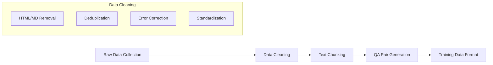

# Dataset and Training Documentation

## Dataset Overview

BlockSeek's Large Language Model is trained on a comprehensive dataset that integrates information from 15+ authoritative sources in the Solana ecosystem. This document details the dataset composition, processing methodology, and training approach.

## Data Sources

### Core Documentation
1. **Official Solana Documentation**
   - Blockchain architecture
   - Consensus mechanisms (PoH, PoS)
   - Smart contract development
   - RPC interaction guides
   - Developer tools documentation

### Project-Specific Documentation
1. **DeFi Protocols**
   - Raydium DEX
   - Jupiter Aggregator
   - Meteora
   - PumpPortal

2. **Infrastructure Providers**
   - Helius
   - QuickNode
   - ChainStack
   - Tatum
   - Alchemy

3. **Market Data & Analytics**
   - DexScreener
   - Bitquery
   - MagicEden

## Data Processing Pipeline

### 1. Data Extraction
- Manual curation to ensure data quality
- Structured data extraction from APIs
- Documentation version tracking
- Source attribution maintenance

### 2. Data Cleaning
- **Format Cleaning**
  - HTML tag removal
  - Markdown formatting standardization
  - Special character handling
  
- **Content Processing**
  - Duplicate content removal
  - Spelling and grammar correction
  - Terminology standardization
  - Inconsistency resolution

### 3. Text Chunking
- Chunk size: 1,500 characters
- Overlap: 200 characters
- Context preservation
- Semantic boundary respect

### 4. QA Pair Generation
- 10 QA pairs per chunk
- GPT-4 powered generation
- Quality assurance criteria:
  - Relevance to chunk content
  - Answer accuracy
  - Question diversity
  - Context completeness

## Training Methodology

### 1. Pre-training
- Base model: DeepSeek
- Architecture modifications
- Vocabulary expansion

### 2. Fine-tuning
- Domain adaptation
- Task-specific training
- Performance metrics

### 3. Evaluation
- Accuracy metrics
- Domain-specific benchmarks
- Real-world testing

## Data Quality Assurance

### Validation Process
1. Automated checks
   - Format validation
   - Content consistency
   - Reference integrity

2. Manual review
   - Expert validation
   - Content accuracy
   - Technical correctness

### Quality Metrics
- Source reliability score
- Content freshness
- Technical accuracy
- Completeness score

## Dataset Maintenance

### Update Frequency
- Core documentation: Weekly
- Market data: Daily
- Project documentation: On release

### Version Control
- Dataset versioning
- Change tracking
- Rollback capability

## Usage Guidelines

### Access Control
- Data access levels
- Usage restrictions
- Attribution requirements

### Best Practices
- Data handling
- Integration methods
- Update procedures

## Future Improvements

1. **Data Sources**
   - Additional protocol integration
   - New market data sources
   - Community contributions

2. **Processing Pipeline**
   - Enhanced automation
   - Improved QA generation
   - Real-time updates

3. **Training Methods**
   - Advanced fine-tuning techniques
   - Improved evaluation metrics
   - Continuous learning capabilities 