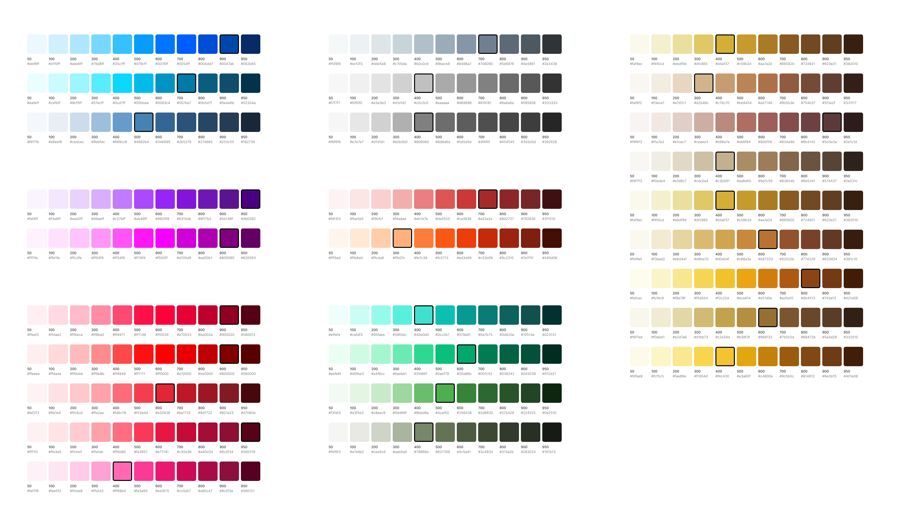
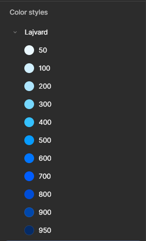
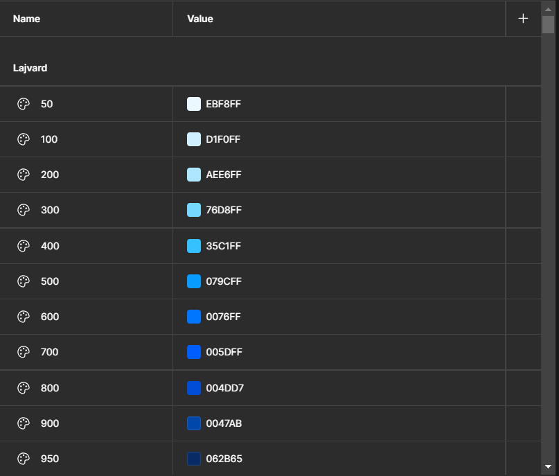

# Iranian Color Palette for Figma

This Figma file provides a Tailwind-style Iranian-inspired color palette, ranging from shades `50` to `950`, designed for easy integration into your design projects. The palette is based on the beautiful and culturally significant colors from the [Iranian Color Palette repository](https://github.com/nafasebra/iranian-colors).

## Features

- **Tailwind-Style Shades**: Each color comes in a range of shades from `50` (lightest) to `950` (darkest), making it versatile for various design needs.
- **Cultural Significance**: The colors are inspired by Iranian culture, art, and nature, bringing a unique aesthetic to your designs.
- **Figma Compatibility**: The palette is designed for Figma, making it easy to import and use in your projects.
- **Customizable**: Easily adjust the colors or add new shades to suit your specific design requirements.
- **Local Styles**: All colors are available as Figma Local Styles, allowing for consistent and reusable color application across your designs.
- **Local Variables**: Colors are also defined as Local Variables, enabling dynamic theming and advanced design system functionality.

## How to Use

### Step 1: Download the Figma File
1. Download the `.fig` file.
2. Save the file to your computer.

### Step 2: Import into Figma
1. Open Figma and create a new project or open an existing one.
2. Go to `File` > `Import` and select the downloaded `.fig` file.
3. The Iranian color palette will now be available in your Figma project.

### Step 3: Apply the Colors
1. Select any design element (e.g., shape, text, or frame).
2. In the `Design` panel, click on the color picker.
3. Choose from the imported Iranian color palette to apply the desired shade.

### Step 4: Customize (Optional)
- To customize the palette, duplicate the color styles and modify them as needed.
- You can also add new shades or adjust the existing ones to better fit your project.

## Preview

Here’s a preview of the Iranian color palette:

  

---

## Contribution

If you have suggestions or improvements for the palette, feel free to open an issue or submit a pull request. Let’s make this palette even better together!

---
