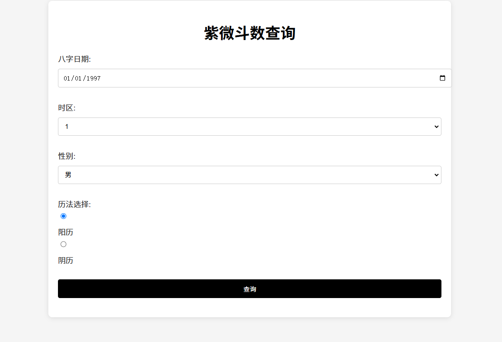
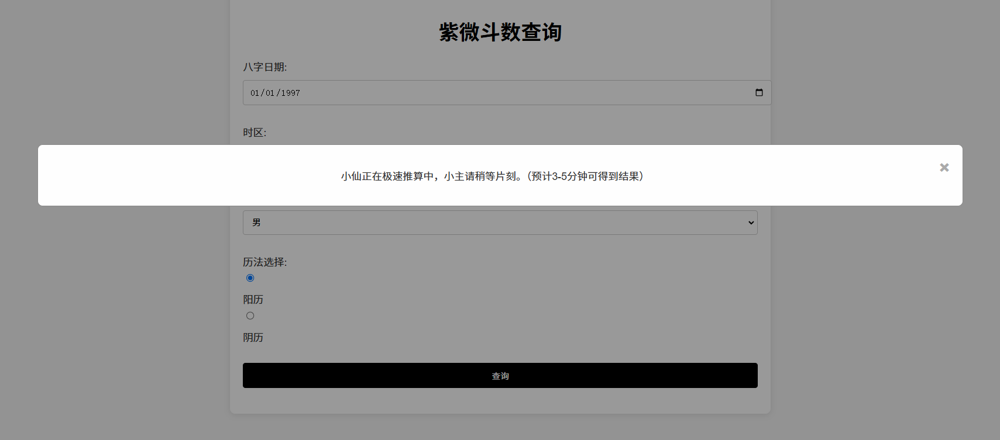
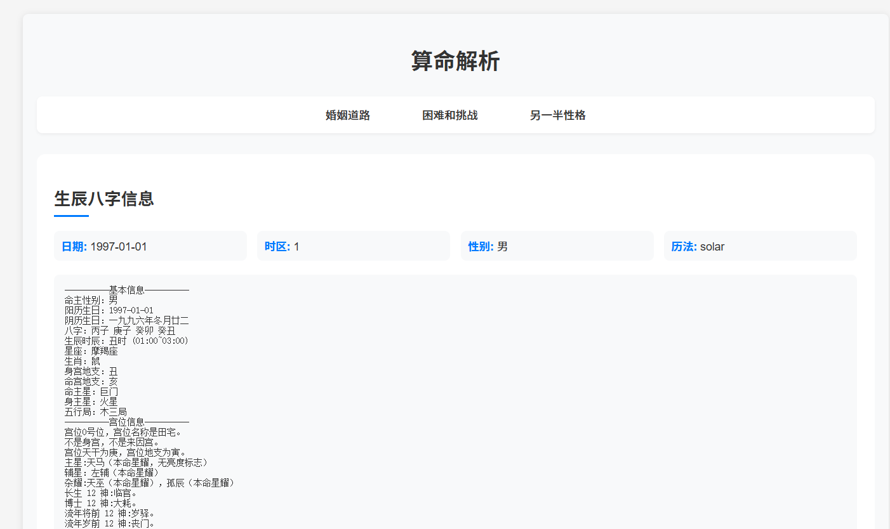
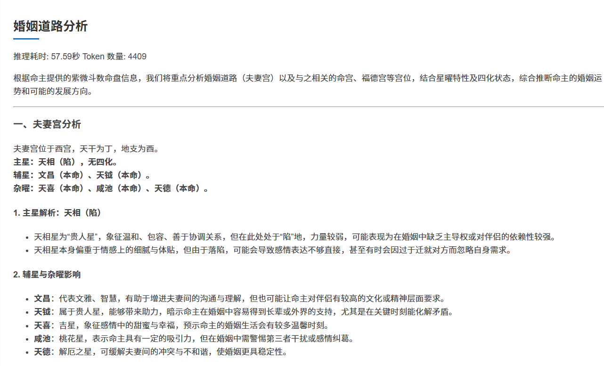
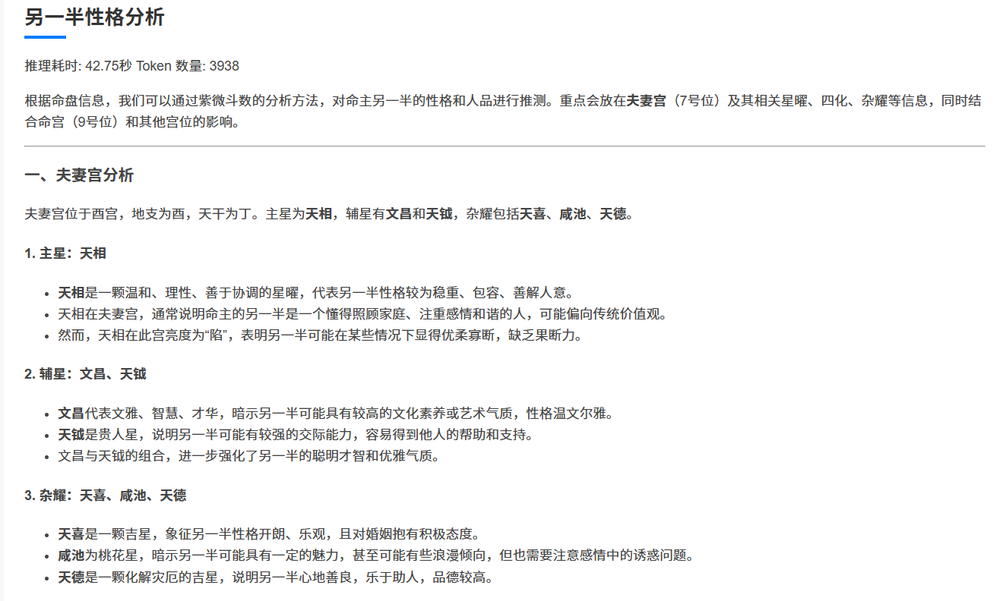
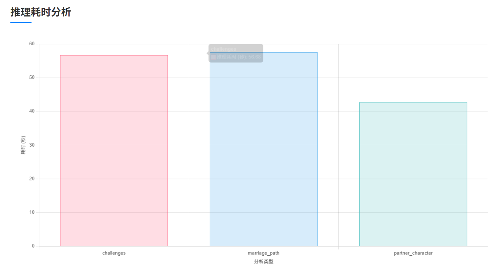
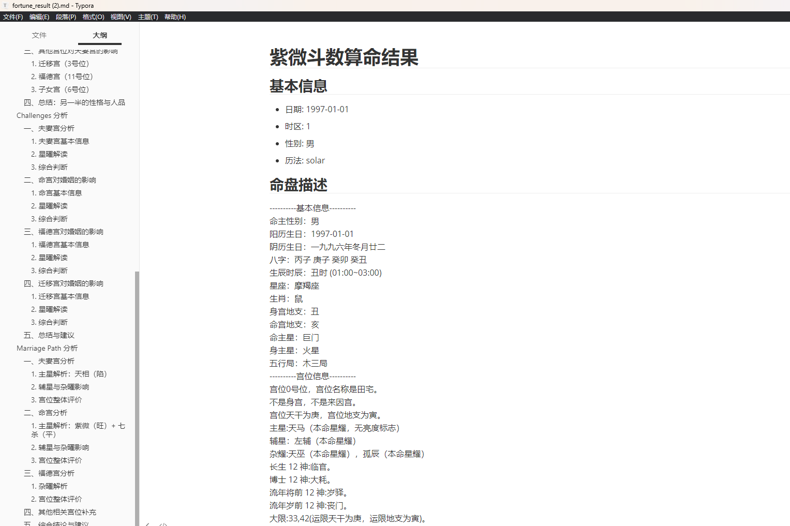

# DeepSeek-Oracle

基于紫微斗数的命理分析系统，使用deepseek等大语言模型进行解读。

## 新闻

v0.0.1 正值情人节发布姻缘版~

## 功能特点

- 支持阳历/阴历日期转换
- 自动生成紫微斗数命盘
- 使用大语言模型分析命盘
- 支持多线程并发分析
- 自动保存分析结果
- Token 使用统计
- Markdown 格式导出

## 界面展示
### bilibili视频展示：
[【情人节到了，来用DeepSeek算算命里的那个ta】](https://www.bilibili.com/video/BV1M4KPeYEUd/?share_source=copy_web&amp;vd_source=61a460664b149ef3561e7fc98974fc81)

1. 进入系统后填写八字即可查询自己的姻缘相关分析。


2. 点击查询稍等一会就能得到结果。


3. 可以获取到的内容有生成八字及紫薇命盘。


4. 婚姻道路分析。


5. 与伴侣的困难和挑战。


6. 另一半的性格。


7. 查阅整体推理耗时情况。


8. 如果满意可以下载为md备用。


## 环境要求

### Node.js 环境
- Node.js 16+
- pnpm

### Python 环境
- Python 3.8+
- pip

## 安装步骤

1. 安装 Node.js 依赖


```bash
pnpm add -S iztro express
```


2. 安装 Python 依赖


### 主要 Python 依赖
- Flask: Web 框架
- Flask-CORS: 处理跨域请求
- python-dotenv: 环境变量管理
- transformers: Tokenizer 处理
- sqlite3: 数据库支持
- requests: HTTP 请求

## 配置说明

### 环境变量配置
在项目根目录创建 `.env` 文件：

```bash
DEEPSEEK_API_KEY=your-api-key-here
DEEPSEEK_BASE_URL=https://dashscope.aliyuncs.com/compatible-mode/v1
```

注意：如果使用火山api请在llmana/deepseek_huoshan_api.py 修改推理接入点 


### 数据库配置
项目使用 SQLite 数据库，首次运行时会自动创建 `data.db` 文件。

## 启动服务

1. 启动 Node.js 服务

```bash
node src/index.js
```

2. 启动 Python 服务

   ```bash
   python app.py
   ```

   

## 访问系统

打开浏览器访问：

http://localhost:5000


## 项目结构

<pre>
python_iztro/
├── app.py # Flask 主应用
├── requirements.txt # Python 依赖
├── .env # 环境变量配置
├── .gitignore # Git 忽略配置
├── fortune_result.md # 分析结果输出
├── llmana/ # 大语言模型接口
│ ├── deepseekapi.py # DeepSeek API
│ ├── glmapi.py # GLM API
│ ├── qwenmax_api.py # QwenMax API
│ └── deepseek_ali_api.py # 阿里云 DeepSeek API
├── token_ana/ # Token 分析工具
├── templates/ # HTML 模板
└── static/ # 静态资源
</pre>

## 使用说明

1. 输入出生日期、时区等信息
2. 系统自动生成紫微斗数命盘
3. 大语言模型分析命盘内容，包括：
   - 婚姻道路分析
   - 困难和挑战分析
   - 伴侣性格分析
4. 可下载分析结果的 Markdown 文件

## 分析结果

分析结果将保存在 `fortune_result.md` 文件中，包含：
- 基本信息（日期、时区、性别、历法）
- 命盘描述
- 各项分析结果
- 每项分析的推理时间和 Token 使用量

## 大语言模型支持

支持多种大语言模型接口：
- DeepSeek
- GLM
- QwenMax
- 阿里云 DeepSeek

## 注意事项

- 请确保已正确配置 API 密钥
- Node.js 服务必须先于 Python 服务启动
- 首次使用需要下载 transformers 模型文件
- 分析结果会自动保存到数据库和 Markdown 文件

## License

MIT
