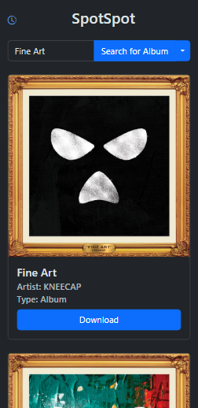
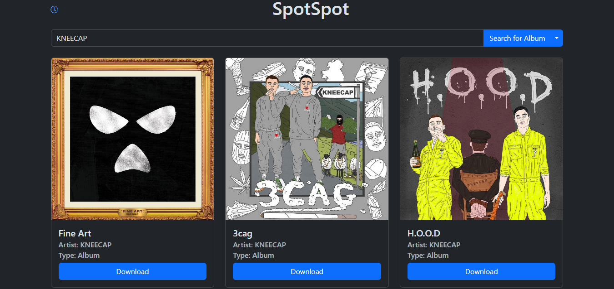

**SpotSpot** is a simple tool for searching Spotify and downloading via YouTube (spotDL/yt-dlp).


## Features:

- **Full SpotDL Support:** Download Albums, Tracks, Playlists, and Artists.
- **Playlist Generator:** Automatically generate playlists.
- **Custom Filepaths:**  Set your download and config directories in the settings.
- **Mobile Optimized:**  Designed for small screens to enhance usability on mobile devices.


## Docker Compose Configuration

Create a `docker-compose.yml` file:

```yaml
services:
  spotspot:
    image: ghcr.io/mattblackonly/spotspot:latest
    container_name: spotspot
    ports:
      - 6544:6544
    volumes:
      - /data:/data # If you need to change this also change it for the TRACK_OUTPUT, ALBUM_OUTPUT, PLAYLIST_OUTPUT, ARTIST_OUTPUT
      - /path/to/config:/config # Option to store cookies file
      - /path/to/temp:/temp # Optional.
      - /etc/localtime:/etc/localtime:ro # Optional. Sync time with host.
      - /etc/timezone:/etc/timezone:ro # Optional. Sync timezone with host.
    environment:
      - PUID=1000
      - PGID=1000
    restart: unless-stopped
```


## 🎵 Playlist Configuration  

For playlists, an **absolute file path** is required in the `.m3u` playlist file. This ensures compatibility with media servers like **Plex**, which require absolute paths for proper playback.  

### ✅ Key Setup Requirements:  
1. **Container Path Mapping:**  
   - The `/data` directory should be **consistently** mapped in the container:  
     ```yml
     /data:/data
     ```
   - This ensures that all media files are accessible using the same path inside and outside the container.  

2. **Output Path Configuration:**  
   - Ensure the following output paths are correctly set:  
     - `TRACK_OUTPUT`  
     - `ALBUM_OUTPUT`  
     - `PLAYLIST_OUTPUT`  
     - `ARTIST_OUTPUT`  
     - `ABSOLUTE_SERVER_PATH`
     - `M3U_PLAYLIST_PATH`
   - These paths should align with your actual directory structure.  

3. **Adjust Paths as Needed:**  
   - If your media files are stored elsewhere, update the paths accordingly to avoid broken playlist links.  


## Configuration via Environment Variables

Customize the behavior of **SpotSpot** and **SpotDL** by setting the following environment variables in your `docker-compose.yml` file:

```yaml
environment:
  # General Configuration
  - CONFIG_PATH=/home/appuser/.spotdl/config.json    # Path where the config file will be saved (Windows default: D:/config.json, Linux default: /home/appuser/.spotdl/config.json)
  - FFMPEG_LOCATION= /usr/bin/ffmpeg                 # Location of ffmpeg executable (Windows default: D:/, Linux default: /usr/bin/ffmpeg)
  - TRACK_OUTPUT=/data/media/music/singles/{artist} - {title}.{output-ext}                      # Format for saving individual tracks (default: {artist} - {title}.{output-ext})
  - ALBUM_OUTPUT=/data/media/music/{artist}/{album} - ({year})/{artist} - {title}.{output-ext}  # Format for saving albums (default: {artist}/{album}/{artist} - {title}.{output-ext})
  - PLAYLIST_OUTPUT=/data/media/music/{list-name}/{artist} - {title}.{output-ext}               # Format for saving playlists (default: {list-name}/{artist} - {title}.{output-ext})
  - ARTIST_OUTPUT=/data/media/music/{artist}/{album} - ({year})/{artist} - {title}.{output-ext} # Format for saving artist albums (default: {artist}/{album}/{artist} - {title}.{output-ext})

  # Jellyfin Configuration
  - TRIGGER_JELLYFIN_SCAN=True                       # Trigger Jellyfin scan after download (default: True)
  - JELLYFIN_ADDRESS=http://192.168.1.123:8096       # Jellyfin server address (default: http://192.168.1.123:8096)
  - JELLYFIN_API_KEY=""                              # Jellyfin API Key (default: None)

  # Plex Configuration
  - TRIGGER_PLEX_SCAN=True                           # Trigger Plex scan after download (default: True)
  - PLEX_ADDRESS=http://192.168.1.123:32400          # Plex server address (default: http://192.168.1.123:32400)
  - PLEX_TOKEN=""                                    # Plex token (default: None)
  - PLEX_LIBRARY_NAME=Music                          # Plex library name (default: Music)
  - PLEX_SECTION_ID=1                                # Plex section ID (default: 1)

  # Playlist Configuration
  - GENERATE_M3U_PLAYLIST=True                       # Generate M3U playlist after download (default: True)
  - M3U_PLAYLIST_NAME=spotify_singles                # Name of the M3U playlist (default: spotify_singles)
  - M3U_PLAYLIST_PATH=/data/media/music/playlists    # Path for M3U playlist (default: /data/media/music/playlists)
  - ABSOLUTE_SERVER_PATH=/data/media/music/singles   # Path for media files (default: /data/media/music/singles)

  # SpotDL Specific Configuration
  - CLIENT_ID=5f573c9620494bae87890c0f08a60293       # Client ID for SpotDL (default: 5f573c9620494bae87890c0f08a60293)
  - CLIENT_SECRET=212476d9b0f3472eaa762d90b19b0ba8   # Client secret for SpotDL (default: 212476d9b0f3472eaa762d90b19b0ba8)
  - AUTH_TOKEN=""                                    # Authentication token for SpotDL (default: None)
  - USER_AUTH=False                                  # Enable user authentication (default: False)
  - HEADLESS=False                                   # Run in headless mode (default: False)
  - CACHE_PATH=/home/appuser/.spotdl/.spotipy        # Cache path for SpotDL (default: /home/appuser/.spotdl/.spotipy)
  - NO_CACHE=True                                    # Disable cache (default: True)
  - OUTPUT={artists} - {title}.{output-ext}          # Output format for downloaded tracks (default: {artists} - {title}.{output-ext})
  - FORMAT=mp3                                       # Format for output file (default: mp3)
  - PRELOAD=False                                    # Preload tracks (default: False)
  - PORT=8800                                        # Port for SpotDL service (default: 8800)
  - HOST=localhost                                   # Host for SpotDL service (default: localhost)
  - KEEP_ALIVE=False                                 # Keep the server alive (default: False)
  - ENABLE_TLS=False                                 # Enable TLS encryption (default: False)
  - PROXY=""                                         # Proxy for SpotDL (default: None)
  - SKIP_EXPLICIT=False                              # Skip explicit content (default: False)

  # Advanced Configuration
  - LOG_LEVEL="DEBUG"                                # Log level for SpotDL (default: DEBUG)
  - MAX_RETRIES=3                                    # Max retries for SpotDL requests (default: 3)
  - USE_CACHE_FILE=False                             # Use cache file (default: False)
  - AUDIO_PROVIDERS="youtube-music"                  # Audio providers for SpotDL (default: youtube-music)
  - LYRIC_PROVIDERS="genius,azlyrics,musixmatch"     # Lyrics providers (default: genius, azlyrics, musixmatch)
  - GENIUS_TOKEN="alXXDbPZtK1m2RrZ8I4k2Hn8Ahsd0Gh_o076HYvcdlBvmc0ULL1H8Z8xRlew5qaG"  # Genius API token
  - PLAYLIST_NUMBERING=False                         # Enable playlist numbering (default: False)
  - PLAYLIST_RETAIN_TRACK_COVER=False                # Retain track covers in playlist (default: False)
  - SCAN_FOR_SONGS=False                             # Scan for songs after download (default: False)
  - M3U=""                                           # Custom M3U playlist (default: None)
  - OVERWRITE="skip"                                 # Overwrite behavior (default: skip)
  - SEARCH_QUERY=""                                  # Search query for track (default: None)
  - FFmpeg_ARGS=""                                   # Custom arguments for ffmpeg (default: None)
  - BITRATE=""                                       # Set bitrate for downloads (default: None)

  # Session and File Management
  - SAVE_FILE=""                                     # Save file path (default: None)
  - FILTER_RESULTS=True                              # Enable result filtering (default: True)
  - THREADS=4                                        # Number of threads to use for downloads (default: 4)
  - COOKIE_FILE=""                                   # Path to cookie file (default: None, e.g /config/cookies.txt)
  - PRINT_ERRORS=False                               # Print errors (default: False)
  - SPONSOR_BLOCK=False                              # Enable sponsor block (default: False)
  - ARCHIVE=""                                       # Path to archive (default: None)
  - LOAD_CONFIG=True                                 # Load configuration (default: True)
  - SIMPLE_TUI=False                                 # Enable simple TUI (default: False)
  - FETCH_ALBUMS=False                               # Fetch albums (default: False)
  - ID3_SEPARATOR="/"                                # Separator for ID3 tags (default: /)

  # Sync and Update Options
  - REDOWNLOAD=False                                 # Redownload if file exists (default: False)
  - SKIP_ALBUM_ART=False                             # Skip album art download (default: False)
  - CREATE_SKIP_FILE=False                           # Create skip file (default: False)
  - RESPECT_SKIP_FILE=False                          # Respect skip file (default: False)
  - SYNC_REMOVE_LRC=False                            # Sync and remove LRC files (default: False)
  - WEB_USE_OUTPUT_DIR=False                         # Use output directory in web (default: False)

  # Security Configuration
  - KEY_FILE=""                                      # Path to key file (default: None)
  - CERT_FILE=""                                     # Path to certificate file (default: None)
  - CA_FILE=""                                       # Path to CA file (default: None)
  - ALLOWED_ORIGINS=""                               # List of allowed origins (default: None)

  # Session and GUI Settings
  - KEEP_SESSIONS=False                              # Keep sessions alive (default: False)
  - FORCE_UPDATE_GUI=False                           # Force update GUI (default: False)
  - WEB_GUI_REPO=""                                  # Web GUI repository (default: None)
  - WEB_GUI_LOCATION=""                              # Web GUI location (default: None)
```

## Screenshots

### Phone (Dark Mode)




### Desktop (Dark Mode)




## Star History

<a href="https://star-history.com/#mattblackonly/spotspot&Date">
 <picture>
   <source media="(prefers-color-scheme: dark)" srcset="https://api.star-history.com/svg?repos=mattblackonly/spotspot&type=Date&theme=dark" />
   <source media="(prefers-color-scheme: light)" srcset="https://api.star-history.com/svg?repos=mattblackonly/spotspot&type=Date" />
   
 </picture>
</a>