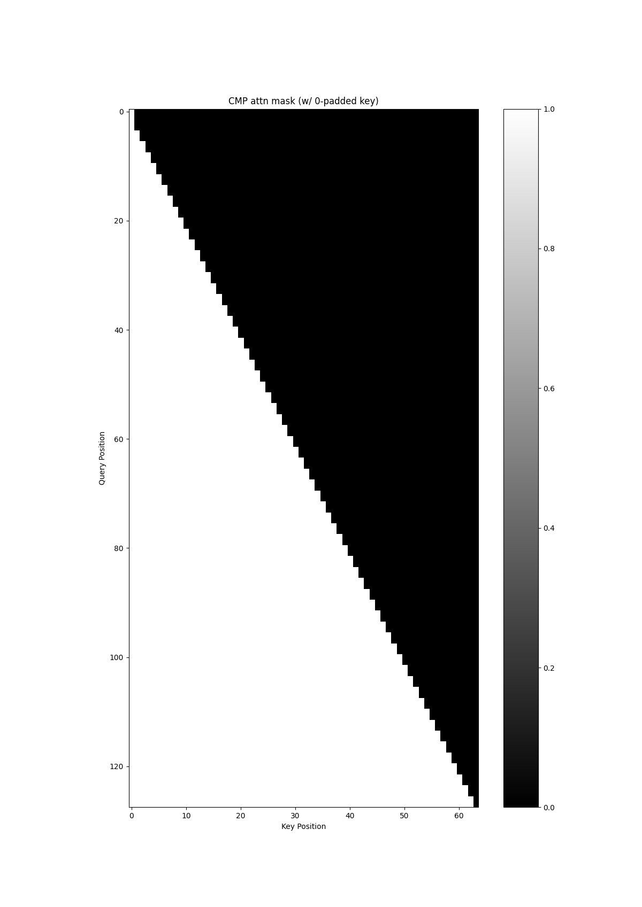
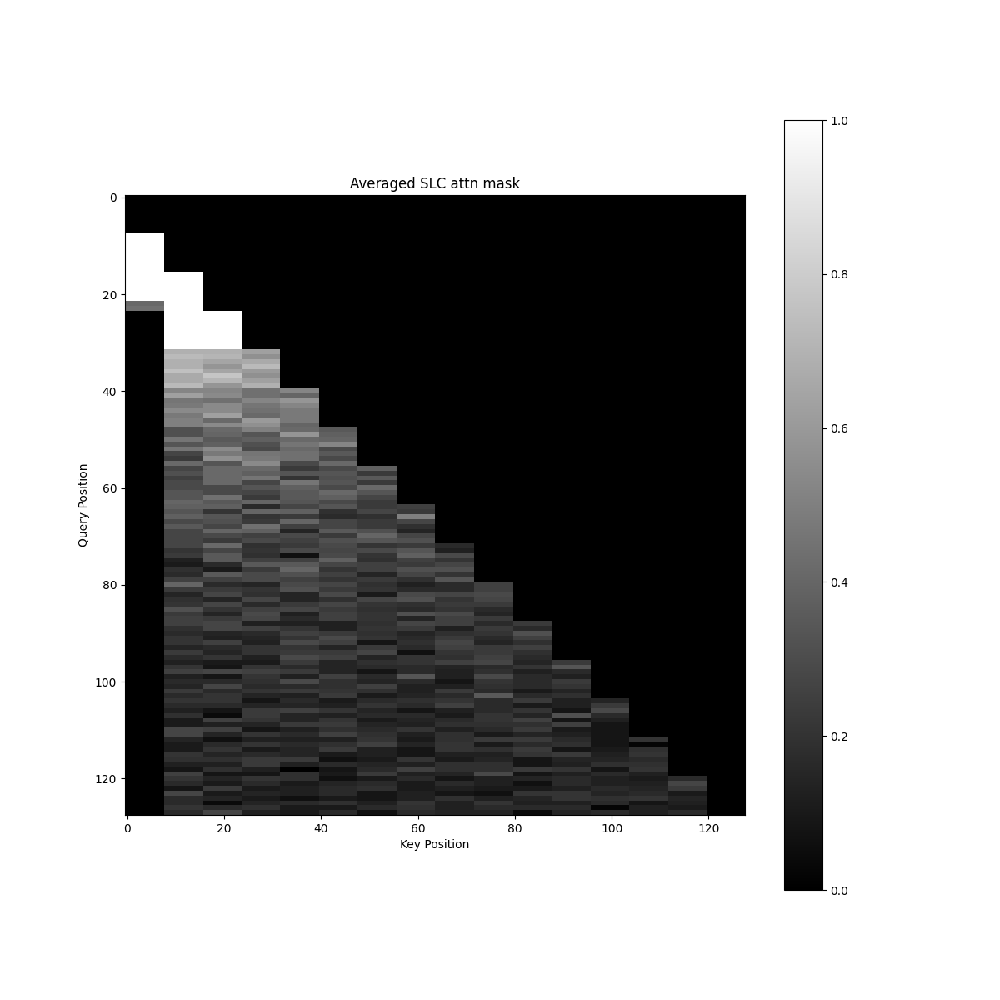

# nsattn
Various implementations of Native Sparse Attention (2502.11089).

```bash
git clone https://github.com/fal-ai-community/NativeSparseAttention && cd NativeSparseAttention
uv sync
```
or
```bash
uv pip install git+https://github.com/fal-ai-community/NativeSparseAttention
```

## [`eager.py`](src/nsattn/eager.py)
An inefficient, naive, eager math implementation of Native Sparse Attention (NSA).

It is written to encourage discussion on (what I perceive to be) ambiguities in the paper.

Please Ctrl-F for all comments with "TODO" or "NOTE" in them.

```bash
DEBUG_NSA=1 uv run python -m nsattn.eager
SWA: BlockMask(shape=(1, 1, 128, 128), sparsity=87.89%, 
(0, 0)
██                              
████                            
  ████                          
    ████                        
      ████                      
        ████                    
          ████                  
            ████                
              ████              
                ████            
                  ████          
                    ████        
                      ████      
                        ████    
                          ████  
                            ████
)
tensor[2, 128, 1536] n=393216 (1.5Mb) x∈[-4.493, 5.403] μ=0.001 σ=1.000 cuda:0
tensor[2, 128, 1536] n=393216 (1.5Mb) x∈[-0.600, 0.687] μ=-0.001 σ=0.084 grad UnsafeViewBackward0 cuda:0
```

The printed mask above is for SWA (which is just a simple flexattn impl)

The Compressed branch has the following mask for all batch/heads:



For shape divisibility / to avoid nan, the key is left-padded with a blank 0 token.

Each query token in the compressed branch should only be able to attend to a key token once all $l$ tokens are in the past.

---

The top-n selection branch has a mask like this (averaged from all batch/heads):



Note that:
* the initial top-left dense block-causal mask is a personal decision, applied where `t < n*l'`.
* the lack of any indices selected at the first query block is due to the inherent numerical bias of my implementation of Equation 9 -- I calculate `p_slc` with a fixed padded conv1d kernel, so the 0th block will always be slightly biased to be smaller.

I am least certain of the correctness of this branch.

## future
- [X] slow impls of SWA/SLC/CMP that look vaguely correct
- [ ] discuss ambiguities and unknowns from the paper
- [ ] support varying l'/l/d, and grouped heads
- [ ] separate prefill/decode impls
- [ ] write kernel(s)
- [X] pray to frontier labs for model that can one-shot impl