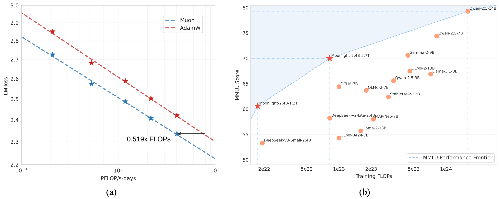

<div align="center">
  <a href="Moonlight.pdf"></a>
</div>

<!-- # Muon is Scalable For LLM Training -->

<div align="center">
  <a href="Moonlight.pdf"><b> Tech Report</b></a>  |  
  <a href="https://huggingface.co/moonshotai/Moonlight-16B-A3B"><b> HuggingFace</b></a>  | 
  <a href="#"><b>Megatron(coming soon)</b></a>
</div>


## Abstract
Recently, the [Muon optimizer](https://github.com/KellerJordan/Muon) based on matrix orthogonalization has demonstrated strong results in training small-scale language models, but the scalability to larger models has not been proven. We identify two crucial techniques for scaling up Muon: (1) adding weight decay and (2) carefully adjusting the per-parameter update scale. These techniques allow Muon to work out-of-the-box on large-scale training without the need of hyper-parameter tuning. Scaling law experiments indicate that Muon achieves ∼ 2× computational efficiency compared to AdamW with compute optimal training.

Based on these improvements, we introduce **Moonlight**, a 3B/16B-parameter Mixture-of-Expert (MoE) model trained with 5.7T tokens using Muon. Our model improves the current Pareto frontier, achieving better performance with much fewer training FLOPs compared to prior models.

We open-source our distributed Muon implementation that is memory optimal and communication efficient. We also release the pretrained, instruction-tuned, and intermediate checkpoints to support future research.

Our code is available at [MoonshotAI/Moonlight](https://github.com/MoonshotAI/Moonlight).

## Key Ingredients

Our work builds upon Muon while systematically identifying and resolving its limitations in large-scale training scenarios. Our technical contributions include:

- **Analysis for Effective Scaling of Muon**: Through extensive analysis, we identify that weight decay plays a crucial roles in Muon's scalability. Besides, we proposed to keep a consistent update root mean square (RMS) across different matrix and non-matrix parameters through parameter-wise update scale adjustments. Such adjustments significantly enhanced training stability.

- **Efficient Distributed Implementation**: We develop a distributed version of Muon with ZeRO-1 style optimization, achieving optimal memory efficiency and reduced communication overhead while preserving the mathematical properties of the algorithm.

- **Scaling Law Validation**: We performed scaling law research that compares Muon with strong AdamW baselines, and showed the superior performance of Muon (see Figure 1). Based on the scaling law results, Muon achieves comparable performance to AdamW trained counterparts while requiring only approximately 52% of the training FLOPs.

<div align="center">
  
  <p><em>Scaling up with Muon. <b>(a)</b> Scaling law experiments comparing Muon and Adam. Muon is 2 times more sample efficient than Adam. <b>(b)</b> The MMLU performance of our Moonlight model optimized with Muon and other comparable models. Moonlight advances the Pareto frontier of performance vs training FLOPs.</em></p>
</div>


## Performance

We named our lightweight model trained with Muon "Moonlight". We compared Moonlight with SOTA public models at similar scale:

- **LLAMA3-3B** is a 3B-parameter dense model trained with 9T tokens
- **Qwen2.5-3B** is a 3B-parameter dense model trained with 18T tokens  
- **Deepseek-v2-Lite** is a 2.4B/16B-parameter MOE model trained with 5.7T tokens

| | **Benchmark (Metric)** | **Llama3.2-3B** | **Qwen2.5-3B** | **DSV2-Lite** | **Moonlight** |
|---|---|---|---|---|---|
| | Activated Param† | 2.81B | 2.77B | 2.24B | 2.24B |
| | Total Params† | 2.81B | 2.77B | 15.29B | 15.29B |
| | Training Tokens | 9T | 18T | 5.7T | 5.7T |
| | Optimizer | AdamW | * | AdamW | Muon |
| **English** | MMLU | 54.75 | 65.6 | 58.3 | **70.0** |
| | MMLU-pro | 25.0 | 34.6 | 25.5 | **42.4** |
| | BBH | 46.8 | 56.3 | 44.1 | **65.2** |
| | TriviaQA‡ | 59.6 | 51.1 | 65.1 | **66.3** |
| **Code** | HumanEval | 28.0 | 42.1 | 29.9 | **48.1** |
| | MBPP | 48.7 | 57.1 | 43.2 | **63.8** |
| **Math** | GSM8K | 34.0 | **79.1** | 41.1 | 77.4 |
| | MATH | 8.5 | 42.6 | 17.1 | **45.3** |
| | CMath | - | 80.0 | 58.4 | **81.1** |
| **Chinese** | C-Eval | - | 75.0 | 60.3 | **77.2** |
| | CMMLU | - | 75.0 | 64.3 | **78.2** |

*Qwen 2 & 2.5 reports didn't disclose their optimizer information. †The reported parameter counts exclude the embedding parameters. ‡We test all listed models with the full set of TriviaQA.*


## Example usage
### Model Download

<div align="center">

| **Model** | **#Total Params** | **#Activated Params** | **Context Length** | **Download Link** |
| :------------: | :------------: | :------------: | :------------: | :------------: |
| Moonlight | 16B | 3B | 8K   | [🤗 Hugging Face](https://huggingface.co/moonshotai/Moonlight-16B-A3B)   |
| Moonlight-Instruct  | 16B | 3B |  8K   | [🤗 Hugging Face](https://huggingface.co/moonshotai/Moonlight-16B-A3B-Instruct)   |

</div>

### Inference with Hugging Face Transformers 

We introduce how to use our model at inference stage using transformers library. It is recommended to use python=3.10, torch>=2.1.0, and transformers=4.48.2 as the development environment. 

For our pretrained model (Moonlight):
```python
from transformers import AutoModelForCausalLM, AutoTokenizer

model_path = "moonshotai/Moonlight-16B-A3B"
model = AutoModelForCausalLM.from_pretrained(
    model_path,
    torch_dtype="auto",
    device_map="auto",
    trust_remote_code=True,
)
tokenizer = AutoTokenizer.from_pretrained(model_path, trust_remote_code=True)

prompt = "1+1=2, 1+2="
inputs = tokenizer(prompt, return_tensors="pt", padding=True, truncation=True).to(model.device)
generated_ids = model.generate(**inputs, max_new_tokens=100)
response = tokenizer.batch_decode(generated_ids)[0]
print(response)
```

For our instruct model (Moonlight-Instruct):

```python
from transformers import AutoModelForCausalLM, AutoTokenizer

model_path = "moonshotai/Moonlight-16B-A3B-Instruct"
model = AutoModelForCausalLM.from_pretrained(
    model_path,
    torch_dtype="auto",
    device_map="auto",
    trust_remote_code=True
)
tokenizer = AutoTokenizer.from_pretrained(model_path, trust_remote_code=True)

messages = [
    {"role": "system", "content": "You are a helpful assistant provided by Moonshot-AI."},
    {"role": "user", "content": "Is 123 a prime?"}
]
input_ids = tokenizer.apply_chat_template(messages, add_generation_prompt=True, return_tensors="pt").to(model.device)
generated_ids = model.generate(inputs=input_ids, max_new_tokens=500)
response = tokenizer.batch_decode(generated_ids)[0]
print(response)
```

Moonlight has the same architecture as DeepSeek-V3, which is supported by many popular inference engines, such as VLLM and SGLang. As a result, our model can also be easily deployed using these tools.  

### Training
```
# train qwen-like dense model with muon
python3 examples/toy_train.py --model qwen --optimizer muon --dataset openwebtext-100k --hidden_size 896 --lr 1e-3

# train qwen-like dense model with adamw
python3 examples/toy_train.py --model qwen --optimizer adamw --dataset openwebtext-100k --hidden_size 896 --lr 1e-3
```

## Intermediate Checkpoints
To support ongoing research efforts, we will soon release our intermediate checkpoints. Coming soon...

## Citation
If you find Moonlight is useful or want to use in your projects, please kindly cite our paper:
```
@article{MoonshotAIMuon,
  author = {Jingyuan Liu and Jianlin Su and Xingcheng Yao and Zhejun Jiang and Guokun Lai and Yulun Du and Yidao Qin and Weixin Xu and Enzhe Lu and Junjie Yan and Yanru Chen and Huabin Zheng and Yibo Liu and Shaowei Liu and Bohong Yin and Weiran He and Han Zhu and Yuzhi Wang and Jianzhou Wang and Mengnan Dong and Zheng Zhang and Yongsheng Kang and Hao Zhang and Xinran Xu and Yutao Zhang and Yuxin Wu and Xinyu Zhou and Zhilin Yang},
  title = {Muon is Scalable For LLM Training},
  year = {2025},
}
```
