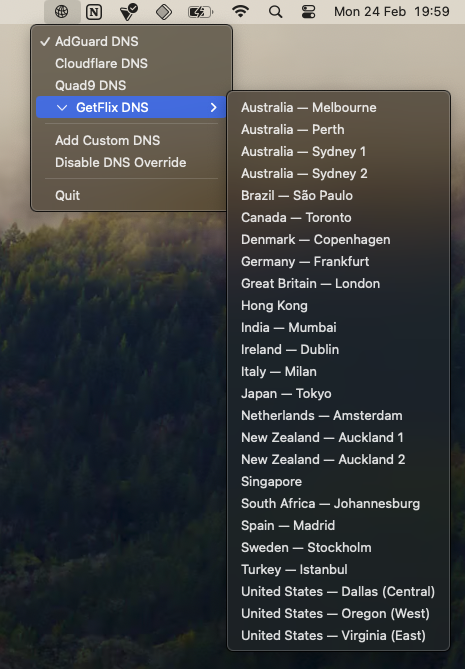

# DNS Easy Switcher
A simple macOS menu bar app that allows you to quickly switch between different DNS providers (or add custom ones).



## Features
- Easy switching between popular DNS providers:
  - Cloudflare DNS (1.1.1.1)
  - Quad9 DNS (9.9.9.9)
  - AdGuard DNS (94.140.14.14)
- Add and manage your own custom DNS servers
- Native macOS menu bar integration
- Persists your settings between app launches
- IPv4 and IPv6 support

## Important Note
Due to macOS security requirements, administrator privileges (password entry) are required each time you switch DNS settings. This is a system-level security measure that cannot be bypassed without a paid Apple Developer account.

## Installation
1. Download the latest release from the [Releases](../../releases) page
2. Mount the DMG file
3. Drag DNS Easy Switcher to your Applications folder
4. Launch DNS Easy Switcher from Applications
5. Allow system extensions when prompted (required for DNS changes)

## Requirements
- macOS 14.0 (Sonoma) or later
- Administrator privileges (required for changing DNS settings)

## Tested Configurations
| macOS Version | Status |
|--------------|--------|
| Sonoma 14.5  | ✅     |

## Building from Source
1. Clone the repository:
```bash
git clone https://github.com/glinford/dns-easy-switcher.git
```
2. Open the project in Xcode 15 or later
3. Build and run the project

## License
This project is licensed under the MIT License - see the [LICENSE](LICENSE) file for details.

## Contributing
Contributions are welcome! Please feel free to submit a Pull Request.

## Acknowledgments
- [Cloudflare DNS](https://1.1.1.1) for their public DNS service
- [Quad9](https://quad9.net) for their secure DNS service
- [AdGuard DNS](https://adguard-dns.io/en/welcome.html) for their privacy-focused DNS service with ad blocking capabilities
- [GetFlix](https://www.getflix.com.au/setup/dns-servers/) 

## Privacy
DNS Easy Switcher does not collect any data. All settings are stored locally on your device.