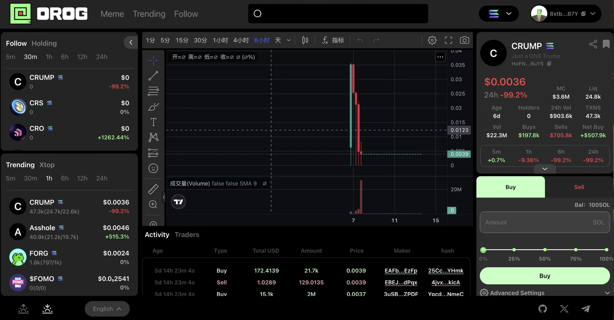

## OROG WEB前端代码

    环境配置
    在项目根目录下创建
    .env.development  开发
    .env.production   生产
    .env.test         测试
    内容为
    NEXT_PUBLIC_BASE_URL_wss=wss://
    NEXT_PUBLIC_BASE_URL=https://
    store/wallet/connectWallet/useWalletSol 文件下的network需要换成私有节点，否则在查询链上数据的时候会拒绝访问

    注意： K线图需要去 tradingview 去申请高级图表获取后把charting_library放入public下

## 运行
1. yarn 安装依赖
2. yarn dev 启动服务
3. yarn build 打包

    