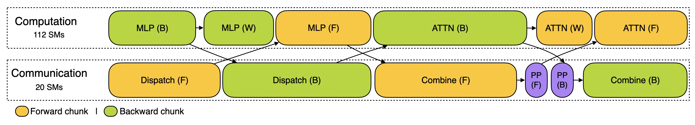
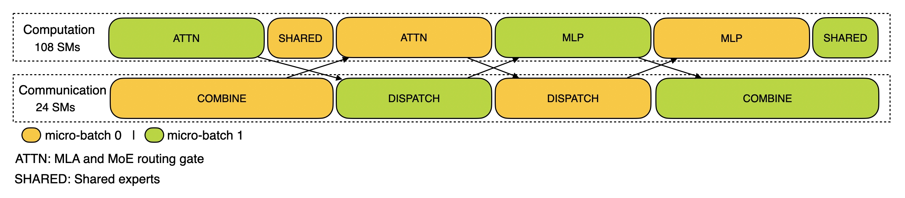
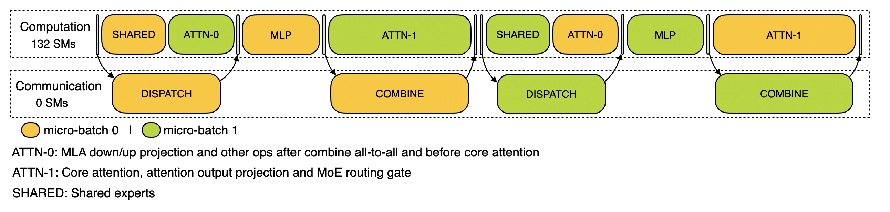

# Profiling Data in DeepSeek Infra

Here, we publicly share profiling data from our training and inference framework to help the community better understand the communication-computation overlap strategies and low-level implementation details. The profiling data was captured using the PyTorch Profiler. After downloading, you can visualize it directly by navigating to chrome://tracing in the Chrome browser (or edge://tracing in the Edge browser). Notice that we simulate an absolutely balanced MoE routing strategy for profiling.

## Training

[[profile_data]](train.json)

The training profile data demonstrates our overlapping strategy for a pair of individual forward and backward chunks in [DualPipe](https://github.com/deepseek-ai/dualpipe). Each chunk contains 4 MoE (Mixture of Experts) layers.
The parallel configuration aligns with DeepSeek-V3 pretraining settings: EP64, TP1 with 4K sequence length. And the PP communication is not included during profilng for simplicity.

## Inference

### Prefilling

[[profile_data]](prefill.json)

For prefilling, the profile employs EP32 and TP1 (in line with DeepSeek V3/R1 ’s actual online deployment), with a prompt length set to 4K and a batch size of 16K tokens per GPU. In our prefilling stage, we utilize two micro-batches to overlap computation and all-to-all communication, while ensuring that the attention computation load is balanced across the two micro-batches — meaning that the same prompt may be split between them.

### Decoding

[[profile_data]](decode.json) (Not ready, release soon)

For decoding, the profile employs EP128, TP1, and a prompt length of 4K (closely matching the actual online deployment configuration), with a batch size of 128 requests per GPU. Similar to prefilling, decoding also leverages two micro-batches for overlapping computation and all-to-all communication. However, unlike in prefilling, the all-to-all communication during decoding does not occupy GPU SMs: after RDMA messages are issued, all GPU SMs are freed, and the system waits for the all-to-all communication to complete after the computation has finished. For more information about the all-to-all implementation, please refer to [DeepEP](https://github.com/deepseek-ai/DeepEP).
