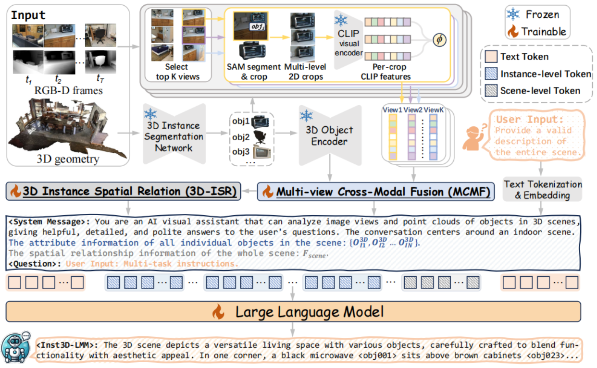

# Inst3D-LMM: Instance-Aware 3D Scene Understanding with Multi-modal Instruction Tuning

This is the official implementation of **Inst3D-LMM: Instance-Aware 3D Scene Understanding with Multi-modal Instruction Tuning** (CVPR 2025) [[Paper]()].

All results of our Inst3D-LMM are evaluated on the same model **without fine-tuning on specific tasks**. 

The full code implementation will be released recently. Please stay tuned.

<div align="left">

</div>

## 🛠️ Preparation

- Prepare the environment:
  
  ```shell
  conda create -n inst3d-lmm python=3.8 # create a virtual environment
  conda activate inst3d-lmm # activate it
  bash requirements.sh # installation requirements
  pip install -e . # install current repository in editable mode
  ```
  
- Download LLM and other foundation models backbone:
  -  We use Vicuna-7B v1.5 ([Hugging Face](https://huggingface.co/lmsys)), the vision encoder from CLIP-ViT-L/14-336px ([Hugging Face](https://huggingface.co/openai/clip-vit-large-patch14-336)) and the ViT-H-based SAM ([Hugging Face](https://huggingface.co/facebook/sam-vit-huge));
  - Change their path in `scripts/config.py` to the corresponding download location.
  
- Dataset Preprocessing:
  
  - Download the full ScanNetv2 dataset and original ScanRefer, Multi3DRefer, ScanQA and Scan2Cap to `annotations/`;
  - run `bash scripts/preprocess_dataset.sh`
  
- Our system messages, instructions, and prompts are provided at `instruction_templates/`. 

## 🚀 Training 

​	**Step1:** Instance-level 3D feature extraction (corresponding to the folder `3d_feature_extraction`):

- We use [Mask3D](https://github.com/JonasSchult/Mask3D) (the model trained on the ScanNet200 training set) to obtain segmented 3D proposals in a ***class-agnostic*** manner;
- Then we use [Uni3D](https://github.com/baaivision/Uni3D?tab=readme-ov-file) (the pre-trained model [uni3d-g](https://huggingface.co/BAAI/Uni3D/blob/main/modelzoo/uni3d-g/model.pt)) to extract 3D instance-level features ;
- run `bash scripts/3d_feature_extraction.sh`.

​	**Step2:** Multi-view 2D feature extraction (corresponding to the folder `2d_feature_extraction`):

- Based on the 3D instance-level segmentation results, we use [SAM](https://github.com/facebookresearch/segment-anything) and [CLIP](https://github.com/openai/CLIP) to extract multi-view 2D features for each 3D instance;
- run `bash scripts/2d_feature_extraction.sh`.

​	**Step3:** End-to-end multi-task instruction-tuning:

- The code for training and evaluating the model is provided at `/run/train.py` and `/run/eval.py`;
- Modify `train_tag` in `scripts/run_train.sh` to specify the datasets used for end-to-end joint training. You can try different combination of training datasets or add customized datasets as you want;
- run `scripts/run_train.sh`.

## 🤖 Inference

- Modify `evaluate=True` and `pretrained_checkpoint="outputs/ckpt_latest.pth"` in `/scripts/run_eval.sh`;
- Modify `val_tag` in `scripts/run_eval.sh` to specify the datasets used for evaluation as you want;
- run `scripts/run_eval.sh`.		

## 😊 Acknowledgement

We are grateful for the open-source contributions of other projects:

- [Vicuna-v1.5](https://github.com/lm-sys/FastChat)
- [OpenMask3D](https://github.com/OpenMask3D/openmask3d)
- [VideoChat](https://github.com/OpenGVLab/Ask-Anything/tree/main/video_chat)
- [Chat3D](https://github.com/Chat-3D)
- [3DMIT](https://github.com/staymylove/3DMIT)
