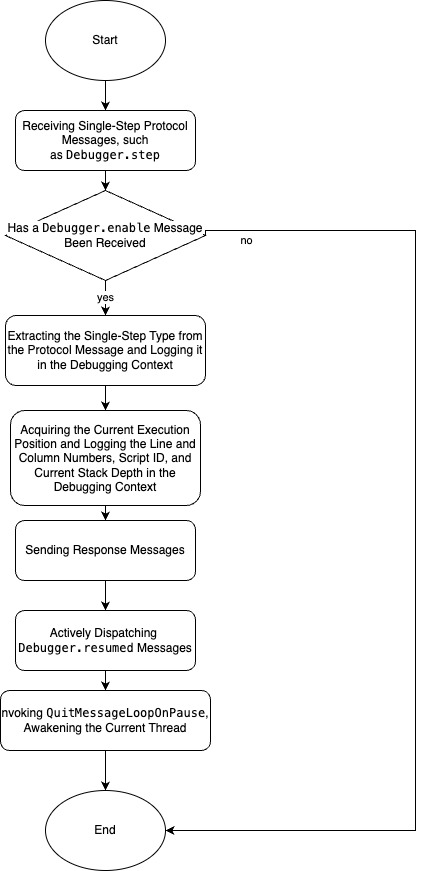
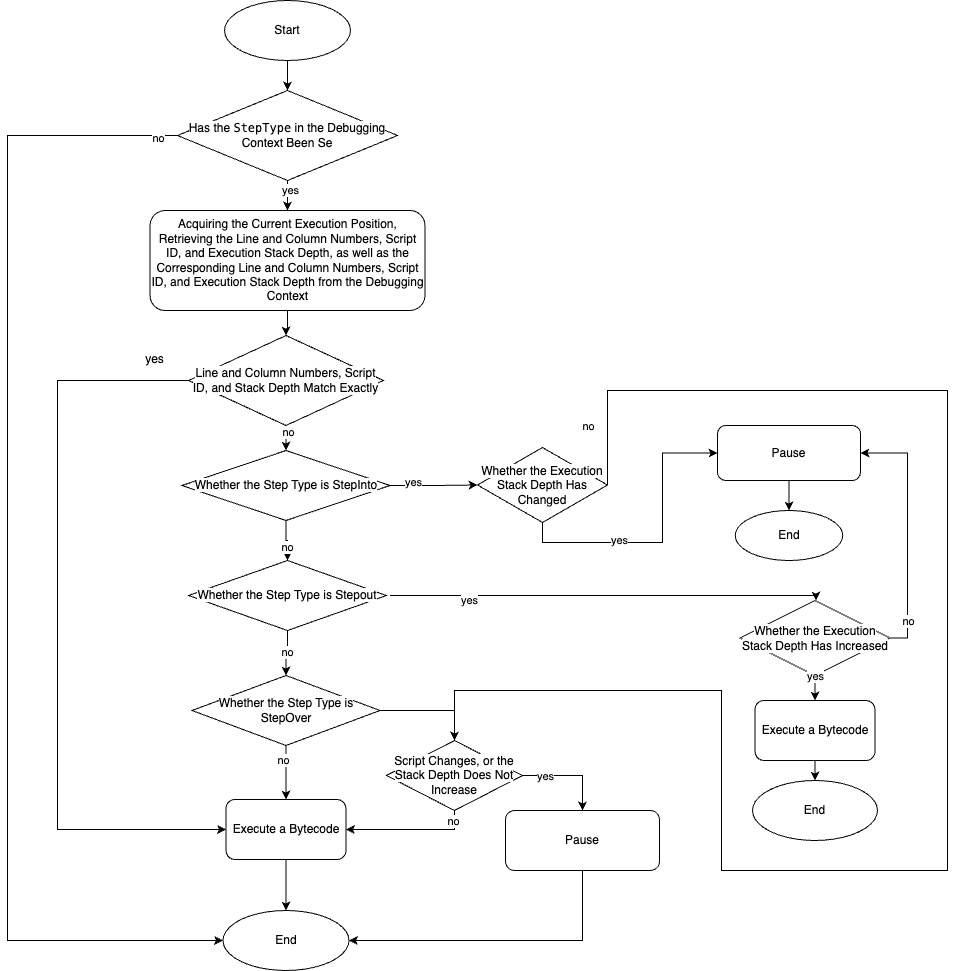

# PrimJS Debugger


## FlowChart
The debugging process in `PrimJS` necessitates the implementation of pertinent debugging protocols as prescribed by the `Chrome DevTools Protocol`. Presented below is the comprehensive flowchart depicting the debugging procedure in `PrimJS`  

<p align = "center">

</p>

When `PrimJS` manages specific protocol messages (such as `Debugger.pause`, etc.) or encounters breakpoints, induces the current thread to pause. It then invokes the `runMessageLoopOnPause` method, transitioning the current thread into a loop waiting state.  

While in a paused state, `PrimJS` processes protocol messages dispatched from the debugging front-end via the `dispatchProtocolMessage` method. These messages are ultimately managed by the debugging module. Subsequently, `PrimJS` determines whether to maintain the paused state or conclude the pause.  

Upon managing specific `CDP` messages, such as `Debugger.resume`, `Debugger.stepInto`, etc., `PrimJS` triggers a transition of the program from a paused state back to an executing state. It then invokes the `quitMessageLoopOnPause` method, effectively cancelling the loop waiting state of the current thread.  

When `PrimJS` operates in an executing state, it calls pertinent methods to retrieve and manage front-end protocol messages prior to the execution of each bytecode. If there are no messages requiring attention, `PrimJS` proceeds with the execution of the subsequent bytecode.

<br>

## Key Data Structures
`PrimJS` employs a specialized data structure named `LepusDebuggerInfo` to house critical debugging information, which includes: the debug protocol queue, breakpoint details, scripts, console information, as well as significant status details (such as the current single-step status, the occurrence of exceptions, and information related to variable lists in the paused state), among others. This data structure resides within the `PrimJS` execution context. Each execution context possesses a corresponding debugging-related data structure. In the following sections, we will provide a detailed exploration of some of these key data structures.  


#### LepusDebuggerInfo

```c++
struct LEPUSDebuggerInfo {
  LEPUSContext *ctx;
  struct qjs_queue *message_queue;
  LEPUSBreakpoint *bps{nullptr};
  const uint8_t *debugger_current_pc;
  struct list_head script_list;
  struct list_head bytecode_list;
  JSDebuggerLocation step_location; 
  struct DebuggerSuspendedState pause_state;  
  struct DebuggerSuspendedState running_state;
  struct DebuggerLiteralPool literal_pool;
  struct DebuggerFixeShapeObj debugger_obj;
  JSDebuggerConsole console;  
  std::map<const uint8_t *, LEPUSValue> break_bytecode_map;
  uint32_t step_depth{static_cast<uint32_t>(-1)};  
  int32_t breakpoints_num{0};
  int32_t is_debugger_enabled{0};
  int32_t is_runtime_enabled{0};
  int32_t breakpoints_capacity{0};
  int32_t next_breakpoint_id{0};
  int32_t max_async_call_stack_depth{0};
  int32_t script_num{0};
  uint8_t breakpoints_is_active{0};         
  uint8_t step_over_valid{0};  
  uint8_t step_type{0};  
  bool process_stop_at_entry{false};
  bool step_statement{false};
  ...
};
```

`LepusDebuggerInfo` is utilized to store information related to debugging. Each `LEPUSContext` has an independent `debuggerInfo` associated with it. Within `debuggerInfo`, there are several key pieces of information:  

- `step_location`: Stores the row and column numbers of current execution, among other details, when the single-step debugging button is activated.  
- `message_queue`: Holds the pending debugging protocol messages.  
- `breakpoints_num` and `breakpoints_is_active`: Store the quantity of breakpoints and the activity status of the current breakpoint, respectively.  
- `step_depth`: Records the stack depth of the current stack frame in the paused state.  
- `pause_state` and `running_state`: Used to record objects that need to retrieve properties in both paused and running states, related to the `Debugger.evaluate` and `Runtime.getProperties` protocol.
- `step_type`: Stores the type of single-step command, such as `Step Over`, `Step Into`, or `Step Out`.  
- `is_debugger_enabled` and `is_runtime_enabled`: Indicate whether the `Debugger.enable` or `Runtime.enable` protocol has been received.  
- `console`: Stores the log information that the script needs to print during debugging.  
- `bps`: Stores breakpoint information during debugging.
- `literal_pool`: A string constant pool related to Debugger, used to minimize memory allocation during Debugging.
- `debugger_obj`: Contains objects related to Debugger, used to optimize the creation of fixed-shape objects.
- `process_stop_at_entry`: Stores whether to handle the first line breakpoint.  


#### LEPUSBreakpoint


```c++
struct LEPUSBreakpoint {
  LEPUSValue breakpoint_id;
  char *script_url;
  int32_t script_id;
  int32_t line;
  int64_t column;
  LEPUSValue condition;
  const uint8_t *pc;
  uint8_t specific_location;
  LEPUSFunctionBytecode *b;
};
```

The `LEPUSBreakpoint` structure is utilized to store essential information related to breakpoints, primarily including:  
- `breakpoint_id`: This serves as a unique identifier for the breakpoint, composed of `url:line number:column number`.  
- `script_url`: This represents the `URL` of the script where the breakpoint is situated.  
- `script_id`: This represents the ID of the script where the breakpoint is situated.  
- `line` and `column`: These represent the line number and column of the breakpoint, respectively.  
- `condition`: This represents the condition that needs to be satisfied for the breakpoint to be hit. It defaults to empty.  
- `pc`: This represents the bytecode where the breakpoint is located.  
- `b`: This is linked to the `LEPUSFunctionBytecode` containing the breakpoint.  

#### JSDebuggerLocation

During the debugging process, the data structure representing the current execution location is of paramount importance. We need to ascertain the current execution position and populate the `JSDebuggerLocation` data structure to determine whether `PrimJS` needs to halt at the current position or if it can resume execution from the paused state. Below is the data structure representing the current execution position:  


```c++
typedef struct JSDebuggerLocation {
  int32_t script_id{-1};
  int32_t line{-1};
  int64_t column{-1};
} JSDebuggerLocation;
```

This structure documents the current position of program execution, encompassing the line number, column number, and the ID of the current script.  

  

#### LEPUSScriptSource

Recording script information is crucial, with one of its most direct applications being the display of source code information for the script under debugging in the debug panel. For some key debugging protocols, such as `Debugger.paused`, `Debugger.getPossibleBreakpoints`, `Debugger.scriptParsed`, and `Debugger.getScriptSource`, it's necessary to return the hash value, `URL`, ID, etc., of the corresponding script for use by the debugging front-end. Presented below is the data structure representing script information:  


```c++
struct LEPUSScriptSource {
  struct list_head link;
  char *url;
  char *source;
  char *hash;
  int32_t id;
  int32_t length;
  int32_t end_line;
  char *source_map_url;
  ...
}
```

This data structure is utilized to store information related to the script being debugged, specifically encompassing the following content:  
- `link`: All scripts currently under debugging are documented in a linked list. `link` records the position of the current script within this linked list.  
- `url`: The `URL` of the script.  
- `source`: The source code of the script.  
- `hash`: The hash value of the script.  
- `id`: The ID of the script.  
- `length`: The length of the script.  
- `end_line`: The line number of the script's final line.  
- `source_map_url`: If the current script employs a Source Map, this field records the `URL` of the Source Map.  

<br>

## CallBack Functions


```c++
typedef struct QJSDebuggerCallbacks2 {
  void (*run_message_loop_on_pause)(LEPUSContext *ctx);
  void (*quit_message_loop_on_pause)(LEPUSContext *ctx);
  void (*send_response)(LEPUSContext *ctx, int32_t message_id,
                        const char *message);
  void (*send_notification)(LEPUSContext *ctx, const char *message);
  void (*inspector_check)(LEPUSContext *ctx);
  void (*debugger_exception)(LEPUSContext *ctx);
  void (*console_message)(LEPUSContext *ctx, int tag, LEPUSValueConst *argv,
                          int argc);
  void (*script_parsed_ntfy)(LEPUSContext *ctx, LEPUSScriptSource *source);
  void (*console_api_called_ntfy)(LEPUSContext *ctx, LEPUSValue *msg);
  void (*script_fail_parse_ntfy)(LEPUSContext *ctx, LEPUSScriptSource *source);
  void (*debugger_paused)(LEPUSContext *ctx, const uint8_t *cur_pc);
  uint8_t (*is_devtool_on)(LEPUSRuntime *rt);
  void (*send_response_with_view_id)(LEPUSContext *ctx, int32_t message_id,
                                     const char *message, int32_t view_id);
  void (*send_ntfy_with_view_id)(LEPUSContext *ctx, const char *message,
                                 int32_t view_id);
  void (*script_parsed_ntfy_with_view_id)(LEPUSContext *ctx,
                                          LEPUSScriptSource *source,
                                          int32_t view_id);
  void (*script_fail_parse_ntfy_with_view_id)(LEPUSContext *ctx,
                                              LEPUSScriptSource *source,
                                              int32_t view_id);
  void (*set_session_enable_state)(LEPUSContext *ctx, int32_t view_id,
                                   int32_t protocol_type);
  void (*get_session_state)(LEPUSContext *ctx, int32_t view_id,
                            bool *is_already_enabled, bool *is_paused);
  void (*console_api_called_ntfy_with_rid)(LEPUSContext *ctx, LEPUSValue *msg);
  void (*get_session_enable_state)(LEPUSContext *ctx, int32_t view_id,
                                   int32_t protocol_type, bool *ret);
  void (*get_console_stack_trace)(LEPUSContext *ctx, LEPUSValue *ret);
  void (*on_console_message)(LEPUSContext *ctx, LEPUSValue console_message,
                             int32_t);
} QJSDebuggerCallbacks2;
```

`LynxDevtool` facilitates interaction with the `PrimJS` Debugger by registering callback functions. Below are some significant callback methods:  
- `run_message_loop_pause`: When `PrimJS` needs to pause due to reasons such as breakpoints, single-step debugging, or exceptions, this method is employed to pause the program.  
- `quit_message_loop_on_pause`: When `PrimJS` transitions from a paused state to an execution state through recovery instructions or single-step instructions, this callback method is used to resume the program.  
- `send_response`: After `PrimJS` completes processing protocol messages, the results are returned to `LynxDevtool` through this method.  
- `send_notification`: This callback function is used to return event messages actively dispatched by `PrimJS`.  
- `inspector_check`: When `PrimJS` is at a breakpoint or in a single-step state, this callback method is executed before each bytecode executed, to determine whether to continue to pause or resume execution, and to process the protocol messages in `message_queue`.  
- `console_message`: This is a callback function, often used to print log information to be displayed on the `LynxDevtool` panel.  
- `get_console_stack_trace`: Retrieves the stack trace information for console logs.  


<br>

## Detail Implementation
For the fundamental debugging protocol implementations within `PrimJS`, we offer more detailed descriptions.  

### Displaying Source Code
#### Related Protocols

- [Debugger.scriptParsed](https://chromedevtools.github.io/devtools-protocol/tot/Debugger/#event-scriptParsed)  

- [Debugger.getScriptSource](https://chromedevtools.github.io/devtools-protocol/tot/Debugger/#method-getScriptSource)  

#### Implementation

After `PrimJS` compiles a script, it needs to proactively dispatch the `Debugger.scriptParsed` protocol message to the debugging front-end. This message contains key information such as the current script's ID and `URL`. `PrimJS` instantiates a `LEPUSScriptSource` for this script, adds it to the script list of the current execution context, and sends a `scriptParsed` event message. 

To display the source code in the debugging panel, the debugging front-end sends a `Debugger.getScriptSource` message. Upon receiving this message, `PrimJS` locates the corresponding script source code from the script list of the execution context based on the script ID contained in the message, and sends it to the front-end in accordance with the protocol format. This completes the display of the source code.  


### Breakpoints
#### Related Protocols
- [Debugger.setBreakpoint](https://chromedevtools.github.io/devtools-protocol/tot/Debugger/#method-setBreakpoint)  

- [Debugger.setBreakpointByUrl](https://chromedevtools.github.io/devtools-protocol/tot/Debugger/#method-setBreakpointByUrl)  

- [Debugger.setBreakpointsActive](https://chromedevtools.github.io/devtools-protocol/tot/Debugger/#method-setBreakpointsActive)  

- [Debugger.getPossibleBreakpoints](https://chromedevtools.github.io/devtools-protocol/tot/Debugger/#method-getPossibleBreakpoints)  

- [Debugger.removeBreakpoint](https://chromedevtools.github.io/devtools-protocol/tot/Debugger/#method-removeBreakpoint)  

- [Debugger.continueToLocation](https://chromedevtools.github.io/devtools-protocol/tot/Debugger/#method-continueToLocation)  


#### Implementation
When a user sets a breakpoint at a certain line in the script, the debugging front-end sends a `Debugger.SetBreakpointByUrl` message. `PrimJS` needs to populate the `LEPUSBreakpoint` data structure, save the line and column numbers of the breakpoint, the ID of the script where the breakpoint is located, and maintain this breakpoint information in the breakpoint linked list.  

When a user deletes a certain breakpoint in the current script, the debugging front-end sends a `Debugger.removeBreakpoint` protocol message. `PrimJS` needs to locate the corresponding breakpoint in the `PrimJS` execution context breakpoint linked list according to the breakpoint identifier in the protocol message, and remove it from the linked list.  

When executing JavaScript bytecode, `PrimJS` can obtain the location information of the current position for each bytecode, that is, the line number, column, and ID of the script at the current position. `PrimJS` traverses all breakpoints in the breakpoint list to determine whether the current position is on a breakpoint. If it is, execution should be paused. At this point, `PrimJS` calls `RunMessageLoopOnPause` to pause the current thread and send a `Debugger.paused` message, displaying the current call stack and variables.  


### Single-step Debugging
#### Related Protocols
- [Debugger.stepInto](https://chromedevtools.github.io/devtools-protocol/tot/Debugger/#method-stepInto)  

- [Debugger.stepOut](https://chromedevtools.github.io/devtools-protocol/tot/Debugger/#method-stepOut)  

- [Debugger.stepOver](https://chromedevtools.github.io/devtools-protocol/tot/Debugger/#method-stepOver)  

- [Debugger.resume](https://chromedevtools.github.io/devtools-protocol/tot/Debugger/#event-resumed)  


#### Implementation
When the step button is clicked, `PrimJS` saves the line number, column number, call stack depth, script ID, and step type of the current execution position in the debugging context. Before executing the bytecode, it processes operations related to single-stepping.  

- `PrimJS` handles the processing flow when receiving step-related protocol messages as follows:  

<p align = "center">

</p>


- The logic for handling single-stepping during `PrimJS` execution is as follows:  

<p align = "center">

</p>


### Displaying Variables
#### Related Protocols
- [Debugger.evaluateOnCallFrame](https://chromedevtools.github.io/devtools-protocol/tot/Debugger/#method-evaluateOnCallFrame)  

- [Runtime.compileScript](https://chromedevtools.github.io/devtools-protocol/tot/Runtime/#method-compileScript)  

- [Runtime.getProperties](https://chromedevtools.github.io/devtools-protocol/tot/Runtime/#method-getProperties)  


#### Implementation
When the current thread is paused due to a breakpoint, exception, single-stepping, or other reasons, the debugging panel will display variables within the current global, closure, or local scope. This feature is implemented through the `Debugger.paused` and `Runtime.getProperties` `CDP` messages.  

When the current thread pauses, `PrimJS` actively dispatches a Debugger.paused message. This message includes a `scopeChain` field, which encapsulates the scope chain information for the corresponding stack frame. Each global, closure, or local scope within each stack frame is assigned a unique `objectId`. In a similar vein, every variable within each scope is also allocated a unique `objectId`.

Following this, `PrimJS` is required to handle the `Runtime.getProperties` message dispatched by the debugging front end. Using the `objectId` within the `Runtime.getProperties` message, `PrimJS` identifies the corresponding variable or scope, and subsequently displays it. 


