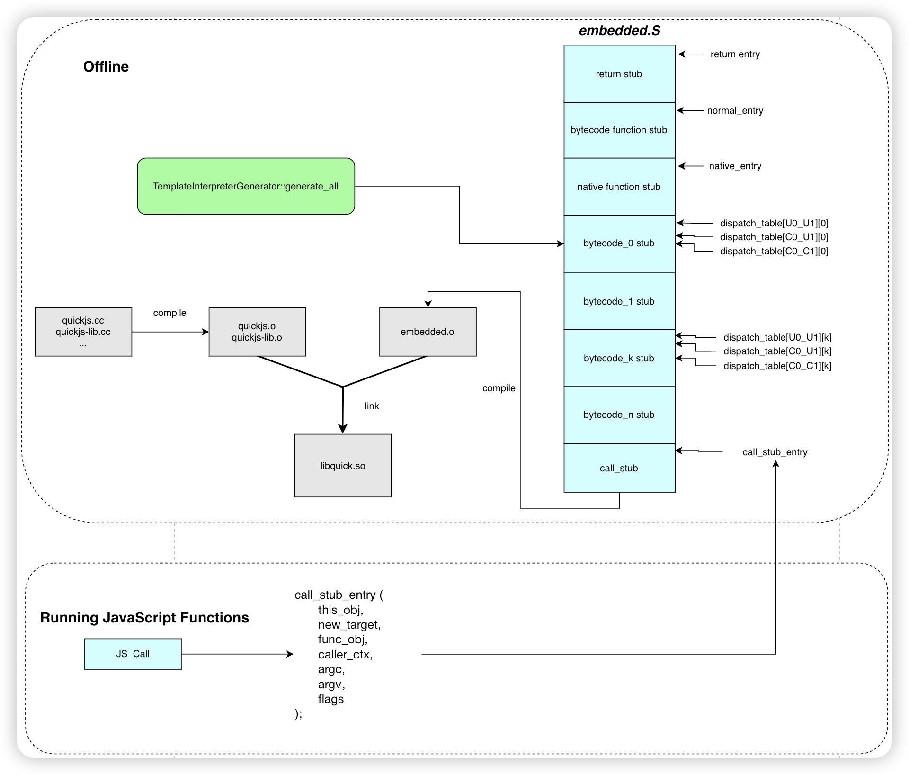
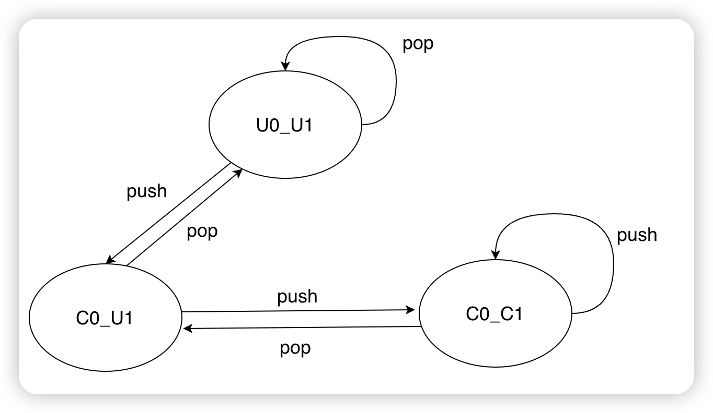

# PrimJs Template Interpreter Technical Documentation

PrimJs includes two interpreters, the QuickJs CPP interpreter and the self-developed Template interpreter. The Template interpreter employs various optimization techniques, resulting in significant performance improvement compared to the QuickJS CPP interpreter.  

Before introducing the Template interpreter, let's briefly introduce the QuickJs CPP interpreter.  

## QuickJs

The CPP interpreter of QuickJs is a traditional switch-based interpreter.  


```c
while (!END()) {
    opcode = *pc++; // get the opcode from bytecode buf
    switch(opcode) {
        case opcode1: {
          handle_opcode1(); // bytecode handler
          break;
        }
        case opcode2: {
          handle_opcode2();
          break;
        }
        ...
    }      
}
```

The execution mechanism of the switch-based interpreter, as shown in the pseudocode above, involves iterating through each bytecode and executing the corresponding handler for each bytecode.  

The implementation of switch-based interpreter is relatively simple, but its performance is not good enough. Therefore, PrimJs introduces the Template interpreter.  

## What is a Template interpreter?

Unlike the CPP interpreter, the Template interpreter uses macro assembler for the implementation of each bytecode (also known as the `bytecode handler`). It seems that the implementation of each bytecode is an assembly "template", so it is called a Template interpreter. The reason why the performance of the Template interpreter is better than that of the naive CPP interpreter is mainly due to the following reasons:  

- Using the native stack  
	- When using the CPP interpreter, we need to simulate an operand stack in the interpreter's stack frame.  
	- When using the Template interpreter, we can directly manipulate these things on the native stack.  

- Global register allocation across bytecodes  
	- Contexts that need to be frequently accessed during JS execution, such as JSContext, bcp, and cpool, can be allocated across bytecodes using global register allocation, thereby reducing frequent memory read and write operations.  
	- Traditional CPP interpreters cannot control register allocation.  

- Stack caching  
	- For stack-based virtual machines, the Template interpreter can cache the top of the stack in registers (top of stack caching), reducing memory read and write operations.  

- Dispatch and Call  
	- The Template interpreter does not need to dispatch bytecodes through a switch-case statement; instead, it uses a dispatch table directly, reducing the overhead of dispatch.  
	- JS-to-JS calls and interpreter-to-VM runtime function calls can achieve efficient instructions through handwritten assembly.  

  

Next, we will introduce the architecture diagram of the PrimJs Template interpreter, followed by a detailed explanation of the technical details.  

## PrimJs Template interpreter architecture diagram


As shown in the diagram, the Template interpreter is mainly composed of the following modules:  

- Bytecode handler generator: Implements the functionality of each bytecode and some method entry-related logic through a macro assembler, and writes it into the `embedded.S` assembly file, which is then mixed with other parts of QuickJs.  

- call_stub: Primarily provides a trampoline for jumping from QuickJs's cpp code into the call_stub to start executing bytecode.   

  

The following sections will explain some specifics in more detail.  

## Bytecode dispatch

The implementation of each bytecode in QuickJS is a piece of C++ code, whereas the Template interpreter is a set of machine instructions generated by macro assembler. The Template interpreter essentially executes by jumping back and forth between these different assembly blocks through bytecode dispatch.  

PrimJs initializes the `dispatch_table` array at the beginning, where `dispatch_table[op]` is the starting address of the assembly instructions corresponding to the `op` implementation. Therefore, it only needs to fetch the next bytecode's `op` from the next `pc`, then access the `dispatch_table` to get the handler address for the corresponding `op`, and jump to execute it.  


```c++
bytecode0_handler:
 ...  // assembly
 ...
 ...
 opcode = *pc; // pc -> current bytecode pointer
 jump dispatch_table[opcode]
 
bytecode1_handler:
 ... // assembly
 ...
 ...
 opcode = *pc;
 jump dispatch_table[opcode]
...

```

## Global register allocation

One reason the PrimJs Template interpreter can improve performance is that frequently accessed contexts during JS execution, such as JSContext, pc, and cpool, can be allocated across bytecodes using global register allocation, thereby avoiding frequent memory read and write operations.  The use of registers needs to meet the register conventions of the corresponding architecture. In AArch64, the PrimJs Template interpreter uses callee-saved registers `x19-x28` as global registers.  

For the AArch64 platform, the register convention of PrimJs is as follows:  


|**Register**    |**JS Global State**    |
|-|-|
|x19    |rcontext: JSContext    |
|x20    |esp: Js expression stack pointer    |
|x21    |rdispatch: dispatch table base    |
|x22    |rbcp: bytecode pointer    |
|x23    |rarg_buf: arg buf    |
|x24    |rvar_buf: var buf    |
|x25    |rthis: this_obj    |
|x26    |rcpool: constant pool    |
|x28    |rvar_refs: var refs    |

## Stack caching

Because QuickJS is a stack-based interpreter, the execution of bytecode involves frequent top-of-stack operations. Therefore, stack caching is an important optimization point for the Template interpreter. The PrimJs Template interpreter uses the x0 and x1 registers to cache the top and second-to-top stack values, significantly reducing memory read and write operations.  

For example, in an addition operation:  


```javascript
var a = 1;
var b = 2;
var c = a + b;
```

As shown in the above code, a simple addition operation in QuickJS will be translated into the following bytecode sequence in the table below. The memory read and write operations for each bytecode before and after using stack caching are as follows:  


|Bytecodes    |Number of Memory Operations    |Instructions with Stack caching    |Number of Memory Operations    |
|-|-|-|-|
|push_1 1    |1 write    |mov x0, 1    |0    |
|put_var a    |1 read + 1 write    |str x0, [addr a]    |1 write    |
|push_2 2    |1 write    |mov x0, 2    |0    |
|put_var b    |1 read + 1 write    |str x0, [addr b]    |1 write    |
|get_var a    |1 read + 1 write    |ldr x0, [addr a]    |1 read    |
|get_var b    |1 read + 1 write    |ldr x1, [addr b]    |1 read    |
|add    |2 reads + 1 write    |add x0, x0, x1    |0    |
|put_var c    |1 read + 1 write    |str x0, [addr c]    |1 write    |

As shown in the table, without considering the cpu cache,  the execution of QuickJS bytecode requires memory read and write operations for each top-of-stack operation. This results in an addition operation requiring `7` memory reads and  `8` memory writes.  

However, with stack caching, where the top and second-to-top stack values are cached in the x0 and x1 registers, the same execution process only requires `2` memory reads and `3` memory writes. This significantly reduces memory read and write operations compared to QuickJS. When such operations are frequent, PrimJs Template interpreter can greatly improve performance.  

### Top-of-stack(TOS) State transition

Due to the PrimJs Template interpreter using the x0 and x1 registers to cache the top and second-to-top stack values, the Top of Stack state transitions with push and pop operations. The TOS state transition diagram is as follows:  


- `U0_U1` indicates that there is no stack top cached in the registers.  

- `C0_U1` indicates that the stack top is cached in x0.  

- `C0_C1` indicates that the stack top is cached in x1, and the second-to-top is cached in x0.  

  

 It is important to note that when both the stack top and second-to-top are already cached, pushing another value onto the stack requires a spill. This means the original second-to-top is pushed onto the operand stack, the original stack top moves to the second-to-top in the x0 register, and the pushed value is placed in x1 as the new stack top.  

