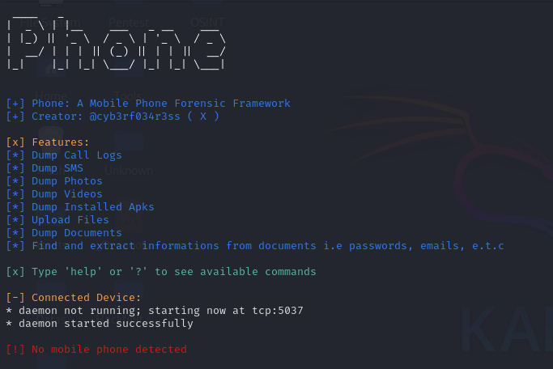

# Phone
Phone: A Mobile Phone Forensic Framework ( Android )

# Features
[*] Dump Call Logs

[*] Dump SMS

[*] Dump Photos

[*] Dump Videos

[*] Dump Installed Apks

[*] Upload Files

[*] Dump Documents

[*] Find and extract informations from documents i.e passwords, emails, e.t.c

[x] Type 'help' or '?' to see available commands

# Requirements
[*] pip install colorama

[*] pip install art 

[*] sudo apt install adb

[*] sudo apt install mvt-android

# Help Usage 
[*] Make sure USB debugging is enabled on the device before connecting the device to the computer.

[*] The mobile device must be unlocked for this software to work properly.

[*] Create a directory named "Datas" : mkdir Datas

[*] ./Phone 

[*] DONE 
