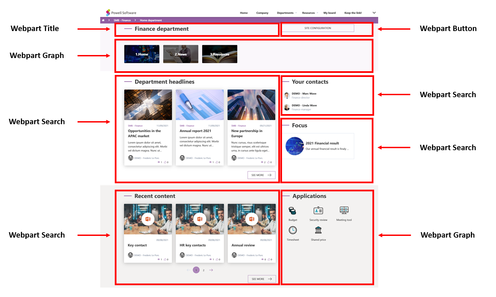
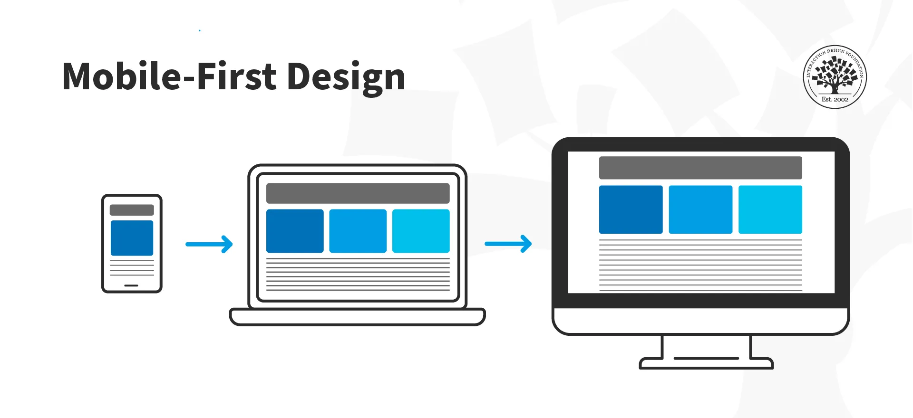
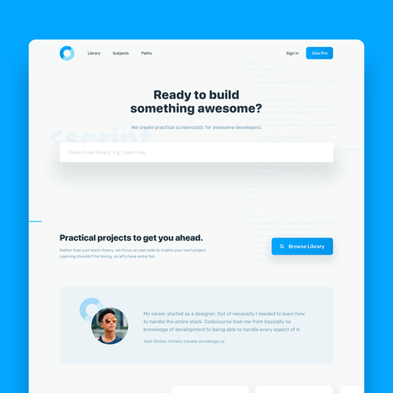
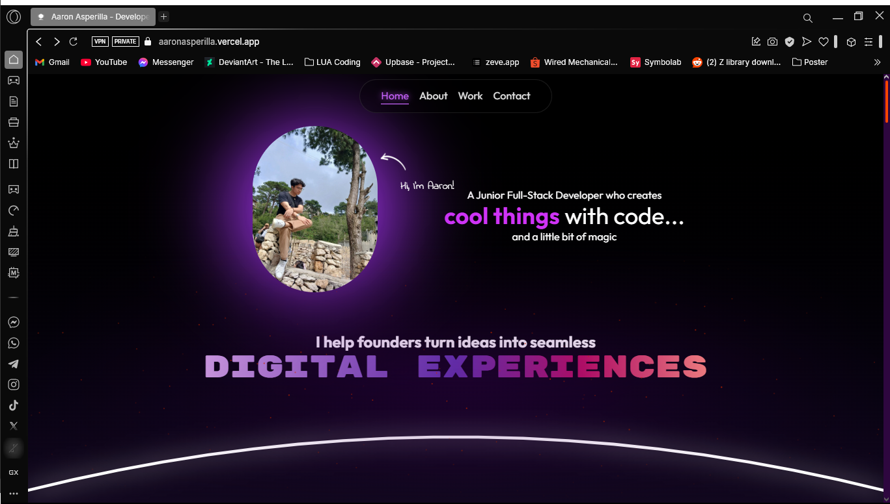
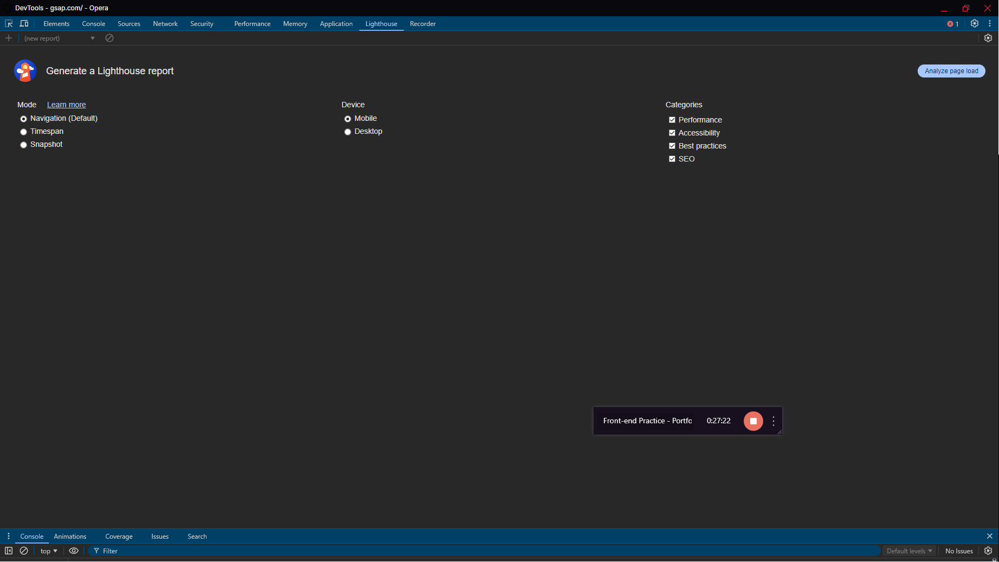
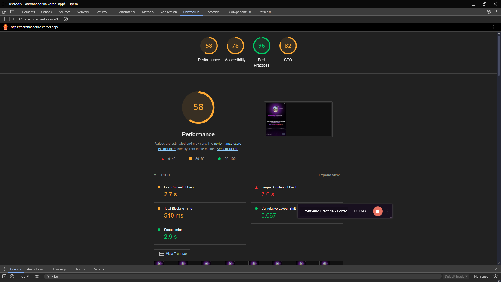
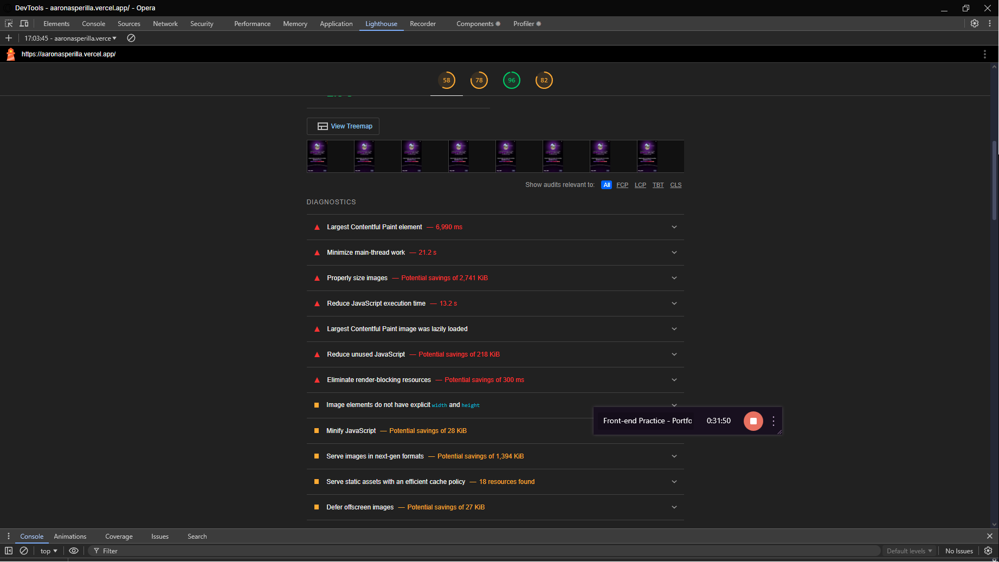

# Complete-WebDev-Cheatsheet
This post is a way for everyone to collaborate &amp; share all of the tips &amp; tricks they know for web development.

It's split into a few parts (step-by-step):
- Designing the website
- Initializing Project 
- Building the layout 
- Styling the layout (with responsiveness)
- Animations
- Testing performance & evaluating (Lighthouse, SEO, & other stuff)
- Deployment 

## How to participate:
Just start your comment with whatever part it is from and the tip you wanna give. After reviewing, I will add it to the GitHub page.

> Contributed: [eltociear](https://github.com/eltociear) | Thank you! Corrected the capitalization.

Example:
```
Animations

Use framer motion ...
```
### Or you can submit a pull request in GitHub.

Here's how to: 
- [How to make a Pull Request on GitHub (Command Line Interface)](https://www.youtube.com/watch?v=nCKdihvneS0)
- [Your First Pull Request with GitHub Desktop (Easier Method)](https://www.youtube.com/watch?v=8x6V5IOuXog)

## Note!
- This isn't a **how to guide** on starting web-development, **it's for those who have already started** (1 month+ experience) & want to **improve / discover** ways or **techniques** to make their development process **more efficient.**
- Let's try to make it as seamless & linear as possible.

---

# Start:
## 1. Designing the website
Designing a website is a very crucial part of starting the website.
```
Design First before Coding 
```
That will be our motto before starting any project. **Without a design, you can think of yourself as a traveler without a map, not sure of where to go**

Here are some tools for designing:
- [Figma](https://www.figma.com/)
- [Penpot (Figma Alternative)](https://penpot.app/)

> Contributed: [u/SouthboundHog](https://www.reddit.com/user/SouthboundHog/) | Thanks!

For getting inspiration, I mainly use:
- [Dribbble](https://dribbble.com/)
- [designresourc.es](https://designresourc.es/)
- [viewport-ui.design](https://viewport-ui.design/)
- [Awwwards](https://www.awwwards.com/)

> Contributed: [imargorsi](https://github.com/imargorsi) | Thank you!

Here are a number of more specific design resources:
- [Free Placeholder Logos](https://logoipsum.com/)
- [Free High Quality Fonts](https://www.fontshare.com/)
- [More Free High Quality Fonts](https://www.freefaces.gallery/)
- [Inspiration With Free Fonts](https://www.awwwards.com/awwwards/collections/free-fonts/)
- [Font Inspiration](https://fontsinuse.com/)
- [Realtime Colors](https://www.realtimecolors.com/)
- [TailwindCSS Box Shadows](https://ui.aceternity.com/tools/box-shadows)
- [SVG Pattern Generation](https://www.fffuel.co/)

> Contributed: [lukeweston1234](https://github.com/lukeweston1234) | Thank you!

### What Does the Client want?
If you are working for a client or a company, make sure to know what the client wants and that both of your views align.

> Contributed: [u/SEOAngle](https://www.reddit.com/user/SEOAngle/) | Very important!

---

## 2. Initializing Project
When initializing your project, you must choose properly the framework you will use (or if you will use any). Here are a few popular frameworks and why you should choose them:

- [React](https://reactjs.org/) (Simple, lightweight, with great demand and a large ecosystem)
- [Next.js](https://nextjs.org/) (Server-Side Rendering, great for SEO, Static page generation, API routes, & more)
- [Angular](https://angular.io/) (Enterprise-grade framework, batteries included, scales well for large projects)
- [Vue.js](https://vuejs.org/) (Progressive & flexible, great ecosystem)
- [Svelte](https://svelte.dev/) (Fast, simple, performant, although APIs have changed a bit from version to version)
- [Solid](https://www.solidjs.com/) (Performant signal based framework with easy to understand primatives. Similar DX to React)
- [Gatsby](https://www.gatsbyjs.com/) (Site generation, Fast page loads, 100/100 lighthouse score)
- [Nuxt](https://nuxtjs.org/) (Server-Side Rendering, Static page generation, API routes, & more)
- [Astro](https://astro.build/) (Site generation, Fast page loads, 100/100 lighthouse score)

> Contributed: [u/Fluid_Economics](https://www.reddit.com/user/Fluid_Economics/)

> Contributed: [lukeweston1234](https://github.com/lukeweston1234) | Thank you!

**There isn't a wrong framework** to choose but there is indeed a better one for each of the projects you will do. One may be better than the other for a specific project.

Each site has their own way of initializing the projects so it's best to go directly to the documentation of the framework you choose.

### USE GITHUB OR OTHER VERSION CONTROL SYSTEM
Without a version control system, you will have a hard time tracking your changes and collaborating with others. It will also make it harder to revert unwanted changes in case something goes wrong.

[GitHub Basics Made Easy: A Fast Beginner's Tutorial!](https://www.youtube.com/watch?v=Oaj3RBIoGFc&t=653s)

Also, here's a fun and interactive way to learn Git Branching (commits, merge, rebasing, etc.): [LearnGitBranching](https://learngitbranching.js.org/)

### Routing vs Single Page Application (SPA)
Basically, whether you want your web-app to have other pages like `/about, /contact,` etc. or not. 

This is crucial when initializing because adding routing will be a pain in the future if you haven't added it from the start.

Again, refer to the documentation of the framework you choose on how to add routing.

### Hot Reloading 
Hot reloading: See code changes live in the browser without reloading.

This is a feature that is very very important to saving time as it speeds up the development process. Don't forget to implement this.

> Contributed: [u/janlaureys9](https://www.reddit.com/user/janlaureys9/)

### Styling 
There are a number of styling options available, teams normally pick some flavor of CSS, SCSS, or TailwindCSS.

If you're new to web development, getting an understanding of vanilla CSS will help you more appreciate the abstractions that SCSS and TailwindCSS bring.

[Tailwind CSS](https://tailwindcss.com/) allows teams to easily implement design systems, while providing a consistent developer experience (DX) that scales well for large projects. Rather than digging around in a number of different files to find where your styles are implemented, you have an easy 1:1 experience of finding the exact styling that is affecting your template.

It's important to know that TailwindCSS works best when your project is componentized. If you are repeating the same TailwindCSS code over and over again, you likely need
more componentization, or a new utility class to avoid repetition.

**This whole "guide" is going to focus on Tailwind CSS Implementations.**

#### `Why should I use Tailwind?`
- Avoiding Unnecessary Seperation of Concerns 
    - Seperation of concerns is a common principle, but rendering templates requires both HTML and styling. Having both under your fingers enhances productivity. 
- Scalable Navigation
    - You longer have to learn the architecture and style guide for every CSS project you are on. You have a consistent pattern that allows you to always know where your styles are located.
- Design System Implementation
    - You can easily implement a consistent design system with the Tailwind config file. This includes fonts, colors, cards, inputs, etc
- Dev Tooling
    - You can setup linting to enforce TailwindCSS styles to be in a certain order, creating a consistent shape for your styles

#### `Why shouldn't I use Tailwind`
- Legacy code
    - Convincing a team or large project to start using TailwindCSS will be an uphill battle.
- Non Componentized Code
    - If you are working on a large vanilla JS project that is not heavily componentized, css classes will scale better.
- Small Lightweight Projects
    - If your project is small enough, vanilla CSS will likely scale just fine

> Improved by: [lukeweston1234](https://github.com/lukeweston1234) | Thank you!

### Note: 
> Though tailwind is very popular— it's not bad— it's not what most big Enterprises that use [Angular](https://angular.io/) are all about! - [u/sh0resh0re](https://www.reddit.com/user/sh0resh0re/)

#### CheatSheet 
Here's a cheatsheet a use a lot when using tailwind: https://nerdcave.com/tailwind-cheat-sheet

---

## 3. Building the layout
Now that you have you have initialized your project, it's time to start building the layout. But... **you can't build the layout without a design. So don't forget that.** Always refer to the design.

1. Break down the design into components
    - Think of each part of a website as a block or box
    
    - Look at the image above, the sections are all just boxes all in the same row or not. You can think of each box as components.
    - After breaking them down bit-by-bit, you can start building the layout.
2. Build the layout
    - So, how would we start this? The best mindset for this is:

### Mobile-first layout 
Simply put, start with the mobile version of the website and then make it responsive for other devices.



#### Simple Mobile-First Layout Example
This example starts with a full-width `div` on mobile and changes its width on larger screens.

```html
<div class="bg-blue-500 text-white p-4 text-center w-full sm:w-3/4 md:w-1/2 lg:w-1/3">
  Responsive Box
</div>
```

#### How does this work?
- `w-full` is the default width for mobile devices
- `sm:w-3/4` is the width for smaller screens (like tablets: 640px and above)
- `md:w-1/2` is the width for medium screens (like laptops: 768px and above)
- `lg:w-1/3` is the width for large screens (like desktops: 1024px and above)

Take note of the **and above** keyword. 

For example, my samsung phone is 640px wide, so it will apply the `sm:w-3/4` style. But my other phone is say, 700px, the `sm:w-3/4` will still apply since it hasn't reached the `md` breakpoint of 768px.

Here's Tailwind's [Official Guide](https://tailwindcss.com/docs/responsive-design) on Mobile-first Responsive Design.

#### Semantic HTML Tags.
Make sure to use semantic HTML tags. Instead of `<div>`, use `<header>`, `<footer>`, `<main>`, etc. This makes it easier for search engines to understand the content of your website. Here's a [cheatsheet](https://www.codecademy.com/learn/learn-html/modules/learn-semantic-html/cheatsheet). 

#### Component Resources:
Since you now know how to build the layout, you can start building components. You can use these resources for faster development:
- https://www.reactbits.dev
- https://tailwindflex.com
- https://ui.aceternity.com/components
- https://magicui.design 
- https://codyhouse.co 
- https://uiverse.io/elements 
- https://mantine.dev

Note that some of them may or may not be responsive, it's up to you to use them.

---

## 4. Styling the layout (with responsiveness)
The above section already explains how to make the layout alongside with responsiveness. Remember, it's faster to build your website with responsiveness in mind. The above approach is the best way to go about it.

---

## 5. Animations
Now that you have your website built (and styled with responsiveness), you can add animations to make it more engaging.


### NOTE! DON'T OVERANIMATE STUFF: Stick to Simplicity.
Over-animating is a common mistake that many developers make. I recently made this mistake as well and it took a hit to the performance of my website. 

Animating things is great but don't overdo it. Stick to simplicity.

### Respect User's Motion Preferences
Source: [Respecting User's Motion Preferences](https://www.smashingmagazine.com/2021/10/respecting-users-motion-preferences/)

When adding animations to your site, it's essential to consider users who might be sensitive to motion. Some users experience discomfort or even motion sickness when exposed to excessive animations. The CSS `prefers-reduced-motion` media query lets you check if a user has requested minimal motion through their system settings. By using this media query, you can ensure that animations are only applied if the user hasn't opted for reduced motion.

For example:

```css
@media (prefers-reduced-motion: no-preference) {
  .some-element {
    animation: bounce 1200ms;
  }
}
```

#### Explanation:

- @media (prefers-reduced-motion: no-preference): This media query targets users who have not indicated a preference for reduced motion. In other words, it only applies the enclosed CSS if the user is comfortable with animations.
- .some-element { animation: bounce 1200ms; }: Inside the media query, you define your animation as usual. In this example, the bounce animation will only run for users who do not have a reduced motion preference.

With this, you can implement animations but still being considerate of all users.

> Contributed: [u/blchava](https://www.reddit.com/user/blchava/)

### Resources for Animations with cheatsheets
These two are the most common animation libraries used in web development. It's basically the industry standard.
- [Framer Motion](https://www.framer.com/motion/) - [Cheatsheet](https://yourdevkit.com/cheat-sheet/framer-motion)
- [GSAP](https://greensock.com/gsap/) - [Cheatsheet](https://gsap.com/cheatsheet/)

### Framer motion - React oriented
Framer motion is a great animation library that is used in many popular websites. The problem with it is:
- Still new so the documentation is not as detailed as other animation libraries. As well as the community support.
- React oriented. It's built with React in mind so it's much more seamless for react-based frameworks / sites. 

#### Animating with Framer Motion (Performance in mind)
`This section is still a work in progress, give your own thoughts on how to create framer motion animations with performance in mind!`

### GSAP - All Frameworks (Vue, Angular, Svelte)
GSAP is a great animation library and is more advanced than Framer Motion. It's more versatile. But problems still exist:
- Additional setup required: Since it's not mainly a react oriented animation library, you need to do additional setup in using it. 
- Not the best for beginners: It's a bit more complex to use compared to Framer Motion.

#### Animating with GSAP (Performance in mind)
`This section is still a work in progress, give your own thoughts on how to create gsap animations with performance in mind!`

### Choose your poison
There are many more animation libraries and it's up to you to choose which one to use.

---

## 6. Testing performance & evaluating (Lighthouse, SEO, & other stuff)
Now that you have made your website, you can test it for performance and SEO. Let's see how you can improve it!

How? You can use [Lighthouse Chrome Extension](https://chromewebstore.google.com/detail/lighthouse/blipmdconlkpinefehnmjammfjpmpbjk) to test your website.

> You can also use the `Performance` tab in your inspect element. It's going to be similar.


### LightHouse (Quick how-to)
1. Open your website in incognito. 

2. Open inspect element and go to lighthouse

3. Select the options you want to test. It's much better to see if your website performs better on mobile or desktop.
4. Click `Analyze page load` and wait. It takes quite a bit of time to see the results.



You can see how the report is showing the stats of your site. Let's see how to improve it!

### Performance 
- Do code-splitting, load components or functions on demand.
- Use `.webp` images instead of .jpg or .png.

`Add your own thoughts on how to improve performance!`

### Accessibility 
`Add your own thoughts on how to improve accessibility!`

### Best Practices
`Add your own thoughts on best practices!`

### SEO
- Use semantic HTML tags. Instead of `<div>`, use `<header>`, `<footer>`, `<main>`, etc. This makes it easier for search engines to understand the content of your website. Here's a [cheatsheet](https://www.codecademy.com/learn/learn-html/modules/learn-semantic-html/cheatsheet). 
- Use proper alt tags for images and other stuff

`Add your own thoughts on how to improve SEO!`

---

## 7. Deployment
There are many ways to deploy your website. Here are a few:

- [Netlify](https://www.netlify.com/)
- [Vercel](https://vercel.com/)
- [GitHub Pages](https://pages.github.com/)
- [Heroku](https://www.heroku.com/)

> Contributed: [u/Fluid_Economics](https://www.reddit.com/user/Fluid_Economics/)

`Add your own thoughts on how to deploy and best practices!`

--- 
> This page is still a work in progress, give your own thoughts on how to improve it!
