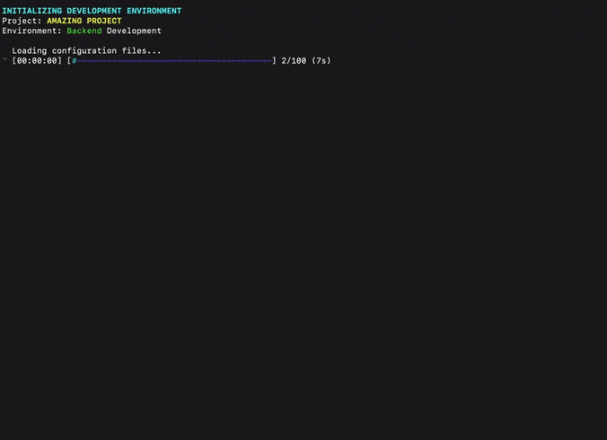

# rust-stakeholder

 



## Become an irreplaceable 10x developer in 30 seconds flat

Why learn actual skills when you can just *look* impressive instead?


Introducing **rust-stakeholder** - a CLI tool that generates absolutely meaningless but impressive-looking terminal output to convince everyone you're a coding genius without writing a single line of useful code.


> "After using rust-stakeholder, my boss stopped asking about my deadlines and started asking for my insights during board meetings." - Developer who still hasn't completed their tickets from last sprint

Remember, it's not about your actual contribution to the codebase, it's about how complicated your terminal looks when the VP of Engineering walks by. Nothing says "I'm vital to this company" like 15 progress bars, cryptic error messages you seem unfazed by, and technical jargon nobody understands.

## Features that add zero value but look incredibly important

- 🖥️ **Dazzling Development Simulations**: Make it look like you're solving CERN-level computing problems when you're actually just refreshing Reddit
- 🧠 **Meaningless Jargon Generator**: Impress with phrases like "Implemented non-euclidean topology optimization for multi-dimensional data representation" (no, it doesn't mean anything)
- 📊 **Convincing Progress Bars**: Nothing says "I'm working" like a progress bar slowly advancing while you're in the break room
- 🌐 **Fake Network Activity**: Simulate mission-critical API requests that are actually just your computer talking to itself
- 🚨 **Artificial Crisis Mode**: Generate realistic-looking alerts so people think you're heroically averting disasters
- 👥 **Imaginary Team Activity**: Pretend your invisible friends are sending you important pull requests
- 🎮 **Domain Chameleon**: Switch between backend, frontend, blockchain and 7 other domains faster than you can say "full-stack developer"

## Installation

```
cargo install --git https://github.com/giacomo-b/rust-stakeholder.git
```

Or build from source (warning: might involve actual programming):

```
git clone https://github.com/giacomo-b/rust-stakeholder.git
cd rust-stakeholder
cargo build --release # Look at you doing real developer things!
```

## Docker
Build image

```bash
docker build -t rust-stakeholder .
```

Usage

Basic usage:

```
docker run -t --rm rust-stakeholder
```

All commands below can be used through:

```bash
docker run -t --rm rust-stakeholder [arguments]
```

## Usage for career advancement

Basic usage (for entry-level imposters):

```
rust-stakeholder
```

Advanced usage (for senior imposters):

```bash
# Impress the blockchain VC investors
rust-stakeholder --dev-type blockchain --jargon extreme --alerts

# Look busy during performance review season
rust-stakeholder --complexity extreme --team --duration 1800

# Convince everyone you're a 10x game developer
rust-stakeholder --dev-type game-development --framework "Custom Engine" --jargon high

# For the data science frauds
rust-stakeholder --dev-type data-science --jargon extreme --project "Neural-Quantum-Blockchain-AI"

# Emergency mode: Your project is due tomorrow and you haven't started
rust-stakeholder --dev-type fullstack --complexity extreme --alerts --team
```

## Career benefits

- **Promotion Fast-Track**: Skip the tedious "delivering value" step entirely
- **Meeting Domination**: Let it run in the background during Zoom calls to seem busy
- **Deadline Extensions**: "Sorry, still resolving those critical system alerts"
- **Salary Negotiation Tool**: Just leave it running during your performance review
- **Job Security**: Become the only person who seems to understand your fictional systems

## Testimonials

> "I left rust-stakeholder running over the weekend. When I came back on Monday, I had been promoted to Principal Engineer." - Anonymous

> "My manager doesn't know what I do, and thanks to rust-stakeholder, neither do I." - Satisfied User

> "Since installing rust-stakeholder, my colleagues have stopped asking me for help because my work 'looks too advanced'." - Senior Imposter Engineer

## Tests? What tests?

Currently, this package has the same amount of test coverage as your excuses for missing deadlines - absolutely none.

Much like your actual development skills while using this tool, tests are purely theoretical at this point. But, if you're feeling particularly productive between fake terminal sessions, consider adding some!

After all, nothing says "I'm a serious developer with impostor syndrome" like meticulously testing a package designed to help you fake being a developer. It's beautifully recursive.

Remember: Red, Green, Refactor...

## Contributing

Contributing? That would involve actual coding. But if you insist:

1. Fork the repo (whatever that means)
2. Add more useless but impressive-looking output
3. Submit a PR and pretend you understand the codebase

## Disclaimer

rust-stakeholder is satire. If your entire technical reputation is built on running a fake terminal program, I am not responsible for the inevitable moment when someone asks you to actually, you know, code something.

I am also not responsible if you accidentally impress your way into a position you're completely unqualified for. Though if that happens, congratulations on your new career in management.