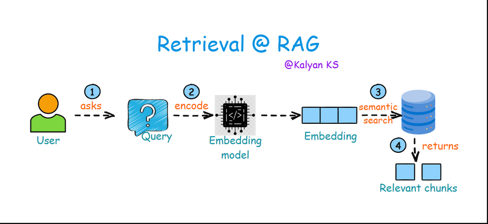
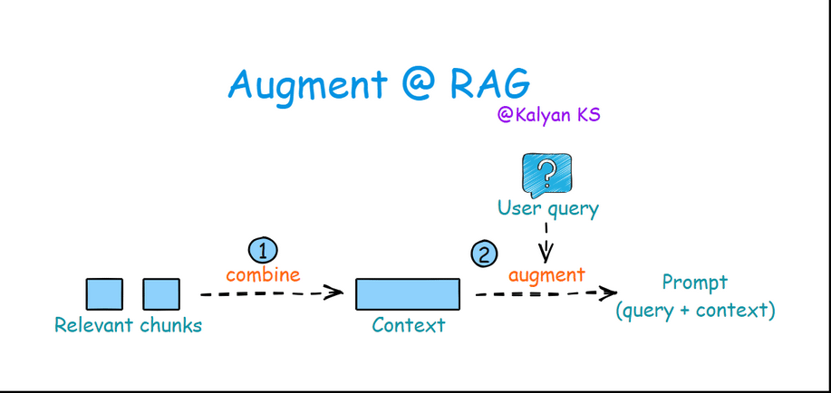
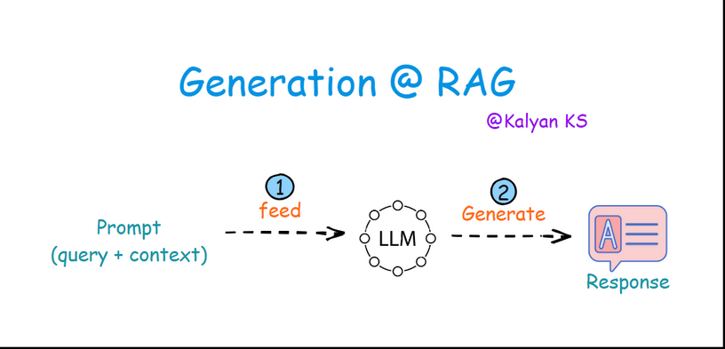

# How does RAG work?

Authored by [Kalyan KS](https://www.linkedin.com/in/kalyanksnlp/). To stay updated with LLM, RAG and Agent updates, you can follow me on [LinkedIn](https://www.linkedin.com/in/kalyanksnlp/), [Twitter](https://x.com/kalyan_kpl) and [YouTube](https://youtube.com/@kalyanksnlp?si=ZdoC0WPN9TmAOvKB). 

RAG involves four steps namely indexing, retrieval, augmentation and generation. Indexing step is done only once, while retrieval, augmentation and generation steps are repeated for each user query. 

### Indexing

Indexing in RAG involves processing raw documents by first extracting their content (parsing) and then splitting them into smaller, meaningful chunks. These chunks are then converted into vector embeddings using an embedding model and stored in a vector database, enabling efficient retrieval during query-time.

- **Parse:** Extract raw text from documents (PDFs, web pages, etc.).
- **Chunk:** Split text into smaller, meaningful segments for retrieval.
- **Encode:** Convert chunks into dense vector embeddings using an embedding model.
- **Store:** Save embeddings in a vector database for fast similarity search.

    

### Retrieval

The user asks a **query** which is converted into a dense vector (embedding) using the same embedding model used in indexing step. This vector representation is then used in **semantic search** to find the most relevant chunks of information from a vector database.

- **Query:** The user inputs a question or prompt.
- **Encode:** The query is converted into a dense vector representation using an embedding model.
- **Semantic Search:** The encoded query is compared against the embeddings in the vector database to find the most relevant embeddings.
- **Relevant Chunks:** The retrieved chunks of text are returned as context for generating a response.

    

### Augmentation

In this step, retrieved relevant chunks are combined to form a context. Then the query is merged with this context to construct a prompt for the LLM.

- **Combine:** Relevant chunks are combined to form the context.
- **Augment:** The query is merged with the context to create a prompt for the LLM.

    

### Generation

In this step, the prompt is fed to the LLM. The LLM processes the prompt and then generates a response based on both the query and the context.

- **Feed:** The prompt having query and context along with instructions is passed on to the LLM.
- **Generate:** The LLM processes the prompt and generates a response based on both the query and the provided context.

    

