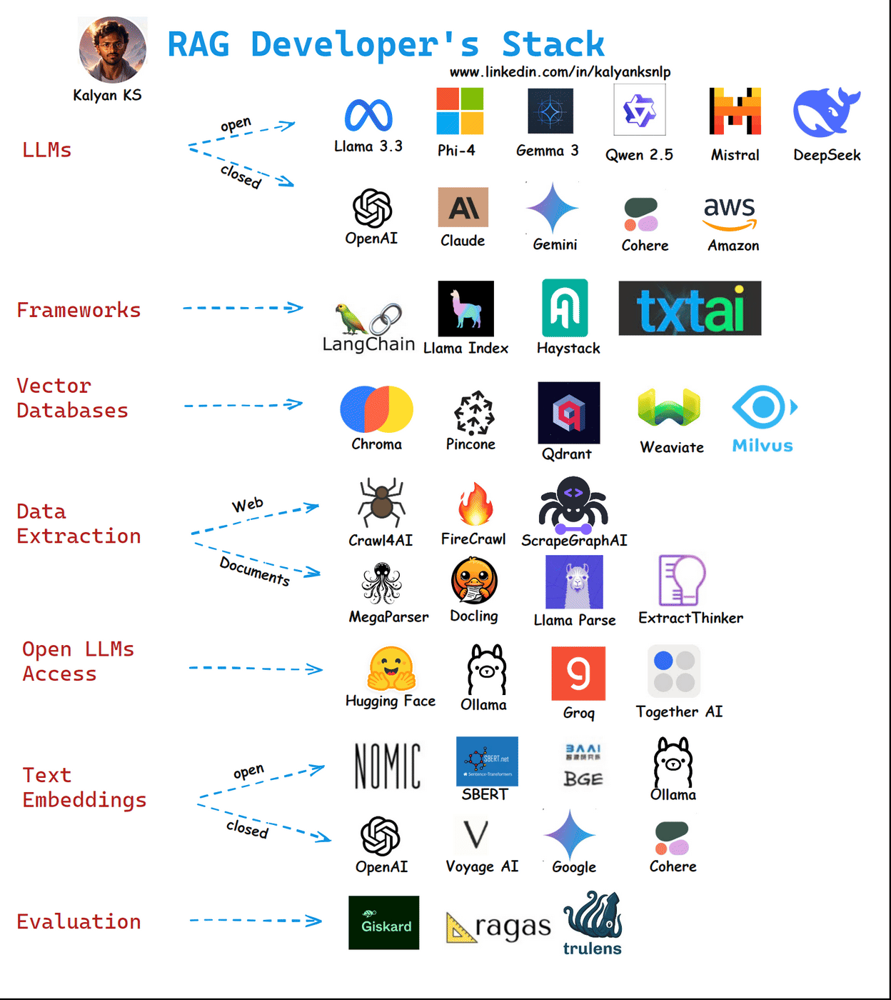

# RAG Stack

Authored by [Kalyan KS](https://www.linkedin.com/in/kalyanksnlp/). To stay updated with LLM, RAG and Agent updates, you can follow me on [LinkedIn](https://www.linkedin.com/in/kalyanksnlp/), [Twitter](https://x.com/kalyan_kpl) and [YouTube](https://youtube.com/@kalyanksnlp?si=ZdoC0WPN9TmAOvKB).

RAG developer’s stack includes LLMs, LLM frameworks, vector databases, data extraction libraries, open LLM access platforms, text embeddings and evaluation libraries. 

    

**LLMs (Large Language Models)**

Powerful AI models trained on vast text data to generate human-like responses. LLMs forms the core of RAG, enabling natural language understanding and generation.

**LLM Frameworks** 

LLM frameworks like LangChain, Llama Index etc. simplify building applications with LLMs by providing in-built tools. These frameworks avoids writing code from scratch and speeds up the LLM application development. 

**Vector Database**

A specialized database that stores and indexes text embeddings as high-dimensional vectors. It enables fast, efficient retrieval of semantically similar content for RAG applications.

**Data Extraction Libraries** 

Data extraction libraries help to extract data from a variety of documents like web pages, PDF, word documents, images, power point presentations etc. Once the data is extracted, the data is chunked, encoded and then stored as embeddings in vector databases. 

**Open LLM Access** 

Open LLM Access platforms provides access to open-source LLMs, making them runnable locally or on custom setups. These empower developers to use cost-effective, customizable models for RAG applications.

**Text Embeddings**

These convert text into numerical vectors, capturing semantic meaning for similarity comparisons. They’re crucial for retrieving relevant documents or chunks in RAG’s retrieval step.

**Evaluation** 

It is crucial to assess the performance of RAG applications to understand the merits and the demerits. For this, we have libraries like RAGAS, Giskard, Trulens etc.