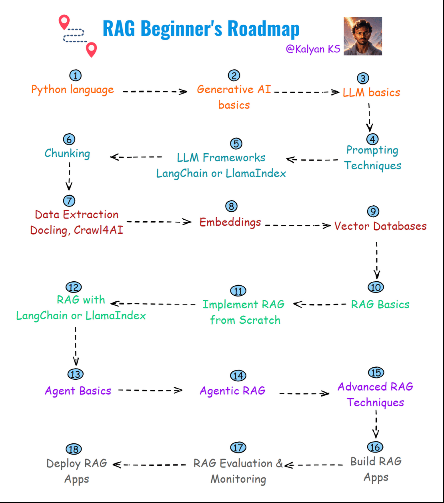

# RAG Roadmap

Authored by [Kalyan KS](https://www.linkedin.com/in/kalyanksnlp/). To stay updated with LLM, RAG and Agent updates, you can follow me on [LinkedIn](https://www.linkedin.com/in/kalyanksnlp/), [Twitter](https://x.com/kalyan_kpl) and [YouTube](https://youtube.com/@kalyanksnlp?si=ZdoC0WPN9TmAOvKB).  

Here is the RAG Beginner’s roadmap. This roadmap provides a structured learning path to mastering RAG from basics to deployment. 🚀

    

**Python Programming Language** 

Python is the primary language for RAG development due to its rich AI ecosystem. It offers libraries like LangChain, LlamaIndex, and sentence-transformers for seamless implementation.

**Generative AI Basics**

Understanding how generative AI models work, including text generation, image generation, and multimodal AI, is crucial for building RAG applications.

**LLM Basics**

Large Language Models (LLMs) are trained on massive datasets to generate human-like text. RAG systems use LLMs to interpret the user query and generate the responses based on the retrieved context.

**LLM Frameworks (LangChain or LlamaIndex)**

These frameworks provides in-built functionalities to develop RAG applications. 

**Chunking**

Chunking means splitting the document into small-size chunks so that relevant chunks can be given to the LLM. Different chunking strategies include fixed-size chunking, recursive chunking, agentic chunking, semantic chunking etc.

**Data Extraction**

Extracting structured data from unstructured documents (PDFs, HTML, text, etc.) is essential for building knowledge bases in RAG. 

**Embeddings**

Embeddings convert text into high-dimensional numerical vectors, capturing semantic meaning. They are used for similarity search, retrieval, and document clustering in RAG systems.

**Vector Databases**

Vector databases like FAISS, ChromaDB, and Weaviate store and retrieve embeddings efficiently. They enable fast semantic search to find relevant chunks for LLMs.

**RAG Basics**

Retrieval-Augmented Generation (RAG) enhances LLMs by retrieving relevant knowledge before generation. This improves accuracy, reduces hallucinations, and enables real-time updates.

**Implement RAG from Scratch** 

Building a RAG system from scratch involves designing retrieval, chunking, indexing, embedding storage, and querying mechanisms without relying on pre-built frameworks.

**Implement RAG with LangChain or LlamaIndex**

These frameworks simplify RAG implementation by providing built-in tools for document loading, embedding, retrieval, and LLM integration.

**Agent Basics**

Agents use reasoning, memory, and tool usage to interact with external systems and automate complex workflows. LLM-powered agents can dynamically retrieve and process data.

**Agentic RAG**

Agentic RAG combines retrieval-based knowledge with autonomous agent capabilities. It enables LLMs to make iterative queries, refine answers, and take actions based on retrieved information.

**Advanced RAG Techniques**

Advanced techniques include hybrid retrieval (semantic + keyword search), query rewriting, re-ranking etc.

**Build RAG Apps**

Building real-world RAG applications involves integrating UI, backend logic, and databases. Use Streamlit, FastAPI, or Flask to create interactive RAG-based systems.

**RAG Evaluation & Monitoring**

Evaluating RAG models requires metrics like retrieval precision, hallucination rate, and response relevance. Monitoring tools like LangSmith help analyze system performance.

**Deploy RAG Apps**

Deploying RAG applications involves hosting models, vector databases, and retrieval pipelines on cloud platforms like AWS, Azure, or Google Cloud for scalable access.